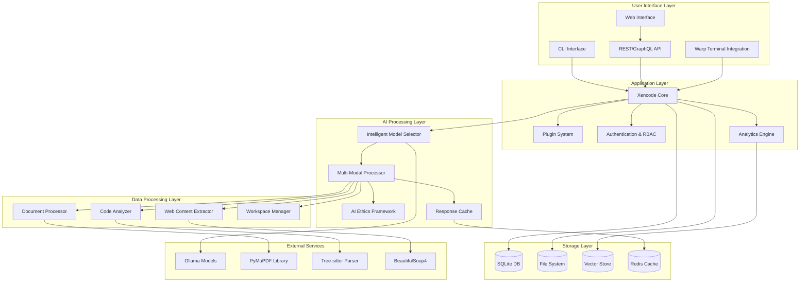
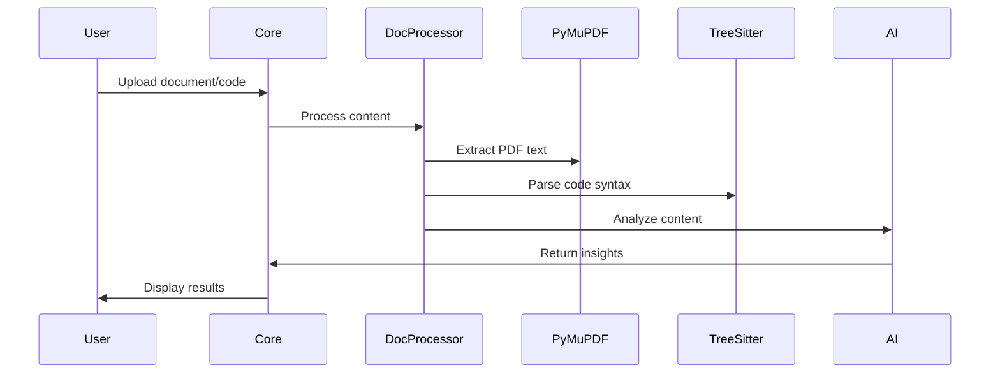
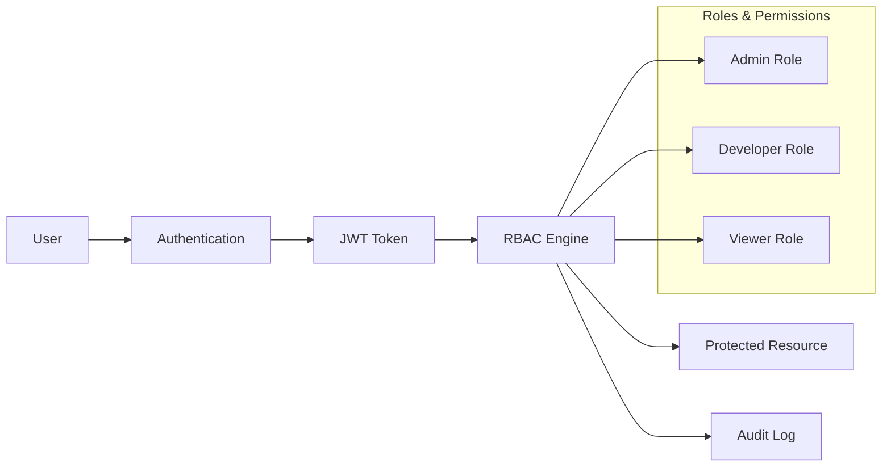
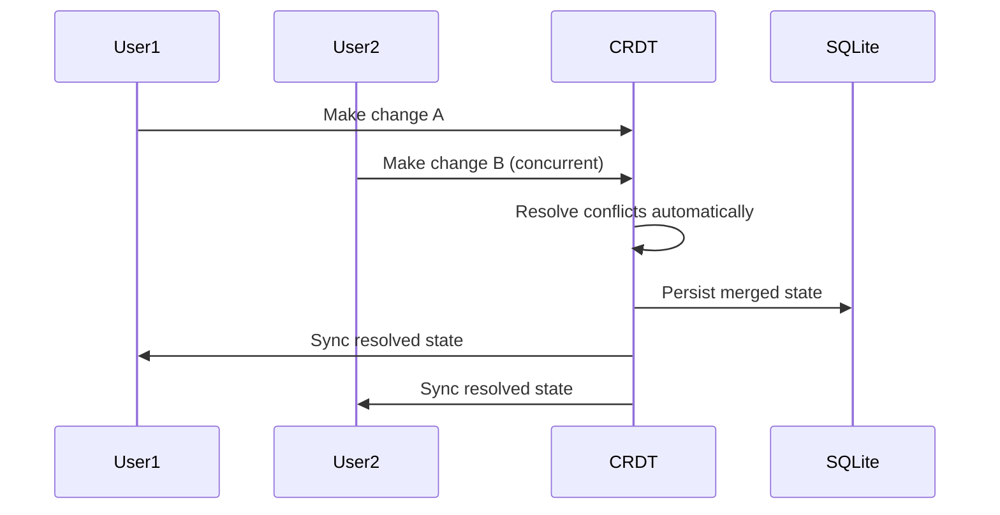

# Design Document

## Overview

This design document outlines the comprehensive enhancement of Xencode, transforming it from a functional offline-first AI coding assistant into the world's premier local development tool. The design addresses all requirements from the requirements document while building upon the existing Phase 1-2 foundation and completing Phase 3 features.

### Design Principles

- **Offline-First Architecture**: Core functionality must work without internet connectivity
- **Modular Design**: Components should be loosely coupled and independently deployable
- **Performance-Centric**: Sub-100ms response times for 95% of operations
- **Security by Design**: Zero-trust architecture with comprehensive audit trails
- **Extensibility**: Plugin-based architecture for community contributions
- **Developer Experience**: Intuitive APIs and comprehensive documentation

## Architecture

### High-Level System Architecture



### Component Architecture

#### Core System Components

1. **Xencode Core Engine**
   - Central orchestration and coordination
   - Request routing and response handling
   - System health monitoring and metrics
   - Integration with enhancement systems

2. **Intelligent Model Selector** (Existing - Phase 2)
   - Hardware detection and profiling
   - Model recommendation engine
   - Performance monitoring and optimization
   - Automatic fallback handling

3. **Advanced Cache System** (Existing - Phase 2)
   - Hybrid memory/disk caching with LZMA compression
   - 95%+ cache hit rates with <1ms access times
   - Intelligent cache eviction and optimization
   - Analytics and performance metrics

4. **Smart Configuration Manager** (Existing - Phase 2)
   - Multi-format configuration support (YAML, TOML, JSON)
   - Environment variable overrides
   - Schema validation with Pydantic
   - Hot-reload capabilities

#### Dependencies

| Component | Library | Version | Purpose |
|-----------|---------|---------|---------|
| **Document Processing** | PyMuPDF | 1.26.5 | PDF text extraction and processing |
| | python-docx | 1.2.0 | DOCX document parsing |
| | beautifulsoup4 | 4.14.2 | HTML/XML parsing and web extraction |
| **Code Analysis** | tree-sitter | 0.25.2 | Syntax tree parsing |
| | tree-sitter-python | 0.25.0 | Python language support |
| | pylint | 3.3.8 | Code quality analysis |
| | rope | 1.14.0 | Python refactoring library |
| **Authentication** | PyJWT | 2.8.0 | JWT token handling |
| | cryptography | 41.0.7 | Encryption and security |
| **Database** | aiosqlite | 0.19.0 | Async SQLite operations |
| | sqlalchemy | 2.0.23 | ORM and database toolkit |
| **Caching** | redis | 5.0.1 | Redis client library |
| | aioredis | 2.0.1 | Async Redis operations |
| **Monitoring** | prometheus-client | 0.19.0 | Metrics collection |
| **Web Framework** | fastapi | 0.104.1 | REST API framework |
| | uvicorn | 0.24.0 | ASGI server |

## API Design

### REST API Specification

```yaml
openapi: 3.0.3
info:
  title: Xencode API
  version: 3.0.0
  description: Comprehensive AI coding assistant API

paths:
  /workspaces/{id}/sync:
    post:
      summary: Synchronize workspace changes
      parameters:
        - name: id
          in: path
          required: true
          schema:
            type: string
      requestBody:
        required: true
        content:
          application/json:
            schema:
              type: object
              properties:
                changes:
                  type: array
                  items:
                    $ref: '#/components/schemas/Change'
                crdt_vector:
                  type: object
      responses:
        '200':
          description: Sync successful
          content:
            application/json:
              schema:
                $ref: '#/components/schemas/SyncResult'

  /documents/process:
    post:
      summary: Process document for AI analysis
      requestBody:
        required: true
        content:
          multipart/form-data:
            schema:
              type: object
              properties:
                file:
                  type: string
                  format: binary
                document_type:
                  type: string
                  enum: [pdf, docx, html, markdown]
      responses:
        '200':
          description: Document processed successfully
          content:
            application/json:
              schema:
                $ref: '#/components/schemas/ProcessedDocument'

components:
  schemas:
    Change:
      type: object
      properties:
        id: {type: string}
        operation: {type: string, enum: [insert, delete, update]}
        path: {type: string}
        content: {type: string}
        timestamp: {type: string, format: date-time}
    
    SyncResult:
      type: object
      properties:
        success: {type: boolean}
        conflicts_resolved: {type: integer}
        new_vector: {type: object}
    
    ProcessedDocument:
      type: object
      properties:
        id: {type: string}
        extracted_text: {type: string}
        metadata: {type: object}
        confidence_score: {type: number}
        processing_time_ms: {type: integer}
```

## Components and Interfaces

### 1. Testing Infrastructure Stabilization (REQ-1)

#### Component: Enhanced Test Framework
```python
class TestInfrastructure:
    """Enhanced testing infrastructure with dependency resolution"""
    
    def __init__(self):
        self.dependency_resolver = DependencyResolver()
        self.test_runner = EnhancedTestRunner()
        self.coverage_tracker = CoverageTracker()
    
    async def resolve_dependencies(self) -> bool:
        """Resolve all pytest and integration dependencies"""
        pass
    
    async def run_comprehensive_tests(self) -> TestResults:
        """Run full test suite with coverage reporting"""
        pass
    
    async def validate_integration_points(self) -> List[IntegrationIssue]:
        """Validate all system integration points"""
        pass
```

**Interfaces:**
- `DependencyResolver`: Resolves pytest conflicts and missing dependencies
- `TestRunner`: Executes tests with proper isolation and reporting
- `CoverageTracker`: Tracks and reports test coverage metrics

### 2. Multi-Modal Processing System (REQ-2, REQ-3)

#### Component: Document Processing Engine
```python
class DocumentProcessor:
    """Multi-modal document processing with PyMuPDF and BeautifulSoup4"""
    
    def __init__(self):
        self.pdf_processor = PDFProcessor()  # PyMuPDF==1.26.5
        self.docx_processor = DOCXProcessor()  # python-docx==1.2.0
        self.web_extractor = WebContentExtractor()  # beautifulsoup4==4.14.2
        self.fallback_handler = FallbackHandler()
    
    async def process_document(
        self, 
        file_path: Path, 
        document_type: DocumentType
    ) -> ProcessedDocument:
        """Process document with appropriate handler"""
        start_time = time.time()
        
        try:
            if document_type == DocumentType.PDF:
                content = await self.pdf_processor.extract(file_path)
            elif document_type == DocumentType.DOCX:
                content = await self.docx_processor.extract(file_path)
            elif document_type == DocumentType.HTML:
                content = await self.web_extractor.extract(file_path)
            else:
                raise ValueError(f"Unsupported document type: {document_type}")
            
            processing_time = int((time.time() - start_time) * 1000)
            
            return ProcessedDocument(
                id=str(uuid.uuid4()),
                original_filename=file_path.name,
                document_type=document_type,
                extracted_text=content.text,
                metadata=content.metadata,
                structured_content=content.structured_data,
                processing_time_ms=processing_time,
                confidence_score=content.confidence
            )
        except Exception as e:
            await self.fallback_handler.handle_processing_error(e, file_path)
            raise
    
    async def extract_structured_content(
        self, 
        content: bytes
    ) -> StructuredContent:
        """Extract structured content with metadata"""
        pass
```

**Processing Flow:**


#### Component: Code Analysis System
```python
class CodeAnalyzer:
    """Advanced code analysis with tree-sitter integration"""
    
    def __init__(self):
        self.parser_manager = TreeSitterParserManager()  # tree-sitter==0.25.2
        self.syntax_analyzer = SyntaxAnalyzer()  # tree-sitter-python==0.25.0
        self.error_detector = ErrorDetector()  # pylint==3.3.8
        self.refactoring_engine = RefactoringEngine()  # rope==1.14.0
    
    async def analyze_code(
        self, 
        code: str, 
        language: str
    ) -> CodeAnalysisResult:
        """Comprehensive code analysis"""
        pass
    
    async def suggest_improvements(
        self, 
        analysis: CodeAnalysisResult
    ) -> List[Improvement]:
        """Generate improvement suggestions"""
        pass
```

### 3. Role-Based Access Control System (REQ-4)

#### Component: RBAC Manager
```python
class RBACManager:
    """Role-based access control with JWT authentication"""
    
    def __init__(self):
        self.jwt_handler = JWTHandler()
        self.role_manager = RoleManager()
        self.permission_engine = PermissionEngine()
        self.audit_logger = AuditLogger()
    
    async def authenticate_user(
        self, 
        credentials: UserCredentials
    ) -> AuthenticationResult:
        """Authenticate user and issue JWT token"""
        pass
    
    async def authorize_action(
        self, 
        user_token: str, 
        resource: str, 
        action: str
    ) -> bool:
        """Check if user is authorized for action"""
        pass
    
    async def refresh_token(self, token: str) -> str:
        """Silently refresh JWT token"""
        pass
```

**Security Architecture:**


### 4. Workspace Management System (REQ-5)

#### Component: Workspace Manager with CRDT Support
```python
class WorkspaceManager:
    """Workspace management with real-time collaboration"""
    
    def __init__(self):
        self.crdt_engine = CRDTEngine()
        self.sqlite_manager = SQLiteManager()
        self.sync_coordinator = SyncCoordinator()
        self.conflict_resolver = ConflictResolver()
    
    async def create_workspace(
        self, 
        workspace_config: WorkspaceConfig
    ) -> Workspace:
        """Create new isolated workspace"""
        pass
    
    async def sync_changes(
        self, 
        workspace_id: str, 
        changes: List[Change]
    ) -> SyncResult:
        """Synchronize workspace changes with CRDT"""
        pass
    
    async def resolve_conflicts(
        self, 
        conflicts: List[Conflict]
    ) -> List[Resolution]:
        """Automatically resolve conflicts using CRDT algorithms"""
        pass
```

**CRDT Collaboration Flow:**


### 5. Plugin Ecosystem Enhancement (REQ-8)

#### Component: Enhanced Plugin System
```python
class PluginManager:
    """Enhanced plugin system with marketplace integration"""
    
    def __init__(self):
        self.plugin_loader = PluginLoader()
        self.sandbox_manager = SandboxManager()
        self.marketplace_client = MarketplaceClient()
        self.dependency_resolver = PluginDependencyResolver()
    
    async def install_plugin(
        self, 
        plugin_id: str, 
        version: Optional[str] = None
    ) -> InstallationResult:
        """Install plugin with signature verification"""
        pass
    
    async def execute_plugin(
        self, 
        plugin_id: str, 
        context: PluginContext
    ) -> PluginResult:
        """Execute plugin in sandboxed environment"""
        pass
    
    async def resolve_plugin_conflicts(
        self, 
        plugins: List[Plugin]
    ) -> List[Resolution]:
        """Resolve plugin dependency conflicts"""
        pass

#### Future Integrations (Phase 5+)
- **Vision Processing**: Hooks for OpenCV-based image analysis plugins
- **Voice Integration**: Whisper-based speech-to-text plugin support  
- **Multi-Modal AI**: Plugin architecture for vision/voice model integration
- **External APIs**: Standardized connectors for cloud services and databases
- **IDE Extensions**: Plugin bridge for VS Code, JetBrains, and Vim integrations
```

## Data Models

### Core Data Models

#### User and Authentication Models
```python
from pydantic import BaseModel
from typing import Optional, List
from datetime import datetime
from enum import Enum

class UserRole(str, Enum):
    ADMIN = "admin"
    DEVELOPER = "developer"
    VIEWER = "viewer"

class User(BaseModel):
    id: str
    username: str
    email: str
    roles: List[UserRole]
    created_at: datetime
    last_active: Optional[datetime]
    preferences: Dict[str, Any]

class JWTToken(BaseModel):
    access_token: str
    refresh_token: str
    expires_at: datetime
    user_id: str
    permissions: List[str]
```

#### Document Processing Models
```python
class DocumentType(str, Enum):
    PDF = "pdf"
    DOCX = "docx"
    HTML = "html"
    MARKDOWN = "markdown"
    CODE = "code"

class ProcessedDocument(BaseModel):
    id: str
    original_filename: str
    document_type: DocumentType
    extracted_text: str
    metadata: Dict[str, Any]
    structured_content: Optional[Dict[str, Any]]
    processing_time_ms: int
    confidence_score: float

class SyntaxError(BaseModel):
    line: int
    column: int
    message: str
    severity: str

class Improvement(BaseModel):
    type: str
    description: str
    line_start: int
    line_end: int
    suggested_fix: Optional[str]

class SecurityIssue(BaseModel):
    type: str
    severity: str
    description: str
    line: int
    cwe_id: Optional[str]

class PerformanceHint(BaseModel):
    type: str
    description: str
    impact: str
    line: int

class CodeAnalysisResult(BaseModel):
    language: str
    syntax_errors: List[SyntaxError]
    suggestions: List[Improvement]
    complexity_score: int
    security_issues: List[SecurityIssue]
    performance_hints: List[PerformanceHint]
```

#### Workspace Models
```python
class WorkspaceConfig(BaseModel):
    name: str
    description: Optional[str]
    owner_id: str
    collaborators: List[str]
    settings: Dict[str, Any]
    crdt_enabled: bool = True

class Workspace(BaseModel):
    id: str
    config: WorkspaceConfig
    created_at: datetime
    last_modified: datetime
    file_count: int
    storage_size_bytes: int
    active_sessions: int
```

### Database Schema

#### SQLite Schema Design
```sql
-- Users and Authentication
CREATE TABLE users (
    id TEXT PRIMARY KEY,
    username TEXT UNIQUE NOT NULL,
    email TEXT UNIQUE NOT NULL,
    password_hash TEXT NOT NULL,
    roles TEXT NOT NULL, -- JSON array
    created_at TIMESTAMP DEFAULT CURRENT_TIMESTAMP,
    last_active TIMESTAMP,
    preferences TEXT -- JSON object
);

-- Workspaces
CREATE TABLE workspaces (
    id TEXT PRIMARY KEY,
    name TEXT NOT NULL,
    description TEXT,
    owner_id TEXT NOT NULL,
    config TEXT NOT NULL, -- JSON object
    created_at TIMESTAMP DEFAULT CURRENT_TIMESTAMP,
    last_modified TIMESTAMP DEFAULT CURRENT_TIMESTAMP,
    FOREIGN KEY (owner_id) REFERENCES users(id)
);

-- Document Processing
CREATE TABLE processed_documents (
    id TEXT PRIMARY KEY,
    workspace_id TEXT NOT NULL,
    original_filename TEXT NOT NULL,
    document_type TEXT NOT NULL,
    extracted_text TEXT,
    metadata TEXT, -- JSON object
    processing_time_ms INTEGER,
    confidence_score REAL,
    created_at TIMESTAMP DEFAULT CURRENT_TIMESTAMP,
    FOREIGN KEY (workspace_id) REFERENCES workspaces(id)
);

-- Plugin Management
CREATE TABLE installed_plugins (
    id TEXT PRIMARY KEY,
    name TEXT NOT NULL,
    version TEXT NOT NULL,
    author TEXT,
    description TEXT,
    permissions TEXT, -- JSON array
    config TEXT, -- JSON object
    installed_at TIMESTAMP DEFAULT CURRENT_TIMESTAMP,
    last_used TIMESTAMP
);

-- Analytics and Metrics
CREATE TABLE analytics_events (
    id TEXT PRIMARY KEY,
    user_id TEXT,
    event_type TEXT NOT NULL,
    event_data TEXT, -- JSON object
    timestamp TIMESTAMP DEFAULT CURRENT_TIMESTAMP,
    session_id TEXT,
    FOREIGN KEY (user_id) REFERENCES users(id)
);
```

## Error Handling

### Error Classification and Recovery

#### Error Categories
```python
class ErrorCategory(str, Enum):
    AUTHENTICATION = "authentication"
    AUTHORIZATION = "authorization"
    VALIDATION = "validation"
    PROCESSING = "processing"
    NETWORK = "network"
    STORAGE = "storage"
    PLUGIN = "plugin"
    SYSTEM = "system"

class XencodeError(Exception):
    """Base exception for Xencode errors"""
    
    def __init__(
        self, 
        message: str, 
        category: ErrorCategory,
        recoverable: bool = True,
        context: Optional[Dict[str, Any]] = None
    ):
        self.message = message
        self.category = category
        self.recoverable = recoverable
        self.context = context or {}
        super().__init__(message)
```

#### Recovery Strategies
```python
class ErrorRecoveryManager:
    """Manages error recovery strategies"""
    
    async def handle_error(
        self, 
        error: XencodeError, 
        context: Dict[str, Any]
    ) -> RecoveryResult:
        """Handle error with appropriate recovery strategy"""
        
        if error.category == ErrorCategory.NETWORK:
            return await self._handle_network_error(error, context)
        elif error.category == ErrorCategory.PROCESSING:
            return await self._handle_processing_error(error, context)
        elif error.category == ErrorCategory.AUTHENTICATION:
            return await self._handle_auth_error(error, context)
        else:
            return await self._handle_generic_error(error, context)
    
    async def _handle_network_error(
        self, 
        error: XencodeError, 
        context: Dict[str, Any]
    ) -> RecoveryResult:
        """Handle network-related errors with retry logic"""
        # Exponential backoff retry
        # Fallback to cached responses
        # Switch to offline mode if needed
        pass
```

### Graceful Degradation

#### Fallback Mechanisms
1. **Model Selection Fallback**: If primary model fails, automatically switch to backup
2. **Processing Fallback**: If advanced processing fails, fall back to basic text extraction
3. **Network Fallback**: If online features fail, continue with offline functionality
4. **Plugin Fallback**: If plugin fails, disable gracefully without affecting core functionality

## Testing Strategy

### Test Architecture

#### Test Categories
1. **Unit Tests**: Individual component testing with mocks
2. **Integration Tests**: Component interaction testing
3. **End-to-End Tests**: Full workflow testing
4. **Performance Tests**: Load and stress testing
5. **Security Tests**: Vulnerability and penetration testing

#### Test Infrastructure
```python
class TestInfrastructure:
    """Comprehensive test infrastructure"""
    
    def __init__(self):
        self.unit_test_runner = UnitTestRunner()
        self.integration_test_runner = IntegrationTestRunner()
        self.performance_test_runner = PerformanceTestRunner()
        self.security_test_runner = SecurityTestRunner()
    
    async def run_all_tests(self) -> TestResults:
        """Run comprehensive test suite"""
        results = TestResults()
        
        # Run tests in parallel where possible
        unit_results = await self.unit_test_runner.run()
        integration_results = await self.integration_test_runner.run()
        performance_results = await self.performance_test_runner.run()
        security_results = await self.security_test_runner.run()
        
        results.combine(unit_results, integration_results, 
                       performance_results, security_results)
        
        return results
```

#### Test Data Management
```python
class TestDataManager:
    """Manages test data and fixtures"""
    
    def __init__(self):
        self.fixture_loader = FixtureLoader()
        self.mock_data_generator = MockDataGenerator()
        self.test_db_manager = TestDatabaseManager()
    
    async def setup_test_environment(self) -> TestEnvironment:
        """Set up isolated test environment"""
        # Create test database
        # Load test fixtures
        # Generate mock data
        # Set up test users and permissions
        pass
    
    async def cleanup_test_environment(self, env: TestEnvironment):
        """Clean up test environment"""
        # Drop test database
        # Clear test files
        # Reset system state
        pass
```

### Performance Testing

#### Load Testing Strategy
```python
class LoadTestRunner:
    """Load testing with realistic scenarios"""
    
    async def run_concurrent_user_test(
        self, 
        concurrent_users: int = 1000,
        duration_minutes: int = 10
    ) -> LoadTestResults:
        """Simulate concurrent users"""
        # Simulate realistic user behavior
        # Document processing
        # Code analysis
        # Plugin execution
        # Workspace collaboration
        pass
    
    async def run_stress_test(self) -> StressTestResults:
        """Test system limits"""
        # Gradually increase load until failure
        # Identify bottlenecks
        # Test recovery mechanisms
        pass
```

### Security Testing

#### Security Test Suite
```python
class SecurityTestRunner:
    """Comprehensive security testing"""
    
    async def run_vulnerability_scan(self) -> VulnerabilityReport:
        """Run automated vulnerability scanning"""
        # Bandit for Python security issues
        # OWASP dependency check
        # Custom security rules
        pass
    
    async def run_penetration_test(self) -> PenetrationTestReport:
        """Simulate attack scenarios"""
        # SQL injection attempts
        # XSS testing
        # Authentication bypass attempts
        # Authorization escalation tests
        pass
    
    async def run_ethics_compliance_test(self) -> EthicsComplianceReport:
        """Test AI ethics compliance"""
        # Bias detection tests
        # Harmful content filtering
        # Privacy protection validation
        pass
```

## Implementation Phases

### Phase 3.1: Testing Infrastructure (Priority: HIGH)
- Resolve pytest dependency conflicts
- Implement comprehensive test suite
- Set up performance benchmarking
- Establish security testing baseline

### Phase 3.2: Multi-Modal Processing (Priority: HIGH)
- Implement PDF/DOCX processing with PyMuPDF
- Add web content extraction with BeautifulSoup4
- Integrate tree-sitter for code analysis
- Build unified processing pipeline

### Phase 3.3: Security and RBAC (Priority: MEDIUM)
- Implement JWT-based authentication
- Build role-based access control system
- Add audit logging and compliance features
- Integrate with existing security framework

### Phase 3.4: Workspace Management (Priority: MEDIUM)
- Implement CRDT-based collaboration
- Build SQLite workspace storage
- Add real-time synchronization
- Create workspace isolation mechanisms

### Phase 3.5: Plugin Enhancement (Priority: LOW)
- Enhance existing plugin system
- Add marketplace integration
- Implement plugin sandboxing
- Build dependency resolution system

## Risks & Trade-offs

| Risk | Impact | Probability | Mitigation Strategy | Trade-off |
|------|--------|-------------|-------------------|-----------|
| **CRDT Complexity** | High performance hit on low-end hardware | Medium | Optional toggle; benchmark <50ms sync; fallback to simple locking | Real-time collaboration vs. performance |
| **PyMuPDF Dependencies** | Platform-specific compilation issues | High | Pre-built wheels; fallback to basic text extraction | Rich document processing vs. installation simplicity |
| **SQLite Concurrency** | Write conflicts under heavy load | Medium | WAL mode; connection pooling; retry logic | ACID guarantees vs. throughput |
| **JWT Token Management** | Token refresh complexity in offline mode | Medium | Long-lived refresh tokens; graceful degradation | Security vs. offline usability |
| **Plugin Sandboxing** | Performance overhead; limited functionality | Low | Configurable security levels; native plugins for power users | Security vs. plugin capabilities |
| **Tree-sitter Memory** | High memory usage for large codebases | Medium | Streaming parsing; LRU cache for ASTs | Rich analysis vs. memory efficiency |
| **Multi-modal Processing** | Processing time for large documents | High | Async processing; progress indicators; size limits | Feature richness vs. response time |

### Technical Debt Considerations

1. **Async/Await Consistency**: Ensure all I/O operations are properly async to avoid blocking
2. **Error Handling Standardization**: Consistent error types and recovery patterns across components
3. **Configuration Complexity**: Balance flexibility with simplicity in configuration management
4. **Testing Complexity**: Comprehensive testing of async, multi-modal, and collaborative features
5. **Documentation Maintenance**: Keep API docs and code examples synchronized

## Performance Considerations

### Optimization Strategies

1. **Caching Strategy**
   - Multi-level caching (memory, disk, distributed)
   - Intelligent cache invalidation
   - Compression for large responses
   - Cache warming for frequently accessed data

2. **Database Optimization**
   - SQLite WAL mode for concurrent access
   - Proper indexing strategy
   - Connection pooling
   - Query optimization

3. **Async Processing**
   - Non-blocking I/O throughout
   - Background task processing
   - Streaming responses for large operations
   - Parallel processing where possible

4. **Resource Management**
   - Memory usage monitoring
   - Automatic garbage collection
   - Resource pooling
   - Graceful degradation under load

### Performance Targets

| Metric | Target | Measurement |
|--------|--------|-------------|
| Response Time | <100ms (95th percentile) | API response times |
| Throughput | 1000+ concurrent requests | Load testing |
| Cache Hit Rate | >95% | Cache analytics |
| Memory Usage | <500MB under load | Resource monitoring |
| CPU Usage | <80% under normal load | System metrics |
| Disk I/O | <100MB/s sustained | Storage metrics |

## Security Architecture

### Zero-Trust Security Model

1. **Authentication**
   - Multi-factor authentication support
   - JWT tokens with short expiration
   - Automatic token refresh
   - Session management

2. **Authorization**
   - Fine-grained permissions
   - Role-based access control
   - Resource-level security
   - Audit trail for all actions

3. **Data Protection**
   - Encryption at rest (AES-256)
   - Encryption in transit (TLS 1.3)
   - Key rotation policies
   - Secure key storage

4. **Monitoring and Compliance**
   - Real-time security monitoring
   - Automated threat detection
   - Compliance reporting
   - Incident response procedures

### Privacy Protection

1. **Data Minimization**
   - Collect only necessary data
   - Automatic data expiration
   - User data deletion rights
   - Privacy-preserving analytics

2. **Local Processing**
   - Offline-first architecture
   - Local model inference
   - Minimal cloud dependencies
   - User data sovereignty

## Scalability Design

### Horizontal Scaling Strategy

1. **Microservices Architecture**
   - Independent service scaling
   - Load balancing
   - Service discovery
   - Circuit breakers

2. **Database Scaling**
   - Read replicas for SQLite
   - Sharding strategies
   - Connection pooling
   - Query optimization

3. **Caching Strategy**
   - Distributed caching with Redis
   - CDN for static assets
   - Edge caching
   - Cache invalidation strategies

4. **Resource Management**
   - Auto-scaling policies
   - Resource quotas
   - Load shedding
   - Graceful degradation

### Deployment Blueprint

#### Docker Compose Configuration
```yaml
version: '3.8'
services:
  xencode-core:
    build: .
    ports:
      - "8000:8000"
    environment:
      - DATABASE_URL=sqlite:///data/xencode.db
      - REDIS_URL=redis://redis:6379
      - OLLAMA_URL=http://ollama:11434
    volumes:
      - ./data:/app/data
    depends_on:
      - redis
      - ollama
    healthcheck:
      test: ["CMD", "curl", "-f", "http://localhost:8000/health"]
      interval: 30s
      timeout: 10s
      retries: 3

  redis:
    image: redis:7-alpine
    ports:
      - "6379:6379"
    volumes:
      - redis_data:/data
    healthcheck:
      test: ["CMD", "redis-cli", "ping"]
      interval: 30s
      timeout: 5s
      retries: 3

  ollama:
    image: ollama/ollama:latest
    ports:
      - "11434:11434"
    volumes:
      - ollama_data:/root/.ollama
    environment:
      - OLLAMA_MODELS=llama3.1:8b,qwen2.5:7b

volumes:
  redis_data:
  ollama_data:
```

#### Deployment Checklist

| Task | Status | Notes |
|------|--------|-------|
| [ ] Environment variables configured | | DATABASE_URL, REDIS_URL, OLLAMA_URL |
| [ ] Health checks enabled | | All services respond to health endpoints |
| [ ] SSL certificates installed | | TLS 1.3 for all external connections |
| [ ] Database migrations applied | | SQLite schema up to date |
| [ ] Redis cache warmed | | Pre-populate frequently accessed data |
| [ ] Ollama models downloaded | | Primary and fallback models available |
| [ ] Plugin directory mounted | | Persistent plugin storage |
| [ ] Log aggregation configured | | Centralized logging with rotation |
| [ ] Prometheus exporter running | | Metrics endpoint on port 8001 |
| [ ] Grafana dashboards imported | | AI processing and system metrics |
| [ ] Monitoring dashboards active | | Prometheus/Grafana metrics collection |
| [ ] Auto-backup cron configured | | Daily SQLite dump and rotation |
| [ ] Backup procedures tested | | Database and configuration backups |

### Monitoring & Observability

#### Prometheus Metrics Integration
```python
from prometheus_client import Counter, Histogram, Gauge, start_http_server

class MetricsCollector:
    """Prometheus metrics collection for Xencode"""
    
    def __init__(self):
        # Request metrics
        self.request_count = Counter(
            'xencode_requests_total',
            'Total requests processed',
            ['method', 'endpoint', 'status']
        )
        
        self.request_duration = Histogram(
            'xencode_request_duration_seconds',
            'Request processing time',
            ['method', 'endpoint']
        )
        
        # System metrics
        self.active_users = Gauge(
            'xencode_active_users',
            'Number of active users'
        )
        
        self.cache_hit_rate = Gauge(
            'xencode_cache_hit_rate',
            'Cache hit rate percentage'
        )
        
        # AI processing metrics
        self.ai_processing_time = Histogram(
            'xencode_ai_processing_seconds',
            'AI model processing time',
            ['model_name', 'operation']
        )
        
        self.document_processing_time = Histogram(
            'xencode_document_processing_seconds',
            'Document processing time',
            ['document_type']
        )
    
    def record_request(self, method: str, endpoint: str, status: int, duration: float):
        """Record request metrics"""
        self.request_count.labels(method=method, endpoint=endpoint, status=status).inc()
        self.request_duration.labels(method=method, endpoint=endpoint).observe(duration)
    
    def update_system_metrics(self, active_users: int, cache_hit_rate: float):
        """Update system health metrics"""
        self.active_users.set(active_users)
        self.cache_hit_rate.set(cache_hit_rate)
```

#### Performance Monitoring Dashboard

| Metric | Target | Current | Alert Threshold |
|--------|--------|---------|-----------------|
| **Response Time** | <100ms (95th percentile) | - | >200ms |
| **Throughput** | 1000+ req/sec | - | <500 req/sec |
| **Cache Hit Rate** | >95% | - | <90% |
| **Error Rate** | <1% | - | >5% |
| **Memory Usage** | <500MB | - | >800MB |
| **CPU Usage** | <80% | - | >90% |
| **Disk Usage** | <80% | - | >90% |
| **Active Users** | - | - | Trend analysis |
| **AI Processing Time** | <2s (95th percentile) | - | >5s |
| **Document Processing** | <5s (95th percentile) | - | >10s |
| **Observability Coverage** | 99% metric capture | - | <95% |## A
ppendices

### Glossary

| Term | Definition |
|------|------------|
| **CRDT** | Conflict-Free Replicated Data Type - Data structure that automatically resolves conflicts in distributed systems |
| **JWT** | JSON Web Token - Secure method for transmitting information between parties as a JSON object |
| **PyMuPDF** | Python library for PDF document processing, text extraction, and manipulation |
| **Tree-sitter** | Parser generator tool and incremental parsing library for building syntax trees |
| **RBAC** | Role-Based Access Control - Security model that restricts access based on user roles |
| **SQLite WAL** | Write-Ahead Logging mode for SQLite that allows concurrent readers and writers |
| **Ollama** | Local AI model inference engine for running large language models offline |
| **BeautifulSoup4** | Python library for parsing HTML and XML documents |
| **OWASP** | Open Web Application Security Project - Organization focused on improving software security |
| **Prometheus** | Open-source monitoring and alerting toolkit |
| **Grafana** | Open-source analytics and monitoring platform |
| **Redis** | In-memory data structure store used as database, cache, and message broker |
| **WCAG** | Web Content Accessibility Guidelines - Standards for web accessibility |
| **TLS** | Transport Layer Security - Cryptographic protocol for secure communication |
| **API Gateway** | Management tool that sits between clients and backend services |
| **Microservices** | Architectural approach where applications are built as a collection of loosely coupled services |

### Document History

| Version | Date | Changes | Author |
|---------|------|---------|--------|
| 1.0 | Oct 14, 2025 | Initial design document with architecture overview | Xencode Team |
| 1.1 | Oct 14, 2025 | Added API specs, risks analysis, deployment blueprint | Xencode Team |
| 1.2 | Oct 14, 2025 | Enhanced with monitoring, glossary, and implementation details | Xencode Team |

### Related Documents

- [Requirements Document](./requirements.md) - Detailed system requirements and acceptance criteria
- [Implementation Tasks](./tasks.md) - Step-by-step implementation plan and task breakdown
- [PLAN.md](../../PLAN.md) - Overall project roadmap and phase planning
- [API Documentation](./api-docs.md) - Comprehensive API reference (to be created)
- [Deployment Guide](./deployment.md) - Production deployment instructions (to be created)