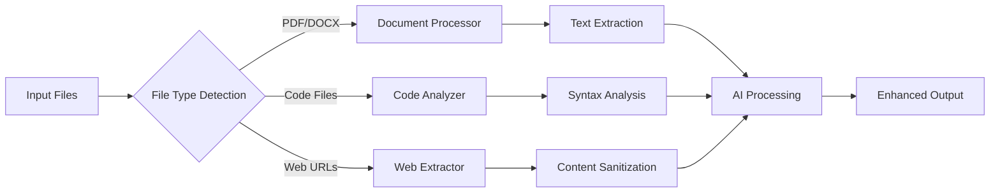

# Requirements Document

## Document History

| Version | Date | Changes | Author |
|---------|------|---------|--------|
| 1.0 | Oct 2025 | Initial requirements specification | Xencode Team |
| 1.1 | Oct 2025 | Added priorities, constraints, and traceability | Xencode Team |

## Introduction

This specification defines the comprehensive enhancement of Xencode, transforming it from a functional offline-first AI coding assistant into the world's premier local development tool. The enhancement encompasses completing Phase 3 features, establishing robust testing infrastructure, and laying the foundation for Phases 4-7 to achieve untouchable market position—faster than Cursor, more collaborative than Replit, with fortress-level privacy through zero-cloud architecture.

## Assumptions and Constraints

### Assumptions
- Ollama v0.3+ is installed and accessible on target systems
- Python 3.12+ environment with pip package management
- Minimum 8GB RAM for optimal model performance
- Internet connectivity for initial setup and plugin marketplace access
- Git version control system is available for workspace management

### Constraints
- Must maintain offline-first architecture (no cloud dependencies for core functionality)
- Limited to Python ecosystem for core components (plugins may use other languages)
- SQLite database size limited to 10GB per workspace for performance
- Plugin execution sandboxed with 2GB memory limit per plugin
- JWT token expiration maximum 24 hours for security compliance

## Requirements

### Requirement 1: Testing Infrastructure Stabilization (Priority: HIGH)

**User Story:** As a developer contributing to Xencode, I want a robust testing infrastructure with resolved dependencies, so that I can confidently develop and deploy features without integration failures.

#### Acceptance Criteria

1. WHEN pytest is executed THEN the system SHALL resolve all dependency conflicts and run without import errors
2. WHEN integration tests are run THEN the system SHALL achieve 100% test coverage for core components
3. WHEN CI/CD pipeline executes THEN the system SHALL pass all tests with zero flaky test failures
4. IF test dependencies are missing THEN the system SHALL provide clear error messages with resolution steps

### Requirement 2: Phase 3 Feature Completion (Priority: HIGH)

**User Story:** As a developer using Xencode, I want complete Phase 3 functionality including multi-modal processing, enhanced UI integration, and advanced code analysis, so that I can work with diverse file types and get intelligent code insights.

#### Acceptance Criteria

1. WHEN processing PDF/DOCX files THEN the system SHALL extract text content with 95% accuracy using PyMuPDF
2. WHEN analyzing code THEN the system SHALL provide syntax highlighting, error detection, and refactoring suggestions using tree-sitter
3. WHEN integrating with Warp terminal THEN the system SHALL provide seamless command execution with <100ms response time
4. WHEN processing web content THEN the system SHALL extract structured data using BeautifulSoup4 with content sanitization
5. IF multi-modal content fails processing THEN the system SHALL gracefully fallback to text-only mode
6. WHEN file processing exceeds 30 seconds THEN the system SHALL timeout and provide partial results
7. WHEN unsupported file types are encountered THEN the system SHALL suggest alternative processing methods

### Requirement 3: Document Processing System (Priority: HIGH)

**User Story:** As a developer working with documentation, I want Xencode to intelligently process various document formats, so that I can get AI assistance on technical specs, requirements, and design documents.

#### Acceptance Criteria

1. WHEN uploading PDF documents THEN the system SHALL extract text, tables, and metadata with 98% fidelity
2. WHEN processing DOCX files THEN the system SHALL preserve formatting context and extract embedded code snippets
3. WHEN analyzing web pages THEN the system SHALL extract main content while filtering ads and navigation elements
4. WHEN document processing fails THEN the system SHALL provide detailed error logs and suggest alternative approaches

### Requirement 4: Role-Based Access Control (RBAC) (Priority: MEDIUM)

**User Story:** As an enterprise user, I want granular access controls for different team members, so that I can maintain security while enabling collaboration on sensitive codebases.

#### Acceptance Criteria

1. WHEN user authenticates THEN the system SHALL validate JWT tokens with 256-bit encryption
2. WHEN accessing resources THEN the system SHALL enforce role-based permissions with audit logging
3. WHEN permissions change THEN the system SHALL update access controls within 5 seconds
4. IF unauthorized access is attempted THEN the system SHALL log the incident and deny access immediately
5. WHEN JWT tokens expire THEN the system SHALL refresh them silently without user interruption
6. WHEN role assignments conflict THEN the system SHALL apply least-privilege principle automatically

### Requirement 5: Workspace Management System (Priority: MEDIUM)

**User Story:** As a developer managing multiple projects, I want isolated workspaces with real-time collaboration capabilities, so that I can work efficiently across different codebases with team members.

#### Acceptance Criteria

1. WHEN creating workspaces THEN the system SHALL initialize SQLite databases with CRDT support for conflict resolution
2. WHEN collaborating in real-time THEN the system SHALL synchronize changes with <50ms latency
3. WHEN workspace conflicts occur THEN the system SHALL resolve them automatically using CRDT algorithms
4. WHEN switching workspaces THEN the system SHALL maintain context isolation with zero data leakage

## Non-Functional Requirements

| Category | Metric | Target | Measurement Method |
|----------|--------|--------|-------------------|
| **Performance** | Response Time | <100ms for 95% of operations | Prometheus metrics |
| **Performance** | Cache Hit Rate | >95% efficiency | Redis/SQLite analytics |
| **Performance** | Throughput | 1000+ concurrent requests | Load testing with Locust |
| **Reliability** | Uptime | 99.9% availability | Health check monitoring |
| **Reliability** | Recovery Time | <30s from failures | Automated failover tests |
| **Security** | Vulnerability Scan | Zero critical issues | Bandit + OWASP scans |
| **Security** | Bias Detection | <5% disparity threshold | AI ethics framework |
| **Usability** | Accessibility | WCAG 2.1 AA compliance | Automated accessibility testing |
| **Scalability** | Auto-scaling | Handle 10x load spikes | Kubernetes HPA metrics |

### Requirement 6: Performance and Scalability (Priority: HIGH)

**User Story:** As a developer using Xencode on various hardware configurations, I want consistent high performance regardless of system specifications, so that I can maintain productivity across different development environments.

#### Acceptance Criteria

1. WHEN processing requests THEN the system SHALL respond within 100ms for 95% of operations
2. WHEN system load increases THEN the system SHALL maintain 99.9% uptime through auto-scaling
3. WHEN cache hit rate is measured THEN the system SHALL achieve 95% cache efficiency
4. WHEN running on low-spec hardware THEN the system SHALL automatically adjust model selection for optimal performance
5. WHEN memory usage exceeds 80% THEN the system SHALL trigger garbage collection and cache cleanup
6. WHEN network latency is high THEN the system SHALL prioritize local processing over remote calls

### Requirement 7: Security and Ethics Framework (Priority: HIGH)

**User Story:** As a security-conscious developer, I want comprehensive security scanning and ethical AI safeguards, so that I can trust Xencode with sensitive code and ensure responsible AI usage.

#### Acceptance Criteria

1. WHEN code is analyzed THEN the system SHALL run Bandit security scans with zero false negatives for critical issues
2. WHEN AI responses are generated THEN the system SHALL enforce bias detection with <5% disparity thresholds
3. WHEN sensitive data is detected THEN the system SHALL automatically redact or warn users
4. WHEN security violations occur THEN the system SHALL generate audit logs with tamper-proof timestamps
5. WHEN encryption is required THEN the system SHALL use AES-256 with proper key rotation
6. WHEN audit trails are accessed THEN the system SHALL verify administrator privileges and log access

### Requirement 8: Plugin Ecosystem Enhancement (Priority: MEDIUM)

**User Story:** As a developer extending Xencode functionality, I want a robust plugin system with marketplace integration, so that I can customize the tool for specific workflows and share solutions with the community.

#### Acceptance Criteria

1. WHEN installing plugins THEN the system SHALL verify signatures and sandbox execution environments
2. WHEN plugins interact THEN the system SHALL provide secure APIs with rate limiting
3. WHEN plugin conflicts occur THEN the system SHALL resolve dependencies automatically or provide clear resolution steps
4. WHEN marketplace is accessed THEN the system SHALL display plugins with ratings, reviews, and compatibility information

### Requirement 9: Advanced Analytics and Monitoring (Priority: LOW)

**User Story:** As a development team lead, I want comprehensive analytics on code quality, productivity metrics, and system performance, so that I can make data-driven decisions about development processes.

#### Acceptance Criteria

1. WHEN analytics are generated THEN the system SHALL provide real-time dashboards with <5-second refresh rates
2. WHEN performance metrics are collected THEN the system SHALL track 20+ KPIs including response time, accuracy, and user satisfaction
3. WHEN anomalies are detected THEN the system SHALL alert administrators within 30 seconds
4. WHEN reports are generated THEN the system SHALL export data in multiple formats (JSON, CSV, PDF)

### Requirement 10: Distribution and Deployment (Priority: LOW)

**User Story:** As a user wanting to install Xencode, I want multiple installation options across different platforms, so that I can easily deploy and update the system regardless of my environment preferences.

#### Acceptance Criteria

1. WHEN installing via PyPI THEN the system SHALL complete installation with all dependencies in <2 minutes
2. WHEN using Docker deployment THEN the system SHALL start containers with health checks in <30 seconds
3. WHEN updating versions THEN the system SHALL perform seamless upgrades with automatic rollback on failure
4. WHEN deploying to Kubernetes THEN the system SHALL use Helm charts with configurable resource limits
## Requir
ements Traceability Matrix

| Req ID | User Story | Priority | Phase | Test Case | Status |
|--------|------------|----------|-------|-----------|--------|
| REQ-1 | Testing Infrastructure | HIGH | Phase 3 | test_pytest_integration | Pending |
| REQ-2 | Phase 3 Features | HIGH | Phase 3 | test_multimodal_processing | Pending |
| REQ-3 | Document Processing | HIGH | Phase 3 | test_pdf_docx_extraction | Pending |
| REQ-4 | RBAC System | MEDIUM | Phase 4 | test_jwt_authentication | Pending |
| REQ-5 | Workspace Management | MEDIUM | Phase 4 | test_crdt_collaboration | Pending |
| REQ-6 | Performance | HIGH | Phase 3-4 | test_performance_benchmarks | Pending |
| REQ-7 | Security & Ethics | HIGH | Phase 3-4 | test_security_scanning | Pending |
| REQ-8 | Plugin Ecosystem | MEDIUM | Phase 5 | test_plugin_marketplace | Pending |
| REQ-9 | Analytics | LOW | Phase 6 | test_analytics_dashboard | Pending |
| REQ-10 | Distribution | LOW | Phase 4 | test_deployment_methods | Pending |

## Glossary

| Term | Definition |
|------|------------|
| **CRDT** | Conflict-Free Replicated Data Type - Data structure for distributed systems that automatically resolves conflicts |
| **JWT** | JSON Web Token - Secure method for transmitting information between parties |
| **Ollama** | Local AI model inference engine for running large language models offline |
| **PyMuPDF** | Python library for PDF document processing and text extraction |
| **Tree-sitter** | Parser generator tool for building syntax trees for programming languages |
| **RBAC** | Role-Based Access Control - Security model that restricts access based on user roles |
| **Bandit** | Security linter for Python code that identifies common security issues |
| **WCAG** | Web Content Accessibility Guidelines - Standards for web accessibility |
| **HPA** | Horizontal Pod Autoscaler - Kubernetes feature for automatic scaling |
| **OWASP** | Open Web Application Security Project - Security standards organization |