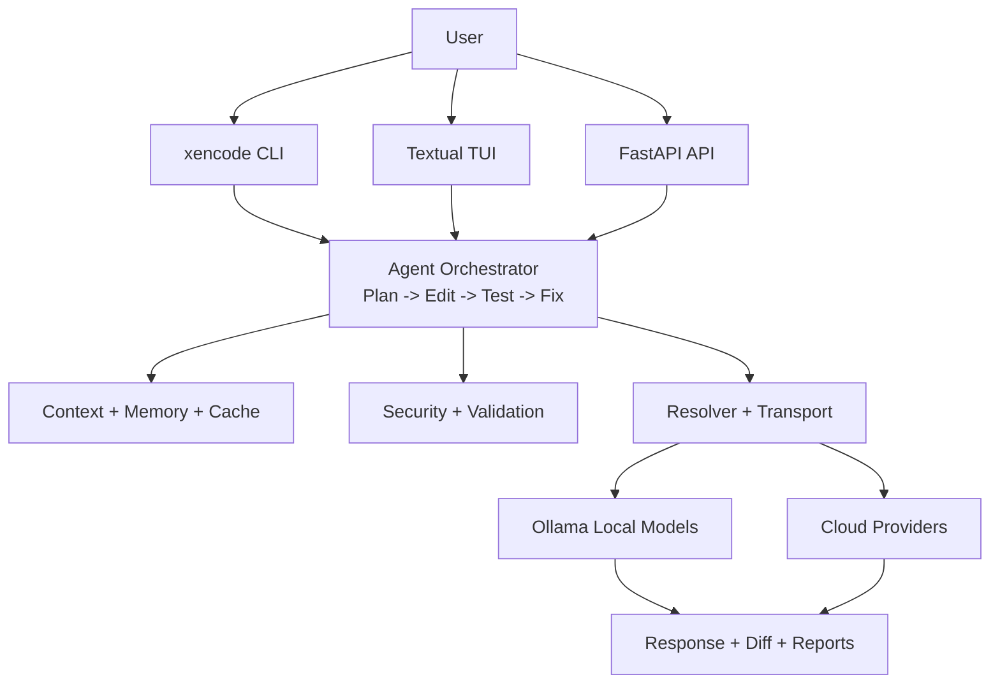
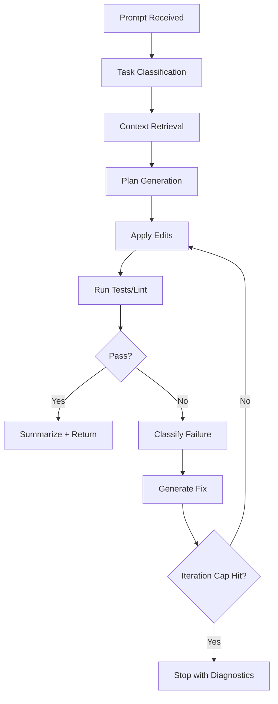

# Xencode - AI-Powered Development Platform

Xencode is an offline-first AI development assistant platform for serious engineering workflows. It combines local/cloud model routing, agentic execution loops, deep terminal/TUI ergonomics, analytics, and production-oriented deployment patterns.

## Table of Contents

- [Why Xencode](#why-xencode)
- [Current Status](#current-status-feb-2026)
- [Core Capabilities](#core-capabilities)
- [Architecture](#architecture)
- [Install](#install)
- [Quick Start (5 minutes)](#quick-start-5-minutes)
- [Command Reference](#command-reference)
- [Configuration & Model Routing](#configuration--model-routing)
- [Testing & Quality](#testing--quality)
- [Deployment](#deployment)
- [Documentation Map](#documentation-map)
- [Troubleshooting](#troubleshooting)
- [Security Notes](#security-notes)
- [Roadmap](#roadmap)
- [Contributing](#contributing)
- [License](#license)

## Why Xencode

- **Offline-first by design** with Ollama support and cloud fallback pathways.
- **Agentic coding loop** supports plan → edit → test → fix with bounded retries.
- **Developer workflow acceleration** via git automation, diff previews, and replay.
- **Operational maturity** through analytics, monitoring, API routers, and deployment assets.
- **Extensible platform** via feature flags and plugin lifecycle management.

## Current Status (Feb 2026)

- ✅ **Milestone A complete**: Reliability hardening (transport retries, diagnostics, model lock, vault, smoke gate)
- ✅ **Milestone B complete**: Agentic MVP stability (workflow loop, auto-fix suggestions, hotkeys, voice MVP)
- ✅ **Milestone C complete**: Deep dev workflow (git automation, diff panel, replay, NL terminal safety)
- 🚧 **Active backlog**: Phase 3+ intelligence, fallback governance, multimodal UX, secure team mode

Roadmap tracking:
- [NEXT_PLAN_TASKS.md](NEXT_PLAN_TASKS.md)
- [NEXT_PLAN.md](NEXT_PLAN.md)

## Core Capabilities

### AI + Agentic
- Multi-model ensemble methods: vote, weighted, consensus, hybrid.
- Agentic orchestrator loop for multi-step coding tasks.
- Error classification and targeted fix suggestions.
- Session export/replay for reproducible execution history.

### Developer Experience
- Textual-based TUI with settings, options, and theme controls.
- Command assistance and terminal-safe generation workflows.
- Side-by-side diff inspection and hunk-level review flows.
- Feature/plugin architecture for modular growth.

### Reliability + Ops
- Hybrid cache (memory + disk) with compression and eviction.
- Structured provider transport with retries/timeouts.
- Monitoring/analytics/reporting support across subsystems.
- API service surfaces for analytics, monitoring, documents, code analysis, workspace, and plugins.

## Architecture

Xencode is organized as layered runtime + service subsystems:
- **Interface layer**: CLI, TUI, API entry points
- **Orchestration layer**: agentic workflows and tool execution
- **Policy layer**: validation, safety, routing, model/provider policy
- **Execution layer**: local/cloud model providers, ensemble and inference logic
- **Data layer**: context/memory/cache/vector stores + persistence
- **Observability layer**: monitoring, analytics, reporting

### High-level Routing Diagram



### Agentic Flow Diagram



For expanded connectivity and deployment diagrams, see [project details.md](project%20details.md).

## Install

### Option A: Python package

```bash
pip install xencode
```

### Option B: npm wrapper

```bash
npm install -g github:sreevarshan-xenoz/xencode
```

Requirements:
- Node.js 18+
- Python 3.8+ in `PATH`

### Option C: Source setup (recommended for contributors)

```bash
git clone https://github.com/sreevarshan-xenoz/xencode
cd xencode
pip install -e .
pip install -r requirements.txt
```

## Quick Start (5 minutes)

```bash
# 1) Verify CLI
xencode --help

# 2) Start TUI (default app experience)
xencode

# 3) Run a quick query
xencode query "Explain clean architecture briefly"

# 4) Start an agentic coding session
xencode agentic --model qwen3:4b

# 5) Check local model availability
xencode ollama list --refresh
```

TUI productivity shortcuts:
- `Ctrl+,` opens settings
- `Ctrl+O` opens options panel

## Command Reference

| Area | Command | Purpose |
|---|---|---|
| General | `xencode` | Launch default TUI experience |
| General | `xencode version` | Show installed version |
| System | `xencode status` | Show runtime status summary |
| System | `xencode health` | Run health checks |
| Query | `xencode query "..."` | Run ensemble query |
| Agentic | `xencode agentic` | Start interactive agentic session |
| Ollama | `xencode ollama list --refresh` | Refresh/list local models |
| Ollama | `xencode ollama pull <model>` | Pull model from registry |
| Ollama | `xencode ollama benchmark <model>` | Benchmark model performance |

For a fuller command guide, see [CLI_GUIDE.md](CLI_GUIDE.md).

## Configuration & Model Routing

- Supports multi-format config patterns (YAML/TOML/JSON/INI style ecosystems in project).
- Routing supports local-first + cloud pathways with retry/fallback transport policy.
- Model/provider behavior is designed to be policy-driven (including lock/override patterns in provider resolver modules).
- Security-first handling includes validation and credential vault-backed secret storage paths.

See:
- [docs/INSTALL_MANUAL.md](docs/INSTALL_MANUAL.md)
- [docs/api_documentation.md](docs/api_documentation.md)
- [project details.md](project%20details.md)

## Testing & Quality

Run from repository root:

```bash
pytest
```

Common quality checks:

```bash
ruff check .
black --check .
mypy xencode
```

Test areas currently include:
- `tests/agentic`
- `tests/auth`
- `tests/features`
- `tests/model_providers`
- `tests/tui`

## Deployment

Xencode includes deployment assets for local, containerized, and orchestrated environments:
- Docker + Compose definitions for multi-service environments
- Kubernetes manifests in `k8s/`
- Monitoring stack assets in `monitoring/`

See:
- [Dockerfile](Dockerfile)
- [docker-compose.yml](docker-compose.yml)
- [k8s/deployment.yaml](k8s/deployment.yaml)

## Documentation Map

- Product and architecture:
  - [project details.md](project%20details.md)
  - [docs/ROADMAP.md](docs/ROADMAP.md)
- User/developer docs:
  - [docs/USER_MANUAL.md](docs/USER_MANUAL.md)
  - [docs/INSTALL_MANUAL.md](docs/INSTALL_MANUAL.md)
  - [docs/ARCHITECTURE_DIAGRAMS.md](docs/ARCHITECTURE_DIAGRAMS.md)
  - [DOCUMENTATION.md](DOCUMENTATION.md)
- Planning and execution:
  - [NEXT_PLAN.md](NEXT_PLAN.md)
  - [NEXT_PLAN_TASKS.md](NEXT_PLAN_TASKS.md)

## Troubleshooting

### Ollama/model issues
- Ensure Ollama is running and reachable from your machine.
- Refresh model list with `xencode ollama list --refresh`.
- Pull a small model first to validate runtime path.

### Slow responses
- Use smaller/faster local models for lower latency.
- Check system status with `xencode status` and `xencode health`.

### Startup or environment issues
- Confirm Python and package versions meet minimum requirements.
- Reinstall in editable mode for local development consistency.

## Security Notes

- Treat API keys and tokens as secrets; avoid storing plaintext credentials in tracked files.
- Review security scanning and auth-related modules before production deployment.
- Use environment-specific secrets management and least-privilege access.

## Roadmap

Near-term direction focuses on:
- Repo-wide context indexing + routing intelligence
- Smart fallback policy governance + provider health UX
- Multimodal inputs and secure team workflows

Track progress in:
- [NEXT_PLAN_TASKS.md](NEXT_PLAN_TASKS.md)

## Contributing

Contributions are welcome. For development context and standards, start with:
- [docs/INSTALL_MANUAL.md](docs/INSTALL_MANUAL.md)
- [docs/terminal_integration_tests.md](docs/terminal_integration_tests.md)

## License

This project is licensed under the MIT License. See [LICENSE](LICENSE).