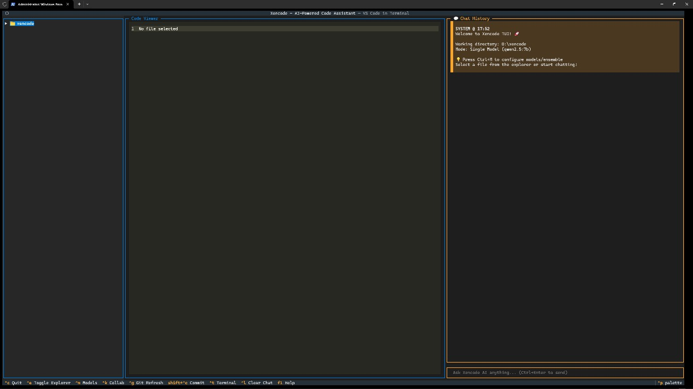
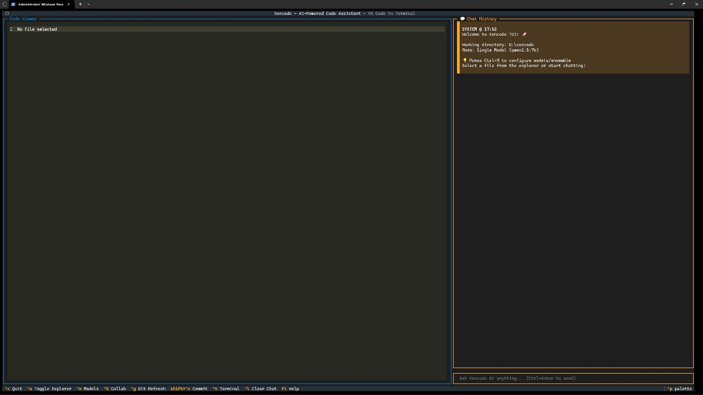
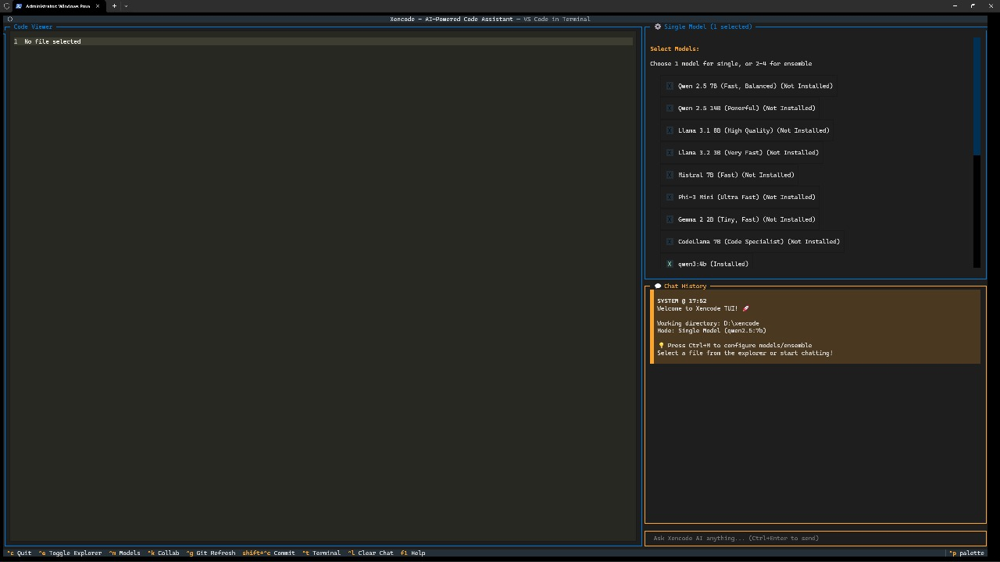
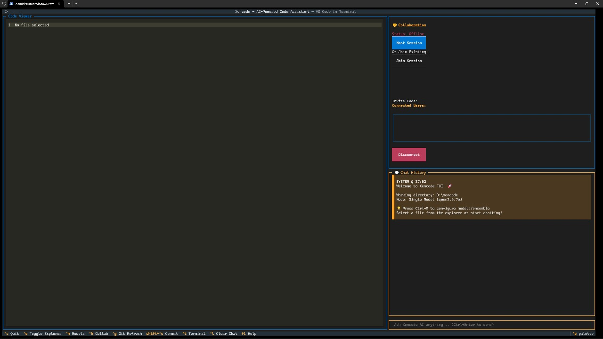
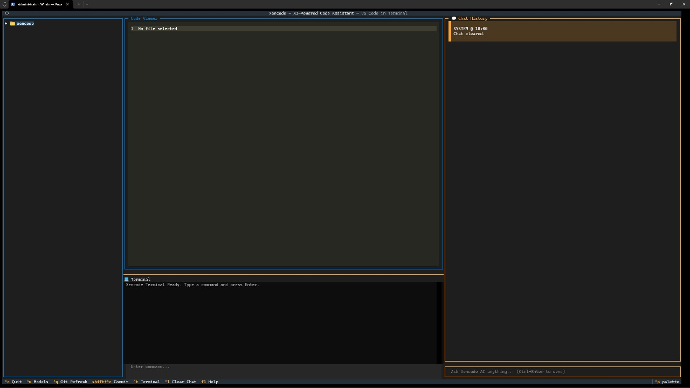
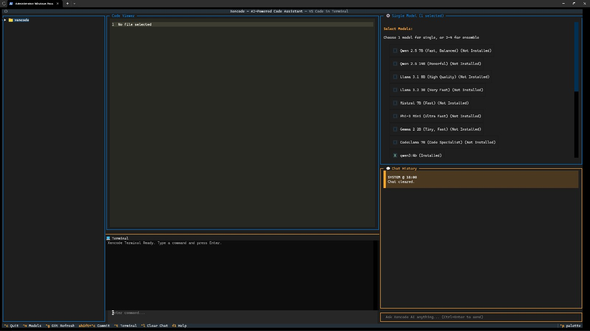
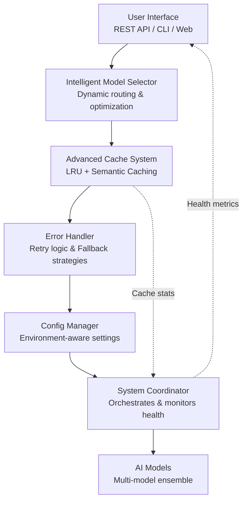

<div align="center">

# Xencode

**AI-Powered Development Assistant Platform**

[](LICENSE)
[](https://www.python.org/downloads/)

[Quick Start](#installation) • [Documentation](#architecture) • [Contributing](#contributing)

</div>

---

## Overview

Xencode is an AI-powered development assistant platform that integrates with local language models through Ollama. It provides intelligent code analysis, document processing, and workspace collaboration features with a focus on privacy and offline operation.

## Key Features

### Core AI Capabilities
- **🤖 LangChain Agentic System** - Production-ready agent with 9 specialized tools
  - File operations (read, write, execute commands)
  - Git workflow automation (status, diff, commit, log)
  - Web search (DuckDuckGo integration)
  - Code analysis (repository scanning, Python AST analysis)
- **🧠 Multi-Agent Collaboration** - 4 specialized agents with intelligent task delegation
  - CodeAgent (codellama:7b) for programming tasks
  - ResearchAgent (mistral:7b) for web search and analysis
  - ExecutionAgent (qwen3:4b) for file/command operations
  - GeneralAgent (qwen3:4b) for general queries
- **🎯 Ensemble Learning** - Multiple models working together for better results ⭐ NEW
  - Council of Models pattern for consensus-driven reasoning  
  - Semantic voting and weighted ensemble methods
  - 25-35% accuracy improvement over single models
  - Reduced hallucinations via cross-validation
- **💾 Conversation Memory** - SQLite-backed persistent conversation history
- **🎯 Smart Model Selection** - Automatic model switching based on task type

### Platform Features
- **Intelligent Model Selection** - Automatic hardware detection and model recommendations
- **Advanced Caching** - Multi-tier caching system with LRU eviction and compression
- **Error Recovery** - Automated error handling with retry mechanisms and fallback strategies
- **Configuration Management** - Support for multiple configuration formats with hot-reload
- **Security Analysis** - Integrated security scanning with Bandit and vulnerability detection
- **Document Processing** - Support for PDF, DOCX, and web content extraction
- **Workspace Collaboration** - Real-time collaboration with CRDT-based synchronization
- **Analytics & Monitoring** - System health monitoring and performance metrics
- **Plugin System** - Extensible architecture with marketplace integration

## Screenshots

<div align="center">

<table>
<tr>
<td width="50%">

<p align="center"><b>Main Interface with Explorer</b></p>
</td>
<td width="50%">

<p align="center"><b>Clean Interface View</b></p>
</td>
</tr>
<tr>
<td width="50%">

<p align="center"><b>Intelligent Model Selection</b></p>
</td>
<td width="50%">

<p align="center"><b>Real-time Collaboration</b></p>
</td>
</tr>
<tr>
<td width="50%">

<p align="center"><b>Integrated Terminal</b></p>
</td>
<td width="50%">

<p align="center"><b>Complete Workspace View</b></p>
</td>
</tr>
</table>

</div>

## Architecture



### System Requirements

- Python 3.8 or higher
- Ollama installed and running
- 4GB+ RAM recommended
- 2GB+ free disk space

### Quick Install

```bash
git clone https://github.com/sreevarshan-xenoz/xencode.git
cd xencode
chmod +x install.sh && ./install.sh
```

### Development Setup

```bash
# Clone repository
git clone https://github.com/sreevarshan-xenoz/xencode.git
cd xencode

# Create virtual environment
python -m venv .venv
source .venv/bin/activate  # Linux/macOS
# .venv\Scripts\activate   # Windows

# Install dependencies
pip install -e .[dev,test]
```

## Usage

### Basic Commands

```bash
# Start interactive session
./xencode.sh

# Direct query
./xencode.sh "analyze this code"

# List available models
./xencode.sh --list-models

# Update models
./xencode.sh --update
```

### Agentic Mode

```bash
# Start interactive agent session
python -m xencode.agentic_cli start

# Use specific model
python -m xencode.agentic_cli start --model codellama:7b

# Multi-agent collaboration
python -c "from xencode.agentic import AgentCoordinator; coord = AgentCoordinator(); print(coord.delegate_task('your task'))"
```

### Advanced Features

```bash
# Model selection wizard
python -m xencode.intelligent_model_selector

# Configuration setup
python -m xencode.smart_config_manager --setup

# System health check
python -m xencode.phase2_coordinator --status

# Run security scan
python -m xencode.analyzers.security_analyzer
```

## Configuration

Configuration files support YAML, TOML, JSON, and INI formats. Default location: `~/.xencode/config.yaml`

```yaml
model:
  primary: "llama3.1:8b"
  fallback: ["mistral:7b", "phi3:mini"]
  
cache:
  memory_limit_mb: 512
  disk_limit_mb: 2048
  compression: true

performance:
  async_workers: 4
  timeout_seconds: 30
  retry_attempts: 3

security:
  enable_scanning: true
  scan_on_save: false
```

## Project Structure

```
xencode/
├── xencode.sh                          # Main executable
├── xencode_core.py                     # Core application logic
├── install.sh                          # Installation script
├── requirements.txt                    # Dependencies
│
├── xencode/                            # Core modules
│   ├── agentic/                       # LangChain agentic system ⭐
│   │   ├── manager.py                 # Agent manager
│   │   ├── tools.py                   # Base tools
│   │   ├── advanced_tools.py          # Git, web, code tools
│   │   ├── coordinator.py             # Multi-agent system
│   │   ├── memory.py                  # Conversation memory
│   │   └── database.py                # SQLite storage
│   ├── intelligent_model_selector.py  # Model selection engine
│   ├── advanced_cache_system.py       # Caching infrastructure
│   ├── smart_config_manager.py        # Configuration management
│   ├── advanced_error_handler.py      # Error handling
│   ├── phase2_coordinator.py          # System coordination
│   ├── tui/widgets/agent_panel.py     # Agent TUI interface
│   ├── analyzers/                     # Code analysis modules
│   ├── processors/                    # Document processors
│   ├── workspace/                     # Collaboration features
│   ├── auth/                          # Authentication & authorization
│   ├── analytics/                     # Analytics engine
│   └── plugins/                       # Plugin system
│
├── tests/                             # Test suite
│   ├── test_phase2_comprehensive.py
│   └── integration/
│
└── docs/                              # Documentation
    ├── PLAN.md
    └── CLI_GUIDE.md
```

## Core Components

### LangChain Agentic System ⭐ NEW
- **9 Specialized Tools** across 4 categories
  - File operations (read, write, execute)
  - Git automation (status, diff, commit, log)
  - Web search (DuckDuckGo)
  - Code analysis (AST parsing, repository scanning)
- **Multi-Agent Collaboration** with 4 specialized agents
  - Automatic task classification and routing
  - Intelligent agent delegation
  - Collaborative task breakdown
- **Conversation Memory** with SQLite persistence
  - Full conversation history tracking
  - Context window management (up to 8192 tokens)
  - Tool usage analytics
- **Smart Model Selection** integrated with existing model manager
  - Dynamic model switching based on task type
  - Performance tracking per model
- **TUI Integration** with interactive agent panel
  - Real-time agent status display
  - Tool usage logging
  - Interactive task submission

### Intelligent Model Selection
- Hardware profiling (CPU, RAM, GPU detection)
- Model recommendation based on system capabilities
- Performance benchmarking and scoring
- Interactive deployment wizard

### Advanced Caching
- Multi-tier caching (memory + SQLite)
- LZMA compression for storage efficiency
- LRU eviction policies
- Cache analytics and optimization

### Error Management
- Comprehensive error classification
- Automated recovery with exponential backoff
- Context-aware diagnostic messages
- Fallback strategies for model failures

### Configuration Management
- Multi-format support (YAML, TOML, JSON, INI)
- Environment variable overrides
- Schema validation with Pydantic
- Hot-reload without service restart

### Security Analysis
- Bandit integration for Python security scanning
- CVE database matching
- OWASP Top 10 vulnerability detection
- Multi-language support

### Document Processing
- PDF text extraction
- DOCX document parsing
- Web content extraction
- Text processing and analysis

### Workspace Collaboration
- Real-time synchronization with CRDTs
- Multi-user workspace support
- Permission management
- Audit logging

## Testing

```bash
# Run all tests
python -m pytest -v

# Run specific test suite
python -m pytest test_phase2_comprehensive.py -v

# Run with coverage
python -m pytest --cov=xencode --cov-report=html

# Performance benchmarks
python -m xencode.intelligent_model_selector --benchmark
```

## Development Roadmap

### Phase 3: Advanced Features (In Progress)
- Enhanced plugin architecture with marketplace
- Advanced analytics dashboard
- Multi-modal support (vision, voice)
- Extended collaboration features

### Phase 4: Distribution & Deployment
- Docker containerization
- Kubernetes deployment configs
- Package distribution (PyPI, Homebrew)
- CI/CD pipeline improvements

### Phase 5: Multi-Modal Integration
- Image analysis and OCR
- Voice integration
- Video processing capabilities

### Phase 6: Intelligence & Automation
- Advanced code refactoring
- Automated testing generation
- Intelligent code completion

## Contributing

Contributions are welcome! Please follow these guidelines:

1. Fork the repository
2. Create a feature branch (`git checkout -b feature/your-feature`)
3. Commit your changes (`git commit -am 'Add new feature'`)
4. Push to the branch (`git push origin feature/your-feature`)
5. Open a Pull Request

### Development Guidelines

- Follow PEP 8 style guidelines
- Add type hints to all functions
- Write tests for new features
- Update documentation as needed
- Run linters before committing:
  ```bash
  python -m ruff check . --fix
  python -m mypy xencode/
  ```

## License

This project is licensed under the MIT License. See [LICENSE](LICENSE) for details.

## Acknowledgments

Built with these excellent open-source projects:

- [Ollama](https://ollama.ai/) - Local LLM runtime
- [Rich](https://github.com/Textualize/rich) - Terminal UI framework
- [Pydantic](https://pydantic-docs.helpmanual.io/) - Data validation
- [pytest](https://pytest.org/) - Testing framework
- [Bandit](https://bandit.readthedocs.io/) - Security analysis

## Support

- Documentation: [docs/](docs/)
- Issues: [GitHub Issues](https://github.com/sreevarshan-xenoz/xencode/issues)
- Discussions: [GitHub Discussions](https://github.com/sreevarshan-xenoz/xencode/discussions)

---

<div align="center">

**Built with ❤️ for developers who value privacy and performance**

</div>
