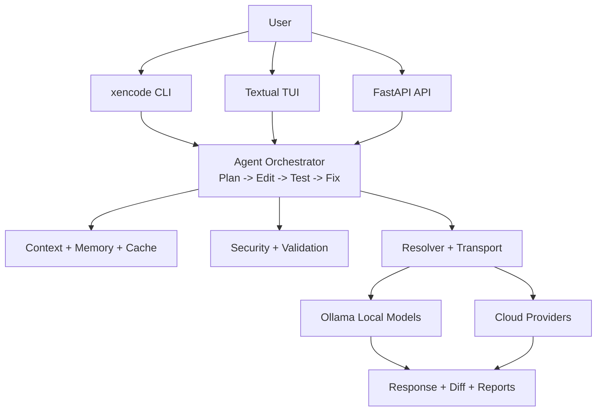
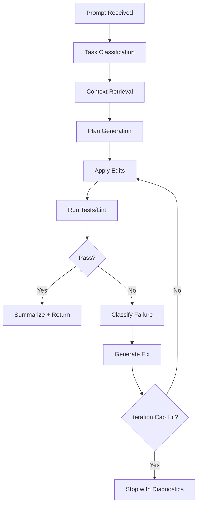

# Xencode - AI-Powered Development Platform

Xencode is an offline-first AI development assistant platform for serious engineering workflows. It combines local/cloud model routing, agentic execution loops, deep terminal/TUI ergonomics, analytics, and production-oriented deployment patterns.

## Table of Contents

- [Why Xencode](#why-xencode)
- [Current Status](#current-status-feb-2026)
- [Core Capabilities](#core-capabilities)
- [Architecture](#architecture)
- [Install](#install)
- [Quick Start (5 minutes)](#quick-start-5-minutes)
- [Command Reference](#command-reference)
- [Configuration & Model Routing](#configuration--model-routing)
- [Testing & Quality](#testing--quality)
- [Deployment](#deployment)
- [Documentation Map](#documentation-map)
- [Troubleshooting](#troubleshooting)
- [Security Notes](#security-notes)
- [Roadmap](#roadmap)
- [Contributing](#contributing)
- [License](#license)

## Why Xencode

- **Offline-first by design** with Ollama support and cloud fallback pathways.
- **Agentic coding loop** supports plan → edit → test → fix with bounded retries.
- **Developer workflow acceleration** via git automation, diff previews, and replay.
- **Operational maturity** through analytics, monitoring, API routers, and deployment assets.
- **Extensible platform** via feature flags and plugin lifecycle management.

## Current Status (September 2026)

### Rust Migration & Multi-Provider Architecture Complete ✅

The full Rust migration and multi-provider architecture is complete — **12 crates, 176 tests passing, zero warnings.**

| Phase | What | Status |
|-------|------|--------|
| 0–4 | Core lib, CLI, Multi-Provider Routing (Ollama, Anthropic, Gemini, Qwen, OpenRouter), Ratatui TUI | ✅ Complete |
| 5 | Code Analysis, Security Scanner, RAG Indexer & Vector Store | ✅ Complete |
| 6 | HTTP/WebSocket Server, Collaboration CRDT & Sync Coordinator | ✅ Complete |
| 7 | Plugin System (trait, manifest, host, registry) | ✅ Complete |
| 8 | Release scripts, smoke tests, parity benchmarks | ✅ Complete |

- ✅ **12 Rust crates** — workspace scan, config, cache, memory, models, providers (with exponential retry middleware & non-destructive streaming), TUI, CLI, analysis, server, collaboration, plugin
- ✅ **Rust binary** as primary entry point (`xencode`) — single-file, zero external Python runtime requirement
- ✅ **17 interactive TUI feature panels & overlays** — ByteBot Agent, Collaboration Hub, Voice Interface, Security Auditor, Performance Profiler, Custom Models, Learning Mode, Multi-Language, Git Commit, Provider Health, Project Analyzer, Model Selector, Settings, and more
- ✅ **Secure & Verified Authentication** — Encrypted credential vault, SQLite user store, refresh token rotation, email verification flow
- ✅ **Release build scripts & CI** — Windows (`build-release.ps1`), Linux/macOS (`smoke-test.sh`), and GitHub Actions CI/CD workflows
- ✅ **Python stack** maintained for backward compatibility, advanced agentic orchestration, and plugin development

## Core Capabilities

### AI + Agentic
- Multi-model ensemble methods: vote, weighted, consensus, hybrid.
- Streaming retry middleware with token-delivery tracking (zero duplicate tokens on retry).
- Agentic orchestrator loop for multi-step coding tasks with bounded retries.
- Error classification and targeted fix suggestions.
- Session export/replay for reproducible execution history.

### Developer Experience
- **Rust ratatui TUI** (primary) — 17 interactive feature panels and overlays (ByteBot, Collaboration, Voice, Security, Profiler, Git Commit, Provider Health, etc.).
- **Python Textual TUI** (legacy) — 31 widget panels with settings, options, and theme controls.
- Command assistance and terminal-safe generation workflows.
- Side-by-side diff inspection and hunk-level review flows.
- Feature/plugin architecture for modular growth.
- Rich CLI with `server`, `analyze`, and `plugin` subcommands.

### Reliability + Ops
- Hybrid cache (memory + disk) with compression and eviction.
- Structured provider transport with retries/timeouts.
- Monitoring/analytics/reporting support across subsystems.
- API service surfaces for analytics, monitoring, documents, code analysis, workspace, and plugins.

## Architecture

Xencode is organized as layered runtime + service subsystems:
- **Interface layer**: CLI, TUI, API entry points
- **Orchestration layer**: agentic workflows and tool execution
- **Policy layer**: validation, safety, routing, model/provider policy
- **Execution layer**: local/cloud model providers, ensemble and inference logic
- **Data layer**: context/memory/cache/vector stores + persistence
- **Observability layer**: monitoring, analytics, reporting

### High-level Routing Diagram


```mermaid
flowchart TD
    U[User]
    CLI[xencode CLI]
    TUI[Textual TUI]
    API[FastAPI API]

    ORCH[Agent Orchestrator\nPlan -> Edit -> Test -> Fix]
    CTX[Context + Memory + Cache]
    SAFE[Security + Validation]
    RES[Resolver + Transport]
    LOCAL[Ollama Local Models]
    CLOUD[Cloud Providers]
    OUT[Response + Diff + Reports]

    U --> CLI
    U --> TUI
    U --> API

    CLI --> ORCH
    TUI --> ORCH
    API --> ORCH

    ORCH --> CTX
    ORCH --> SAFE
    ORCH --> RES
    RES --> LOCAL
    RES --> CLOUD
    LOCAL --> OUT
    CLOUD --> OUT
```

### Agentic Flow Diagram


```mermaid
flowchart TD
    A[Prompt Received] --> B[Task Classification]
    B --> C[Context Retrieval]
    C --> D[Plan Generation]
    D --> E[Apply Edits]
    E --> F[Run Tests/Lint]
    F --> G{Pass?}
    G -- Yes --> H[Summarize + Return]
    G -- No --> I[Classify Failure]
    I --> J[Generate Fix]
    J --> K{Iteration Cap Hit?}
    K -- No --> E
    K -- Yes --> L[Stop with Diagnostics]
```

For expanded connectivity and deployment diagrams, see [project details.md](project%20details.md).

## Install

### Option A: Rust binary (recommended — fastest, no dependencies)

```bash
# Build from source (requires Rust toolchain)
cd rust && cargo build --release -p xencode-cli
./target/release/xencode --help

# Or download a prebuilt binary from GitHub Releases
```

Requirements:
- Rust 1.75+ (for building from source)
- Ollama (for local AI models)

### Option B: Python package

```bash
pip install xencode
```

Requirements:
- Python 3.8+
- Ollama (for local AI models)

### Option C: Source setup (recommended for contributors)

```bash
git clone https://github.com/sreevarshan-xenoz/xencode
cd xencode
pip install -e .
pip install -r requirements.txt

# Optional: build Rust binary too
cd rust && cargo build --release -p xencode-cli
```

## Quick Start (5 minutes)

```bash
# 1) Verify CLI (Rust binary)
xencode --help

# 2) Start TUI (default app experience)
xencode tui

# 3) Run a quick query
xencode query "Explain clean architecture briefly"

# 4) Analyze code for issues and vulnerabilities
xencode analyze src/

# 5) Start the collaboration server
xencode server --port 8765

# 6) Manage plugins
xencode plugin list
xencode plugin install ./my-plugin/

# 7) Check local model availability
xencode models list
```

TUI productivity shortcuts:
- `Tab` cycle panels, `Esc` close overlay, `Ctrl+F` open Feature Navigator
- 14 interactive panels: ByteBot, Collaboration Hub, Voice Interface, Security Auditor, etc.

## Command Reference

| Area | Command | Purpose |
|---|---|---|
| General | `xencode` | Launch Rust TUI (default experience) |
| General | `xencode --version` | Show installed version |
| System | `xencode status` | Show runtime status summary |
| System | `xencode health` | Run health checks |
| Query | `xencode query "..."` | Run ensemble query |
| Scan | `xencode scan . --max-depth 2` | Scan workspace |
| Config | `xencode config show` | Show runtime config |
| Models | `xencode models list` | List available models with health |
| Memory | `xencode memory list` | List conversation sessions |
| Cache | `xencode cache stats` | Show cache statistics |
| **Server** | `xencode server --port 8765` | Start collaboration HTTP/WebSocket server |
| **Analyze** | `xencode analyze <path>` | Code analysis + security vulnerability scan |
| **Plugin** | `xencode plugin list` | List installed plugins |
| **Plugin** | `xencode plugin install <path>` | Install a plugin |
| **Plugin** | `xencode plugin remove <name>` | Remove a plugin |
| Ollama | `xencode models list` | List/refresh local models |
| Vault | `xencode vault init` | Initialize encrypted credential vault |
| Vault | `xencode vault migrate` | Migrate plaintext API keys into the vault |
| Vault | `xencode vault status` | Show vault path, credential count, encryption |
| Vault | `xencode vault monitor` | Watch vault health via WebSocket (Python) |

For the Rust binary command reference, run `xencode --help`. For Python CLI, run `python xencode_cli.py --help`.

## Configuration & Model Routing

- Supports multi-format config patterns (YAML/TOML/JSON/INI style ecosystems in project).
- Routing supports local-first + cloud pathways with retry/fallback transport policy.
- Model/provider behavior is designed to be policy-driven (including lock/override patterns in provider resolver modules).
- Security-first handling includes validation and credential vault-backed secret storage paths.

See:
- [docs/INSTALL_MANUAL.md](docs/INSTALL_MANUAL.md)
- [docs/api_documentation.md](docs/api_documentation.md)
- [project details.md](project%20details.md)

## Testing & Quality

### Rust (primary)
```bash
cd rust && cargo test           # Run all 176+ Rust tests across 12 crates
cargo test -p xencode-analysis-rs  # Single crate
cargo test -p xencode-tui-rs       # TUI widgets and panels
cargo test -p xencode-server-rs    # Axum HTTP/WS server & auth
```

### Python (legacy)
```bash
pytest                         # Run Python test suite
ruff check .                   # Lint
black --check .                # Format check
mypy xencode                   # Type check
```

Key test areas:
- Rust: 176+ tests passing across 12 crates (workspace, config, cache, memory, models, providers, TUI, CLI, analysis, server, collaboration, plugin)
- Python: 60+ test files across agentic, auth, features, model_providers, TUI widgets

## Deployment

Xencode includes deployment assets for local, containerized, and orchestrated environments:
- Docker + Compose definitions for multi-service environments
- Kubernetes manifests in `k8s/`
- Monitoring stack assets in `monitoring/`

See:
- [Dockerfile](Dockerfile)
- [docker-compose.yml](docker-compose.yml)
- [k8s/deployment.yaml](k8s/deployment.yaml)

## Documentation Map

- Product and architecture:
  - [project details.md](project%20details.md)
  - [docs/ROADMAP.md](docs/ROADMAP.md)
  - [docs/RUST_MIGRATION_STATUS.md](docs/RUST_MIGRATION_STATUS.md)
  - [docs/RUST_MIGRATION_PLAN.md](docs/RUST_MIGRATION_PLAN.md)
- User/developer docs:
  - [docs/USER_MANUAL.md](docs/USER_MANUAL.md)
  - [docs/INSTALL_MANUAL.md](docs/INSTALL_MANUAL.md)
  - [docs/ARCHITECTURE_DIAGRAMS.md](docs/ARCHITECTURE_DIAGRAMS.md)
  - [DOCUMENTATION.md](DOCUMENTATION.md)
- Feature documentation:
  - [docs/FEATURES.md](docs/FEATURES.md)
  - [docs/api_documentation.md](docs/api_documentation.md)
  - [docs/enhanced_security_scanning.md](docs/enhanced_security_scanning.md)

## Troubleshooting

### Ollama/model issues
- Ensure Ollama is running and reachable from your machine.
- Refresh model list with `xencode ollama list --refresh`.
- Pull a small model first to validate runtime path.

### Slow responses
- Use smaller/faster local models for lower latency.
- Check system status with `xencode status` and `xencode health`.

### Startup or environment issues
- Confirm Python and package versions meet minimum requirements.
- Reinstall in editable mode for local development consistency.

## Security Notes

- Use `xencode vault init` to create an encrypted credential vault for storing API keys and secrets.
- Use `xencode vault migrate` to scan your config file for plaintext keys and move them into the vault.
- Use `xencode vault status` to inspect the vault path, credential count, and encryption status.
- Treat API keys and tokens as secrets; avoid storing plaintext credentials in tracked files or config files.
- Review security scanning and auth-related modules before production deployment.
- Use environment-specific secrets management and least-privilege access.

## Roadmap

### ✅ Rust migration complete — all 8 phases shipped

Near-term direction:
- Repo-wide context indexing + routing intelligence
- Smart fallback policy governance + provider health UX
- Multimodal inputs and secure team workflows

Track progress in:
- [docs/ROADMAP.md](docs/ROADMAP.md)
- [docs/RUST_MIGRATION_STATUS.md](docs/RUST_MIGRATION_STATUS.md)

## Contributing

Contributions are welcome. For development context and standards, start with:
- [docs/INSTALL_MANUAL.md](docs/INSTALL_MANUAL.md)
- [docs/terminal_integration_tests.md](docs/terminal_integration_tests.md)

## License

This project is licensed under the MIT License. See [LICENSE](LICENSE).