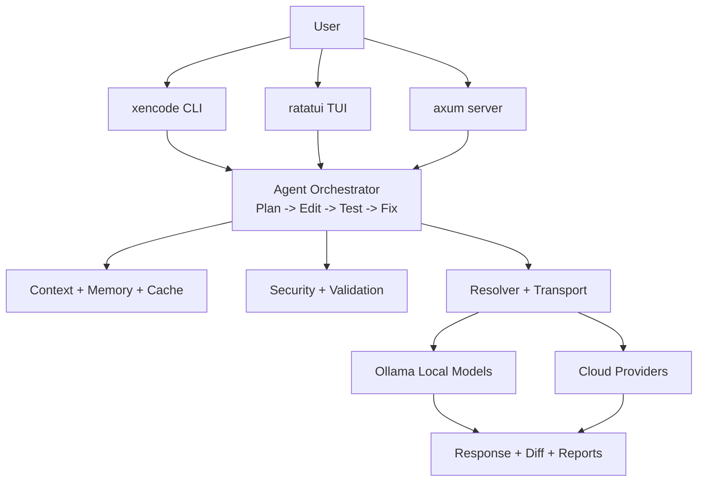
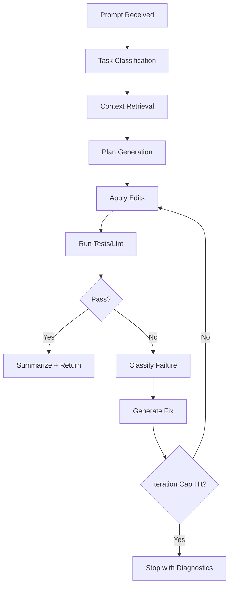

<p align="center">
  
</p>

<div align="center">

# Xencode

**The offline-first AI development assistant platform.**

A Rust-first, dual-stack AI coding platform that routes requests across local
and cloud models with zero-latency ensemble reasoning, agentic
`plan → edit → test → fix` loops, and deep terminal ergonomics.

[](https://github.com/sreevarshan-xenoz/xencode/actions)
[](#option-a-rust-binary-recommended)
[](https://github.com/sreevarshan-xenoz/xencode/releases)
[](LICENSE)
[](CONTRIBUTING.md)

**Offline by default. Online when you choose.** Your code never has to leave your machine.

</div>

---

Xencode is an AI-powered development assistant built for engineers who care
about privacy, control, and speed. It runs local models through [Ollama](https://ollama.ai)
out of the box, falls back to cloud providers (Anthropic, Gemini, Qwen, OpenRouter)
when you want them, and combines multiple models through ensemble reasoning to
get you better answers than any single model alone.

At its core is a fast, single-file **Rust** binary (13 crates, 499 tests,
zero warnings) wrapped around an agentic coding loop that can plan, edit, test,
and fix your code — driven entirely from your terminal.

---

## ✨ Highlights

- **🧠 Offline-first AI** — local Ollama models by default; cloud fallback only when you opt in.
- **🤖 Agentic coding loop** — bounded `plan → edit → test → fix` cycles with error classification and targeted fixes.
- **⚖️ Ensemble reasoning** — combine multiple models via vote, weighted, consensus, or hybrid strategies.
- **🖥️ Immersive TUI** — a modern Rust/ratatui interface (23 panels): agent, collaboration, audit, profiler, git, models, and more.
- **🔒 Secure by design** — token-authenticated collaboration server and OWASP-based security scanning.
- **🔌 Extensible platform** — plugin trait system, feature flags, and lifecycle management.
- **🛰️ Built for teams** — HTTP/WebSocket collaboration server with CRDT sync, plus Docker, Compose, and Kubernetes assets.
- **🐎 Performance first** — zero duplicate tokens on retry (token-delivery tracking), hybrid memory+disk cache, streaming with exponential backoff.

---

## 🧠 Why Xencode?

| Problem | Xencode |
| --- | --- |
| **Privacy** | Fully offline by default. Code, context, and models stay local. |
| **Lock-in** | Bring your own models — Ollama, Anthropic, Gemini, Qwen, OpenRouter, OpenAI, Hugging Face. |
| **Single-model blind spots** | Ensemble reasoning and multi-model voting produce more reliable answers. |
| **Context loss** | Persistent conversation memory, hybrid cache, and RAG-indexed workspace context. |
| **Slow terminal tools** | Native Rust core for a snappy, instantly responsive TUI/CLI. |

---

## 📸 Screenshots

Interactive TUI panels and workflows live in the [`images/`](images/) directory:

<p align="center">
  
  
  
</p>

---

## 📋 Table of Contents

- [Features](#-features)
- [Installation](#-installation)
- [Quick Start](#-quick-start)
- [Usage](#-usage)
- [Command Reference](#-command-reference)
- [Architecture](#-architecture)
- [Configuration & Model Routing](#-configuration--model-routing)
- [Testing & Quality](#-testing--quality)
- [Deployment](#-deployment)
- [Repository Structure](#-repository-structure)
- [Documentation](#-documentation)
- [Troubleshooting](#-troubleshooting)
- [Security](#-security)
- [Roadmap](#-roadmap)
- [Contributing](#-contributing)
- [License](#-license)

---

## ✨ Features

### AI + Agentic
- Local-first model routing through Ollama with cloud fallback (Anthropic, Gemini, Qwen, OpenRouter, OpenAI, Hugging Face).
- Multi-model **ensemble methods**: vote, weighted, consensus, hybrid.
- **Agentic orchestrator** for multi-step coding tasks with bounded retries.
- **Zero-duplicate-token** streaming retry middleware with token-delivery tracking.
- Error classification and targeted fix suggestions.
- Session export/replay for reproducible execution history.

### Developer Experience
- **Rust ratatui TUI** (primary) — 23 interactive panels and overlays: ByteBot agent, collaboration hub, voice interface, security auditor, performance profiler, git commit, provider health, model selector, and more.
- Code analysis with language-aware AST parsing (Python, JavaScript/TypeScript, Rust).
- Side-by-side diff inspection and hunk-level review flows.
- Rich CLI with `server`, `analyze`, and `plugin` subcommands.

### Reliability + Ops
- Hybrid cache (memory + disk) with compression and eviction.
- Structured provider transport with retries, timeouts, and health checks.
- Monitoring, analytics, and reporting across subsystems.
- API service surfaces for analytics, monitoring, documents, code analysis, workspace, and plugins.

---

## 📥 Installation

### Prerequisites
| Requirement | Used for | Get it |
| --- | --- | --- |
| **Ollama** | Local AI models (required) | [ollama.ai](https://ollama.ai/download) |
| **Rust 1.75+** | Building the binary | [rustup.rs](https://rustup.rs) |

### Option A: Rust binary (recommended)

A single-file executable with no runtime dependencies — the fastest, cleanest path.

```bash
git clone https://github.com/sreevarshan-xenoz/xencode
cd xencode/rust
cargo build --release -p xencode-cli

# Linux/macOS
cp target/release/xencode /usr/local/bin/xencode
# Windows
copy target\release\xencode.exe C:\Windows\System32\xencode.exe

xencode --help
```

### Option B: One-liner installers

The repository ships cross-platform installer scripts — [`install.sh`](install.sh) (Linux/macOS) and [`install.ps1`](install.ps1) (Windows). Download the script and run it, or review it first and execute locally:

```bash
# Linux/macOS
./install.sh
# Windows (PowerShell)
.\install.ps1
```

> ✨ Tip: pull a small model first so you can validate the whole path:
> `ollama pull qwen3:4b`

---

## 🚀 Quick Start

```bash
# 1) Verify the CLI
xencode --help

# 2) Check your local model health
xencode models list

# 3) Launch the immersive terminal UI (the default experience)
xencode tui

# 4) Run a quick query without leaving your shell
xencode query "Explain clean architecture briefly"

# 5) Analyze code for issues and vulnerabilities
xencode analyze src/

# 6) Collaborate with your team
xencode server --port 8765

# 7) Extend Xencode with plugins
xencode plugin list
```

**TUI shortcuts:** `Tab` cycles panels · `?` opens the keybinding help overlay · `Ctrl+F` opens the Feature Navigator.

---

## ⚙️ Usage

```bash
xencode                          # Launch the Rust TUI (default experience)
xencode query "explain async"    # One-shot query without leaving your shell
xencode analyze ./src            # Code analysis + image inventory
xencode models list              # Model health
xencode --version                # Show version
```

### In-chat commands

```
/help       Show all commands       /model <name>  Switch model
/models     Show available models   /project    Show project context
/status     System status           /clear      Clear conversation
/exit       Leave chat mode
```

---

## 📚 Command Reference

| Area | Command | Purpose |
| --- | --- | --- |
| **General** | `xencode` | Launch Rust TUI (default experience) |
| **General** | `xencode --version` | Show installed version |
| **Query** | `xencode query "…"` | Run a one-shot query |
| **Scan** | `xencode scan . --max-depth 2` | Scan workspace |
| **Config** | `xencode config show` | Show runtime config |
| **Models** | `xencode models list` | List available models with health |
| **Memory** | `xencode memory list` | List conversation sessions |
| **Tasks** | `xencode tasks list` | File-backed background tasks (start/poll/stop/rm) |
| **Worktree** | `xencode worktree list` | List/add/remove git worktrees |
| **Cache** | `xencode cache stats` | Show cache statistics |
| **Server** | `xencode server --port 8765` | Start collaboration HTTP/WebSocket server |
| **Analyze** | `xencode analyze <path>` | Code analysis + security scan + image inventory |
| **Fetch** | `xencode fetch <url>` | Web extraction to research-ready text |
| **Review** | `xencode review [--base main]` | PR-level diff triage with per-file analysis |
| **LlamaCpp** | `xencode llamacpp status` | Local llama-server status and timings |
| **Plugin** | `xencode plugin list` | List installed plugins |
| **Plugin** | `xencode plugin install <path>` | Install a plugin |
| **Plugin** | `xencode plugin remove <name>` | Remove a plugin |

> For the full CLI reference run `xencode --help`.

---

## 🏗️ Architecture

Xencode is organized as a layered runtime:

- **Interface layer** — CLI, TUI, API entry points
- **Orchestration layer** — agentic workflows and tool execution
- **Policy layer** — validation, safety, routing, model/provider policy
- **Execution layer** — local/cloud model providers, ensemble and inference logic
- **Data layer** — context/memory/cache/vector stores + persistence
- **Observability layer** — monitoring, analytics, reporting

### Routing


```mermaid
flowchart TD
    U[User]
    CLI[xencode CLI]
    TUI[ratatui TUI]
    API[axum server]

    ORCH[Agent Orchestrator\nPlan -> Edit -> Test -> Fix]
    CTX[Context + Memory + Cache]
    SAFE[Security + Validation]
    RES[Resolver + Transport]
    LOCAL[Ollama Local Models]
    CLOUD[Cloud Providers]
    OUT[Response + Diff + Reports]

    U --> CLI
    U --> TUI
    U --> API

    CLI --> ORCH
    TUI --> ORCH
    API --> ORCH

    ORCH --> CTX
    ORCH --> SAFE
    ORCH --> RES
    RES --> LOCAL
    RES --> CLOUD
    LOCAL --> OUT
    CLOUD --> OUT
```

### Agentic loop


```mermaid
flowchart TD
    A[Prompt Received] --> B[Task Classification]
    B --> C[Context Retrieval]
    C --> D[Plan Generation]
    D --> E[Apply Edits]
    E --> F[Run Tests/Lint]
    F --> G{Pass?}
    G -- Yes --> H[Summarize + Return]
    G -- No --> I[Classify Failure]
    I --> J[Generate Fix]
    J --> K{Iteration Cap Hit?}
    K -- No --> E
    K -- Yes --> L[Stop with Diagnostics]
```

> Extended connectivity and deployment diagrams: [project details.md](project%20details.md)

---

## 🔧 Configuration & Model Routing

- Multi-format configuration (YAML/TOML/JSON/INI) for every environment.
- Local-first routing with retry/fallback transport policy.
- Policy-driven model/provider behavior, including lock/override patterns in the provider resolver.
- Security-first secret storage backed by an encrypted credential vault.

Start from the example config:

```bash
cp .xencode.example.json .xencode.json
```

Then point `xencode` at your Ollama server (`http://localhost:11434` by default) and add cloud keys only if you want cloud fallback — the vault will secure them:

```bash
xencode vault init
xencode vault migrate   # sweeps plaintext keys out of config files
```

See also: [docs/INSTALL_MANUAL.md](docs/INSTALL_MANUAL.md) · [docs/api_documentation.md](docs/api_documentation.md)

---

## 🧪 Testing & Quality

### Rust

```bash
cd rust
cargo test                          # Full workspace suite (499 tests)
cargo test -p xencode-analysis-rs   # Single crate
cargo test -p xencode-tui-rs        # TUI widgets and panels
cargo test -p xencode-server-rs     # Axum HTTP/WS server & auth
cargo fmt --check                   # Format gate (CI)
cargo clippy --workspace --all-targets -- -D warnings -A clippy::format-in-format-args
```

CI runs fmt + clippy + the full suite on every push — see [`.github/workflows/`](.github/workflows/).

---

## 🐳 Deployment

Xencode ships production-oriented deployment assets:

- **Docker** — [`Dockerfile`](Dockerfile) + [`docker-compose.yml`](docker-compose.yml) (Rust builder → slim runtime running `xencode server`)
- **Kubernetes** — manifests in [`k8s/`](k8s/) (deployment, postgres, templated secrets)
- **Monitoring** — Prometheus config in [`monitoring/`](monitoring/)
- **CI/CD** — fmt → clippy → cargo test → Trivy security scan → ghcr.io push → staging/prod deploy in [`.github/workflows/ci-cd.yml`](.github/workflows/ci-cd.yml)

---

## 📂 Repository Structure

```
xencode/
├── rust/                    # Rust workspace — 13 crates
│   └── crates/
│       ├── xencode-cli      # # CLI entry point (xencode binary)
│       ├── xencode-tui-rs   # Ratatui TUI
│       ├── xencode-server-rs# Axum HTTP/WebSocket collaboration server
│       ├── xencode-analysis-rs # Code analysis + security scanner + image intake
│       └── ...
├── k8s/                     # Kubernetes manifests
├── monitoring/              # Prometheus + analytics
├── scripts/                 # Build/smoke-test scripts (Rust)
├── images/                  # Screenshots
└── .xencode.example.json    # Example configuration
```

---

## 📖 Documentation

| Topic | Where |
| --- | --- |
| Getting started | [`QUICK_START.md`](QUICK_START.md) |
| Manual installation | [`docs/INSTALL_MANUAL.md`](docs/INSTALL_MANUAL.md) |
| User manual | [`docs/USER_MANUAL.md`](docs/USER_MANUAL.md) |
| CLI guide | [`CLI_GUIDE.md`](CLI_GUIDE.md) |
| API reference | [`docs/api_documentation.md`](docs/api_documentation.md) |
| Architecture & diagrams | [`docs/ARCHITECTURE_DIAGRAMS.md`](docs/ARCHITECTURE_DIAGRAMS.md) + [`project details.md`](project%20details.md) |
| Feature catalog | [`docs/FEATURES.md`](docs/FEATURES.md) |
| Roadmap | [`docs/ROADMAP.md`](docs/ROADMAP.md) |
| Full documentation index | [`DOCUMENTATION.md`](DOCUMENTATION.md) |

---

## 🛠️ Troubleshooting

### Ollama not running
```bash
ollama serve                       # run in a terminal, or
systemctl start ollama             # Linux systemd
curl -s http://localhost:11434/api/tags   # verify reachability
```

### No models available
```bash
ollama pull qwen3:4b               # small, fast starter model
```

### Slow responses
- `/model phi3:mini` — switch to a faster local model.
- `xencode models list` — check provider health.

### Rust build errors
```bash
rustup update
cd rust && cargo build -p xencode-cli 2>&1
```

---

## 🔒 Security

- Store API keys via `xencode config`, never in tracked files.
- OWASP Top 10 + CVE vulnerability scanning built into `xencode analyze`.
- Never commit plaintext credentials — use environment-specific secrets management and least-privilege access.

Vulnerabilities can be reported privately to **security@xenoz.com** — see
[CONTRIBUTING.md](CONTRIBUTING.md) for details.

---

## 🗺️ Roadmap

The Rust migration (all 8 phases, 13 crates) is **complete**. Near-term direction:

- Repo-wide context indexing + routing intelligence
- Smart fallback policy governance + provider health UX
- Multimodal inputs and secure team workflows
- Multi-model arena mode · git autopilot agent · workspace RAG · session replay

Track progress in [docs/ROADMAP.md](docs/ROADMAP.md).

---

## 🤝 Contributing

We welcome contributions of all kinds — bug reports, docs, features, and plugins.

1. Fork the repo and create a branch.
2. Set up the dev environment: `cargo test --workspace` under `rust/` (plus `cargo fmt --check` and clippy per above).
3. Follow the standards in [CONTRIBUTING.md](CONTRIBUTING.md) and [AGENTS.md](AGENTS.md) (rustfmt, clippy `-D warnings`, atomic commits, Conventional Commits).
4. Open a PR — CI runs fmt, clippy, and the full workspace suite automatically.

Please read our [Code of Conduct](CODE_OF_CONDUCT.md) and see the
[Contributing Guide](CONTRIBUTING.md) to get started.

---

## 📜 License

Distributed under the **MIT License**. See [`LICENSE`](LICENSE) for details.

---

<div align="center">

Built with ❤️ by [Sreevarshan](mailto:sreevarshan@xenoz.com) and contributors ·
For an always-on companion to this README, read the [full documentation](DOCUMENTATION.md).

</div>