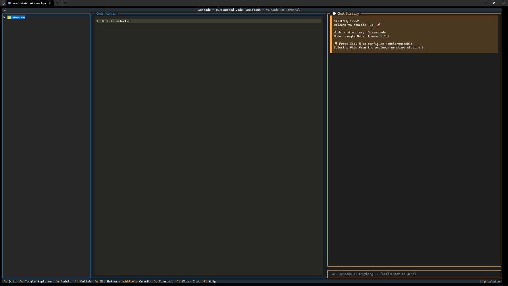
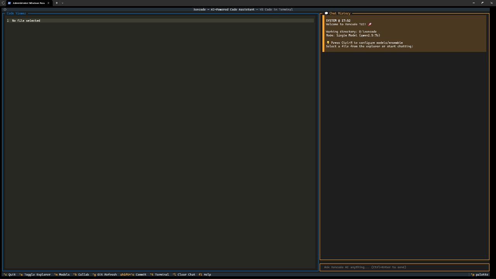
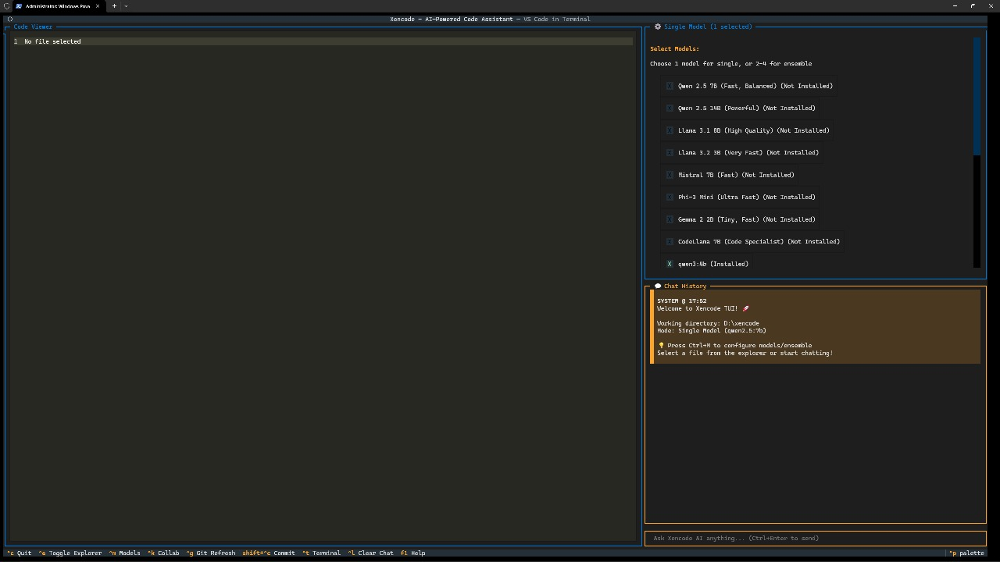
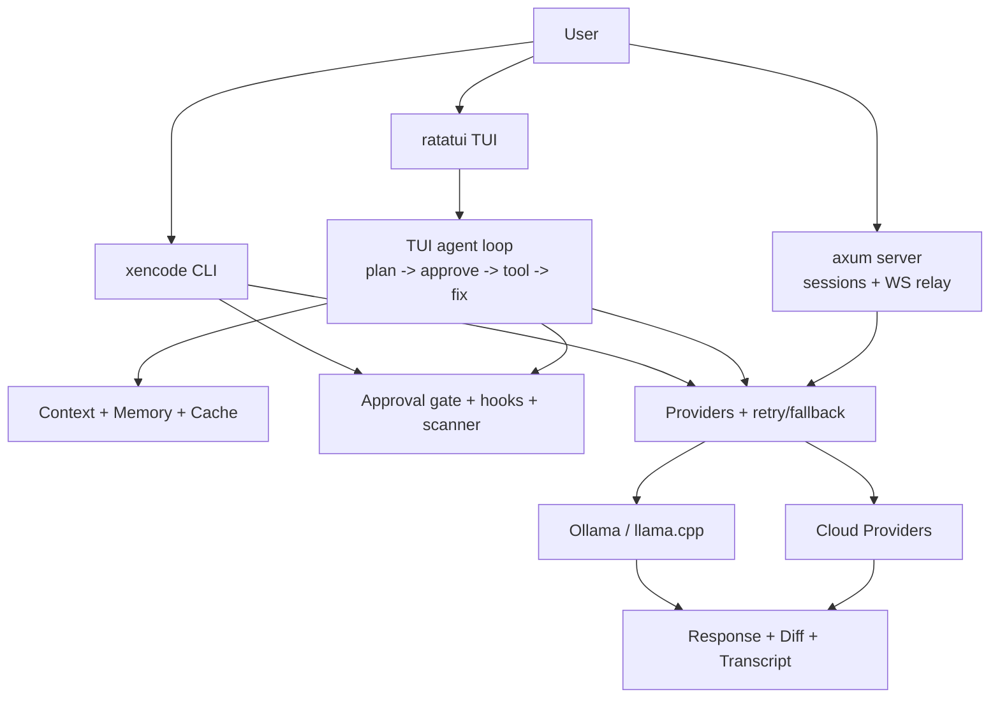
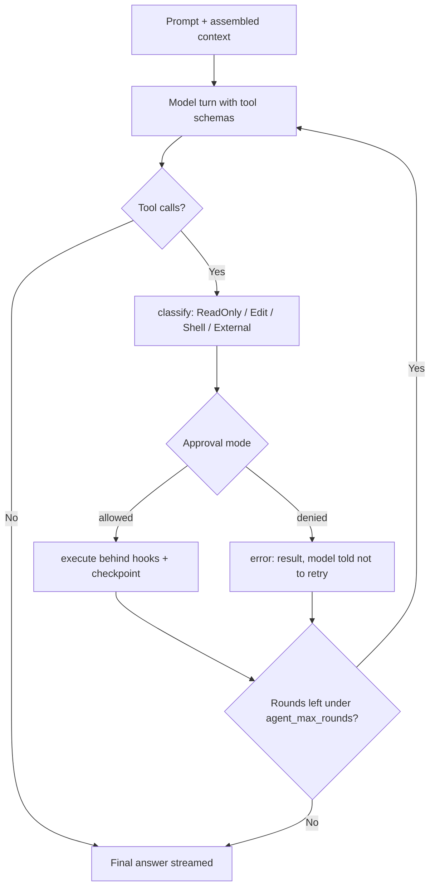

<p align="center">
  
</p>

<div align="center">

# Xencode

**The offline-first AI development assistant.**

A Rust terminal-native AI coding assistant that routes requests across local
and cloud models with a sequential provider fallback chain, runs an
approval-gated agentic tool loop, and has deep terminal ergonomics.

[](https://github.com/sreevarshan-xenoz/xencode/actions)
[](#option-a-rust-binary-recommended)
[](https://github.com/sreevarshan-xenoz/xencode/releases)
[](LICENSE)
[](CONTRIBUTING.md)

**Offline by default. Online when you choose.** Your code never has to leave your machine.

</div>

---

Xencode is an AI-powered development assistant built for engineers who care
about privacy, control, and speed. It runs local models through [Ollama](https://ollama.ai)
and llama.cpp out of the box, talks to cloud providers (Gemini, Qwen, and any
OpenAI-compatible model through OpenRouter) when you opt in, and keeps a chat
turn alive by walking a **sequential provider
fallback chain** — primary model first, then the configured alternates — when a
provider is down.

At its core is a fast, single-file **Rust** binary (14 crates, 684 tests,
zero warnings) wrapped around an agentic coding loop that can plan, edit, test,
and fix your code — driven entirely from your terminal.

---

## ✨ Highlights

- **🧠 Offline-first AI** — local Ollama models by default; cloud providers only when you opt in.
- **🤖 Agentic coding loop** — the model reads, edits and runs your workspace through approval-gated tools, bounded by `agent_max_rounds`, with per-turn checkpoints you can `/rewind`.
- **🔀 Provider fallback chain** — when the primary model fails before streaming a token, the turn walks your ordered `agent_fallback_models` list. Sequential, not fused: no multi-model ensemble exists.
- **🖥️ Immersive TUI** — a modern Rust/ratatui interface over 24 focus areas (three selectable layouts via `Ctrl+U`, 17 of them reachable from the `Ctrl+F` feature navigator): agent, collaboration, git, models, and more.
- **🔒 Secure by design** — token-authenticated collaboration server and a pattern-based OWASP Top 10 scanner (`xencode analyze`).
- **🔌 Extension surface** — a plugin trait, manifest and host with event routing in `xencode-plugin-rs`; the CLI's `plugin` commands install and list plugin **manifests** (no plugin runtime loads them yet).
- **🛰️ Built for teams** — HTTP/WebSocket collaboration server with bearer-token auth, role-based relay and an audit trail, plus Docker, Compose, and Kubernetes assets.
- **🐎 Performance first** — zero duplicate tokens on retry (token-delivery tracking), memory+disk cache, streaming with exponential backoff.

---

## 🧠 Why Xencode?

| Problem | Xencode |
| --- | --- |
| **Privacy** | Fully offline by default. Code, context, and models stay local. |
| **Lock-in** | Bring your own models — Ollama and llama.cpp locally; Gemini, Qwen, and OpenRouter (any OpenAI-compatible model id, including `vendor/model` Claude ids) in the cloud. |
| **Provider outages** | A sequential fallback chain re-runs the turn on your alternate models when a provider fails before its first token. |
| **Context loss** | Persistent conversation memory, memory+disk cache, and a lexical (BM25) workspace context index. |
| **Slow terminal tools** | Native Rust core for a snappy, instantly responsive TUI/CLI. |

---

## 📸 Screenshots

Interactive TUI panels and workflows live in the [`images/`](images/) directory:

<p align="center">
  
  
  
</p>

---

## 📋 Table of Contents

- [Features](#-features)
- [Installation](#-installation)
- [Quick Start](#-quick-start)
- [Usage](#-usage)
- [Command Reference](#-command-reference)
- [Architecture](#-architecture)
- [Configuration & Model Routing](#-configuration--model-routing)
- [Testing & Quality](#-testing--quality)
- [Deployment](#-deployment)
- [Repository Structure](#-repository-structure)
- [Documentation](#-documentation)
- [Troubleshooting](#-troubleshooting)
- [Security](#-security)
- [Roadmap](#-roadmap)
- [Contributing](#-contributing)
- [License](#-license)

---

## ✨ Features

### AI + Agentic
- Local-first model routing through Ollama and llama.cpp, with cloud providers (Gemini, Qwen, OpenRouter / any OpenAI-compatible model) on opt-in.
- **Sequential provider fallback** across those models (`agent_fallback_models`) when a provider fails before streaming.
- **Agentic orchestrator** for multi-step coding tasks with bounded retries.
- **Zero-duplicate-token** streaming retry middleware with token-delivery tracking.
- Error classification and targeted fix suggestions.
- Canonical transcript persisted under `.xencode/cache/transcript/`, with a raw snapshot copied before any rewrite.

### Developer Experience
- **Rust ratatui TUI** (primary) — 24 focus areas: chat, explorer, editor, model selector, settings, code review, PR review, git commit, ByteBot agent, collaboration hub, background tasks, worktrees, insights, provider health, performance dashboard, project analyzer, feature navigator and more. Seven of them (voice interface, terminal assistant, security auditor, performance profiler, custom models, learning mode, multi-language) are interface mockups with scripted content — they render, they do not scan, listen or profile. Use `xencode analyze` and `xencode advise` for real findings.
- **Approval-gated agent tool loop** — the chat model can call 11 tools (`read_file`, `list_dir`, `search_files`, `write_file`, `edit_file`, `run_command`, `update_plan`, `background_start/poll/stop`, `repo_advise`); file changes and shell commands stop at a modal prompt showing the exact diff or command line (`y` allow · `a` allow for the session · `n`/`Esc` deny), paths outside the workspace are refused in every mode, every answer is logged in the transcript, the model's todo list renders above the chat (`/plan`), and `/rewind` puts the files back. `/bytebot <task>` delegates the same loop — its panel's steps are the real calls and their real outcomes. `agent_hooks` config runs your own shell commands before/after approved calls (per tool or `*`); a failing `before` hook vetoes the call entirely. `/spawn <task> [#branch]` runs the same delegated loop in a fresh sibling git worktree (`proj-spawn-1` on branch `xencode/spawn-1`), streams its live steps, posts its final answer back as `(spawn #<id> · <task>)`, and `/spawn status` lists the registered runs.
- **MCP tool servers** — declare stdio servers under `mcp_servers` in config and `/mcp` starts them on request; their tools reach the model as `mcp__<server>__<tool>` behind the same approval gate (`External` class — always a `y`/`n`, never waved through by autonomy), with `mcp_timeout` bounding each call and a broken server failing in its own words.
- Code analysis with per-language heuristics for Python, JavaScript/TypeScript, and Rust.
- Per-file diff review in the TUI (`Ctrl+Y`, base toggle HEAD ↔ main) and rename-aware triage on the CLI (`xencode review`).
- Rich CLI with `advise`, `server`, `analyze`, `fetch`, `tasks`, `worktree`, and `plugin` subcommands.

### Reliability + Ops
- Two-tier cache (memory + disk) with LRU eviction.
- Structured provider transport with status-code-driven retries, retry budgets, timeouts, and a provider-health panel.
- Per-request context metrics appended to `.xencode/cache/metrics.jsonl`.
- Collaboration server exposing sessions, a WebSocket relay, auth, model/provider status, and llama.cpp load/unload routes — bearer-token gated except the public ones.

---

## 📥 Installation

### Prerequisites
| Requirement | Used for | Get it |
| --- | --- | --- |
| **Ollama** | Local AI models (required) | [ollama.ai](https://ollama.ai/download) |
| **Rust 1.80+** (stable) | Building the binary | [rustup.rs](https://rustup.rs) |

### Option A: Rust binary (recommended)

A single-file executable with no runtime dependencies — the fastest, cleanest path.

```bash
git clone https://github.com/sreevarshan-xenoz/xencode
cd xencode/rust
cargo build --release -p xencode-cli

# Linux/macOS
cp target/release/xencode /usr/local/bin/xencode
# Windows
copy target\release\xencode.exe C:\Windows\System32\xencode.exe

xencode --help
```

### Option B: One-liner installers

The repository ships cross-platform installer scripts — [`install.sh`](install.sh) (Linux/macOS) and [`install.ps1`](install.ps1) (Windows). Download the script and run it, or review it first and execute locally:

```bash
# Linux/macOS
./install.sh
# Windows (PowerShell)
.\install.ps1
```

> ✨ Tip: pull a small model first so you can validate the whole path:
> `ollama pull qwen3:4b`

---

## 🚀 Quick Start

```bash
# 1) Verify the CLI
xencode --help

# 2) Check your local model health
xencode models list

# 3) Launch the immersive terminal UI (the default experience)
xencode tui

# 4) Run a quick query without leaving your shell
xencode query "Explain clean architecture briefly"

# 5) Analyze code for issues and vulnerabilities
xencode analyze src/

# 6) Collaborate with your team
xencode server           # local-first: http://127.0.0.1:8765, ws://
# then in the TUI: Ctrl+F → Collaboration Hub → c to create, j to join

# 7) List installed plugin manifests
xencode plugin list
```

**TUI shortcuts:** `Tab` cycles panels · `?` opens the keybinding help overlay · `Ctrl+F` opens the Feature Navigator.

---

## ⚙️ Usage

```bash
xencode                          # Launch the Rust TUI (default experience)
xencode query "explain async"    # One-shot query without leaving your shell
xencode analyze ./src            # Code analysis + image inventory
xencode models list              # Model health
xencode --version                # Show version
```

### In-chat commands

These eight are the only strings the chat input intercepts — anything else is
sent to the model as a prompt.

```
/init [abort|status]        Index the repo / stop / inspect an index run
/ctx [status|track|compact|eval|kv|archive]
                            Context bundle: state, tracking, compaction, retrieval eval
/advise [filter]            Live refactor insights (same report as Ctrl+L)
/bytebot <task>             Delegate the task to the agent loop and watch its real calls
/spawn <task> [#branch]     Run the delegated loop in a fresh git worktree
/spawn status               List registered spawn runs and where they live
/plan [clear]               Pin the model's todo list (or drop it)
/rewind [turns]             Undo agent file writes for recent turns
/mcp [status|stop]          Start the configured MCP servers / report / withdraw them
```

Press `?` in the TUI for the live keybinding and command overlay.

---

## 📚 Command Reference

| Area | Command | Purpose |
| --- | --- | --- |
| **General** | `xencode` | Launch Rust TUI (default experience) |
| **General** | `xencode --version` | Show installed version |
| **Query** | `xencode query "…"` | Run a one-shot query |
| **Scan** | `xencode scan . --max-depth 2` | Scan workspace |
| **Config** | `xencode config show` | Show runtime config |
| **Models** | `xencode models list` | List installed Ollama models (`health <name>` checks one) |
| **Memory** | `xencode memory list` | List conversation sessions |
| **Advise** | `xencode advise [FILTER] [--json] [--limit 40]` | Repo insights from the `.xencode` snapshot |
| **Tasks** | `xencode tasks list` | File-backed background tasks (start/poll/stop/rm) |
| **Worktree** | `xencode worktree list` | List/add/remove git worktrees |
| **Cache** | `xencode cache stats` | Show cache statistics |
| **Server** | `xencode server` | Start collaboration server (local-first: `127.0.0.1:8765`; TLS opt-in) |
| **Analyze** | `xencode analyze <path>` | Code analysis + security scan + image inventory |
| **Fetch** | `xencode fetch <url>` | Web extraction to research-ready text |
| **Review** | `xencode review [--base main]` | PR-level diff triage with per-file analysis |
| **LlamaCpp** | `xencode llamacpp status` | Local llama-server status and timings |
| **Plugin** | `xencode plugin list` | List installed plugins |
| **Plugin** | `xencode plugin install <path>` | Install a plugin |
| **Plugin** | `xencode plugin remove <name>` | Remove a plugin |

> For the full CLI reference run `xencode --help`.

---

## 🏗️ Architecture

Xencode is organized as a layered runtime:

- **Interface layer** — CLI (`xencode-cli`) and ratatui TUI
- **Orchestration layer** — agentic tool loop, approval gate, checkpoints, background tasks
- **Policy layer** — permission classification, hook veto, retry/fallback eligibility, context budgeting
- **Execution layer** — model providers (Ollama, llama.cpp, Gemini, Qwen, OpenRouter-compatible)
- **Data layer** — context index, conversation memory, cache, transcripts under `.xencode/`
- **Collaboration layer** — axum server: bearer tokens, RBAC relay, JSONL audit; the `xencode-collaboration-rs` / `-server-rs` crates

### Routing


```mermaid
flowchart TD
    U[User]
    CLI[xencode CLI]
    TUI[ratatui TUI]
    API[axum server\nsessions + WS relay]

    ORCH[TUI agent loop\nplan -> approve -> tool -> fix]
    CTX[Context + Memory + Cache]
    SAFE[Approval gate + hooks + scanner]
    RES[Providers + retry/fallback]
    LOCAL[Ollama / llama.cpp]
    CLOUD[Cloud Providers]
    OUT[Response + Diff + Transcript]

    U --> CLI
    U --> TUI
    U --> API

    CLI --> RES
    CLI --> SAFE
    TUI --> ORCH
    ORCH --> CTX
    ORCH --> SAFE
    ORCH --> RES
    API --> RES
    RES --> LOCAL
    RES --> CLOUD
    LOCAL --> OUT
    CLOUD --> OUT
```

### Agentic loop

What actually runs per chat turn in the TUI (`agent_rounds` in
`xencode-tui-rs/src/app.rs`):


```mermaid
flowchart TD
    A[Prompt + assembled context] --> B[Model turn with tool schemas]
    B --> C{Tool calls?}
    C -- No --> H[Final answer streamed]
    C -- Yes --> D[classify: ReadOnly / Edit / Shell / External]
    D --> E{Approval mode}
    E -- denied --> F[error: result, model told not to retry]
    E -- allowed --> G[execute behind hooks + checkpoint]
    G --> I{Rounds left under agent_max_rounds?}
    F --> I
    I -- Yes --> B
    I -- No --> H
```

> Extended connectivity and deployment diagrams: [project details.md](project%20details.md)

---

## 🔧 Configuration & Model Routing

- One JSON file: `~/.xencode/config.json`. Point Xencode elsewhere with
  `XCODE_CONFIG_DIR` — the conversation memory and the server's audit log
  resolve to the same directory.
- Manage it with `xencode config show | set <KEY> <VALUE> | reset`, or the
  TUI Settings panel. Only the keys in the struct are read; unknown keys are
  ignored.
- Routing is by **model prefix** on `default_model` (and each fallback entry):
  `qwen:…`, `google_gemini:…`, an OpenRouter-style `vendor/model`, `llamacpp:…`
  for a local llama-server, anything else goes to Ollama on `ollama_url`.
- **No Anthropic key field exists yet.** `xencode-providers-rs` has an
  Anthropic client, but neither `ApiKeys` nor the app passes an Anthropic key,
  so an `anthropic:…` model always fails with *"Anthropic API key not
  configured"*. Reach Claude models through OpenRouter (`anthropic/…`) instead.
- A failing provider walks `agent_fallback_models` in order — one attempt each,
  only while nothing has streamed yet.
- API keys are stored as plain strings in that JSON file. There is **no
  encrypted vault** in the Rust implementation: protect the file with
  permissions (`chmod 600 ~/.xencode/config.json`) and keep it out of git.

Start from the annotated example (it lists every real key):

```bash
mkdir -p ~/.xencode
cp .xencode.example.json ~/.xencode/config.json
xencode config show        # confirm the loader accepted it
```

Then point `xencode` at your Ollama server (`http://localhost:11434` by default)
and add cloud keys only if you want cloud access:

```bash
xencode config set default_model qwen3:4b
xencode config set agent_fallback_models qwen2.5:14b,openai/gpt-4o-mini
```

See also: [docs/INSTALL_MANUAL.md](docs/INSTALL_MANUAL.md) · [docs/api_documentation.md](docs/api_documentation.md)

---

## 🧪 Testing & Quality

### Rust

```bash
cd rust
cargo test                          # Full workspace suite (684 tests)
cargo test -p xencode-analysis-rs   # Single crate
cargo test -p xencode-tui-rs        # TUI widgets and panels
cargo test -p xencode-server-rs     # Axum HTTP/WS server & auth
cargo fmt --check                   # Format gate (CI)
cargo clippy --workspace --all-targets -- -D warnings -A clippy::format-in-format-args
```

CI runs fmt + clippy + the full suite on every push — see [`.github/workflows/`](.github/workflows/).

---

## 🐳 Deployment

- **Docker** — [`Dockerfile`](Dockerfile) + [`docker-compose.yml`](docker-compose.yml): Rust builder → slim runtime running `xencode server --port 8765`, health-checked against `/api/status`. This path is real.
- **CI/CD** — [`.github/workflows/ci.yml`](.github/workflows/ci.yml) runs fmt → clippy → `cargo test --workspace` on every push and PR. [`.github/workflows/ci-cd.yml`](.github/workflows/ci-cd.yml) runs the same gate, then builds and pushes the image to `ghcr.io` and Trivy-scans it. There is no deploy stage: the server is a stateless single binary, so nothing applies Kubernetes manifests, and the `k8s/` and `monitoring/` directories that implied otherwise have been removed.

---

## 📂 Repository Structure

```
xencode/
├── rust/                    # Rust workspace — the whole product, 14 crates
│   └── crates/
│       ├── xencode-cli      # CLI entry point (xencode binary)
│       ├── xencode-tui-rs   # Ratatui TUI + agent loop
│       ├── xencode-providers-rs # Providers, retry, fallback, tool schemas
│       ├── xencode-context-rs   # Index, retrieval, budget, watcher, advise
│       ├── xencode-mcp-rs       # MCP stdio client
│       ├── xencode-server-rs    # Axum HTTP/WebSocket collaboration server
│       ├── xencode-analysis-rs  # Code analysis + pattern scanner + image intake
│       └── ...              # core, config, cache, memory, models, collaboration, plugin
├── scripts/                 # Shell/PowerShell build + smoke-test helpers
├── images/                  # Screenshots
└── .xencode.example.json    # Example of ~/.xencode/config.json
```

---

## 📖 Documentation

Current, and kept in step with the Rust implementation:

| Topic | Where |
| --- | --- |
| Getting started | [`QUICK_START.md`](QUICK_START.md) |
| User manual | [`docs/USER_MANUAL.md`](docs/USER_MANUAL.md) |
| CLI guide | [`CLI_GUIDE.md`](CLI_GUIDE.md) |
| Active task list | [`NEXT_PLAN_TASKS.md`](NEXT_PLAN_TASKS.md) · [`NEXT_PLAN.md`](NEXT_PLAN.md) |
| Route + auth reference | [`docs/api_documentation.md`](docs/api_documentation.md) (server section is current; the module sections below it are marked legacy) |

Historical, **not** descriptions of this codebase — they predate the Rust
migration and still document a Python stack, ensemble reasoning, and modules
that no longer exist. Read them for intent only:

| Archive | Was |
| --- | --- |
| [`DOCUMENTATION.md`](DOCUMENTATION.md) | Full Python-era documentation index |
| [`PRD.md`](PRD.md) | Original product requirements |
| [`project details.md`](project%20details.md) | Python-era architecture + feature inventory |
| [`docs/FEATURES.md`](docs/FEATURES.md) | Post-migration idea backlog ("wild ideas"), not shipped features |
| [`docs/ROADMAP.md`](docs/ROADMAP.md) | Long-term roadmap; many sections are marked historical |

---

## 🛠️ Troubleshooting

### Ollama not running
```bash
ollama serve                       # run in a terminal, or
systemctl start ollama             # Linux systemd
curl -s http://localhost:11434/api/tags   # verify reachability
```

### No models available
```bash
ollama pull qwen3:4b               # small, fast starter model
```

### Slow responses
- `xencode config set default_model phi3:mini` — switch to a faster local model (restart the TUI to pick it up).
- `xencode models health <name>` — check one model answers; in the TUI, `Ctrl+H` runs a health check and `Ctrl+F` → *Provider Health* opens the panel.

### Rust build errors
```bash
rustup update
cd rust && cargo build -p xencode-cli 2>&1
```

---

## 🔒 Security

- API keys live in `api_keys` inside `~/.xencode/config.json`. `xencode config set`
  does not accept key names, so edit that file directly and keep it out of git —
  there is no encryption layer, so file permissions are the control (`chmod 600`).
- `xencode analyze` runs a pattern-based scanner over OWASP Top 10 categories
  (hardcoded secrets, injection, weak crypto, path traversal, SSRF). It matches
  source text — it does not consult a CVE database or your dependency tree.
- The collaboration server authenticates every mutation with bearer tokens, gates
  the relay by role, and appends joins, mutations and denials to an audit log.
- Never commit plaintext credentials — use environment-specific secrets management and least-privilege access.

Vulnerabilities can be reported privately to **security@xenoz.com** — see
[CONTRIBUTING.md](CONTRIBUTING.md) for details.

---

## 🗺️ Roadmap

The Rust migration (all 8 phases, 14 crates) is **complete**. Near-term direction:

- An `anthropic_api_key` field so the existing Anthropic client is reachable
  without going through OpenRouter
- Making the seven scripted TUI panels real: microphone input, a live profiler,
  an auditor wired to the analyzer — or removing them
- A plugin runtime that loads and runs `XencodePlugin` implementations, not
  just their manifests
- Retry budgets and fallback-policy governance + provider health UX
- Multimodal inputs and secure team workflows
- Multi-model arena mode · git autopilot agent · session replay

The roadmap file below is the pre-migration plan, kept for history.

---

## 🤝 Contributing

We welcome contributions of all kinds — bug reports, docs, features, and plugins.

1. Fork the repo and create a branch.
2. Set up the dev environment: `cargo test --workspace` under `rust/` (plus `cargo fmt --check` and clippy per above).
3. Follow the standards in [CONTRIBUTING.md](CONTRIBUTING.md) and [AGENTS.md](AGENTS.md) (rustfmt, clippy `-D warnings`, atomic commits, Conventional Commits).
4. Open a PR — CI runs fmt, clippy, and the full workspace suite automatically.

Please read our [Code of Conduct](CODE_OF_CONDUCT.md) and see the
[Contributing Guide](CONTRIBUTING.md) to get started.

---

## 📜 License

Distributed under the **MIT License**. See [`LICENSE`](LICENSE) for details.

---

<div align="center">

Built with ❤️ by [Sreevarshan](mailto:sreevarshan@xenoz.com) and contributors ·
For an always-on companion to this README, read the [full documentation](DOCUMENTATION.md).

</div>