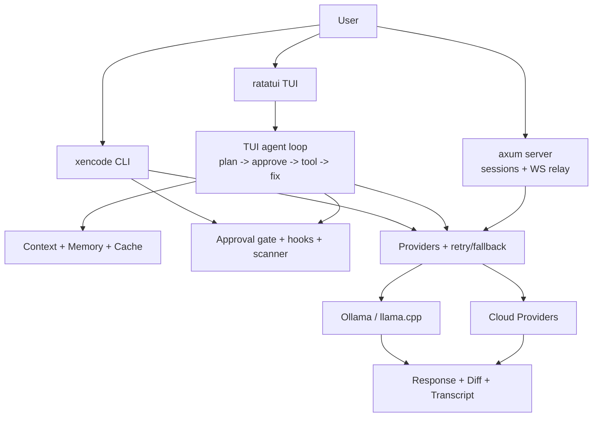
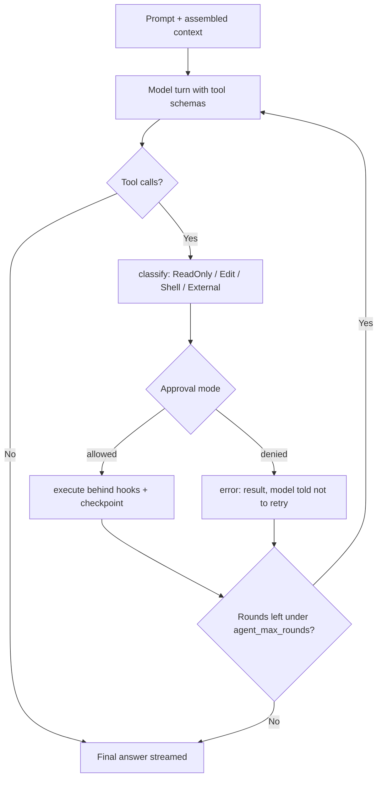

<p align="center">
  
</p>

<div align="center">

# Xencode

**The local-first AI coding agent. Bring your own model.**

A Rust terminal-native AI coding assistant that routes requests across local
and cloud models with a sequential provider fallback chain, runs an
approval-gated agentic tool loop, and has deep terminal ergonomics.

[](https://github.com/sreevarshan-xenoz/xencode/actions)
[](#option-a-rust-binary-recommended)
[](https://github.com/sreevarshan-xenoz/xencode/releases)
[](LICENSE)
[](CONTRIBUTING.md)

**Local-first: your machine, your model.** Online only when you point it somewhere. Your code never has to leave your machine.

</div>

---

Xencode is an AI-powered development assistant built for engineers who care
about privacy, control, and speed. It runs local models through [Ollama](https://ollama.ai)
and llama.cpp out of the box, talks to cloud providers (Gemini, Qwen, and any
OpenAI-compatible model through OpenRouter) when you opt in, and keeps a chat
turn alive by walking a **sequential provider
fallback chain** — primary model first, then the configured alternates — when a
provider is down.

At its core is a fast, single-file **Rust** binary (15 crates, 815 tests,
zero warnings) wrapped around an agentic coding loop that can plan, edit, test,
and fix your code — driven entirely from your terminal.

---

## ✨ Highlights

- **🧠 Local-first, your model** — Ollama and llama.cpp serve from your own machine with your code never leaving it; cloud providers, a Colab GPU you rent, or any OpenAI-compatible endpoint are opt-in choices, not a service you depend on.
- **🤖 Agentic coding loop** — the model reads, edits and runs your workspace through approval-gated tools, bounded by `agent_max_rounds`, with per-turn checkpoints you can `/rewind`.
- **🔀 Provider fallback chain** — when the primary model fails before streaming a token, the turn walks your ordered `agent_fallback_models` list. Sequential, not fused: no multi-model ensemble exists.
- **🖥️ Immersive TUI** — a modern Rust/ratatui interface over 24 focus areas (three selectable layouts via `Ctrl+U`, 17 of them reachable from the `Ctrl+F` feature navigator): agent, collaboration, git, models, and more.
- **🔍 Nothing scripted** — every panel shows data that came from the machine, the provider or the repo, and says so in its own words when it cannot get it. No list in this UI is seeded with samples, and no gauge renders a zero for a measurement that never happened.
- **🔒 Secure by design** — token-authenticated collaboration server and a pattern-based OWASP Top 10 scanner (`xencode analyze`).
- **🔌 Plugin runtime** — `xencode-plugin-rs` discovers `plugin.json` manifests, registers each compatible one with the host, and routes what it declares into every agent turn: a prompt prefix ahead of the system prompt and `before`/`after` tool hooks (config.json wins any conflict). No dynamic linking: a manifest is the whole plugin, and `xencode plugin list` / the TUI's `/plugin` report which ones actually took hold.
- **☁️ Rented GPUs, no infrastructure** — `xencode colab up` brings a Google Colab VM up with llama.cpp or Ollama serving an OpenAI endpoint and tunnels it to `127.0.0.1` over the official `colab ssh` bridge; the model picker, `remote:…` routing and Provider Health treat it like any other provider. No public URL, nothing exposed.
- **🛰️ Built for teams** — HTTP/WebSocket collaboration server with bearer-token auth, role-based relay and an append-only audit trail, plus a Dockerfile and Compose setup for the API server.
- **🐎 Performance first** — zero duplicate tokens on retry (token-delivery tracking), memory+disk cache, streaming with exponential backoff.

---

## 🧠 Why Xencode?

| Problem | Xencode |
| --- | --- |
| **Privacy** | Local by default: code, context and models stay on your machine. A remote backend is a choice you make, never a dependency you inherit. |
| **Lock-in** | Bring your own models — Ollama and llama.cpp locally; Gemini, Qwen, and OpenRouter (any OpenAI-compatible model id, including `vendor/model` Claude ids) in the cloud. |
| **Provider outages** | A sequential fallback chain re-runs the turn on your alternate models when a provider fails before its first token. |
| **Context loss** | Persistent conversation memory, memory+disk cache, and a lexical (BM25) workspace context index. |
| **Slow terminal tools** | Native Rust core for a snappy, instantly responsive TUI/CLI. |

---

## 📸 Screenshots

Interactive TUI panels and workflows live in the [`images/`](images/) directory:

<p align="center">
  
  
  
</p>

---

## 📋 Table of Contents

- [Features](#-features)
- [Installation](#-installation)
- [Quick Start](#-quick-start)
- [Usage](#-usage)
- [Command Reference](#-command-reference)
- [Architecture](#-architecture)
- [Configuration & Model Routing](#-configuration--model-routing)
- [Testing & Quality](#-testing--quality)
- [Deployment](#-deployment)
- [Repository Structure](#-repository-structure)
- [Documentation](#-documentation)
- [Troubleshooting](#-troubleshooting)
- [Security](#-security)
- [Roadmap](#-roadmap)
- [Contributing](#-contributing)
- [License](#-license)

---

## ✨ Features

### AI + Agentic
- Local-first model routing through Ollama and llama.cpp, with cloud providers (Gemini, Qwen, OpenRouter / any OpenAI-compatible model) on opt-in.
- **Sequential provider fallback** across those models (`agent_fallback_models`) when a provider fails before streaming.
- **Agentic orchestrator** for multi-step coding tasks with bounded retries.
- **Zero-duplicate-token** streaming retry middleware with token-delivery tracking.
- Tool and shell failures reach the model as `error:`-prefixed or `exit <code>`
  results, and the agent's instructions make it name the failure and change
  approach instead of retrying it unchanged. There is **no automatic error
  classifier** — nothing parses a compiler or test message into a category and a
  suggested fix; that is a planned item, not current behavior.
- Canonical transcript persisted under `.xencode/cache/transcript/`, with a raw snapshot copied before any rewrite.

### Developer Experience
- **Rust ratatui TUI** (primary) — 24 focus areas: chat, explorer, editor, model selector, settings, code review, PR review, git commit, ByteBot agent, collaboration hub, background tasks, worktrees, insights, provider health, performance dashboard, project analyzer, feature navigator and more.
- **The seven panels that used to play recordings are real** (Milestone J):
  - *Security auditor* — `Enter` walks the workspace with the same file list `xencode analyze` uses and runs the pattern scanner per file, streaming findings and finishing with real totals; unreadable files and a failed walk surface as their own log lines.
  - *Performance profiler* — this process's CPU (two `/proc/self/stat` reads 250 ms apart) and resident memory, the session's own average turn latency and tokens/s, per-provider health latency, and the last rows of `.xencode/cache/metrics.jsonl`. A gauge with no data renders `n/a`.
  - *Terminal assistant* — asks the configured model for commands and runs the one you pick **through the agent's approval gate**, never around it.
  - *Multi-language* — tabulates a real `scan_tree` walk (files, lines, share per language; secret and binary files counted, never read) and translates your text with one model call.
  - *Custom models* — edits real `model_profiles` in `config.json`: `Enter` applies to the next turn, `s` saves, `t` shows the provider's real reply or its real error.
  - *Learning mode* — queues the files the project index says declare something and asks the model to teach that file and quiz you on it.
  - *Voice* — opens the microphone through the first of `arecord`/`pw-record`/`parec` on `PATH`. `Enter` records, `Enter` again stops; the level bar, peak and clip length are RMS over the PCM the recorder actually sent, and the clip lands in `.xencode/voice/clip-<unix>.wav`. Text appears only from a whisper CLI's stdout — with none installed the panel names the clip and says there is no speech engine.
- **Approval-gated agent tool loop** — the chat model can call 11 tools (`read_file`, `list_dir`, `search_files`, `write_file`, `edit_file`, `run_command`, `update_plan`, `background_start/poll/stop`, `repo_advise`); file changes and shell commands stop at a modal prompt showing the exact diff or command line (`y` allow · `a` allow for the session · `n`/`Esc` deny), paths outside the workspace are refused in every mode, every answer is logged in the transcript, the model's todo list renders above the chat (`/plan`), and `/rewind` puts the files back. `/bytebot <task>` delegates the same loop — its panel's steps are the real calls and their real outcomes. `agent_hooks` config runs your own shell commands before/after approved calls (per tool or `*`); a failing `before` hook vetoes the call entirely. `/spawn <task> [#branch]` runs the same delegated loop in a fresh sibling git worktree (`proj-spawn-1` on branch `xencode/spawn-1`), streams its live steps, posts its final answer back as `(spawn #<id> · <task>)`, and `/spawn status` lists the registered runs.
- **MCP tool servers** — declare stdio servers under `mcp_servers` in config and `/mcp` starts them on request; their tools reach the model as `mcp__<server>__<tool>` behind the same approval gate (`External` class — always a `y`/`n`, never waved through by autonomy), with `mcp_timeout` bounding each call and a broken server failing in its own words.
- Code analysis with per-language heuristics for Python, JavaScript/TypeScript, and Rust.
- Per-file diff review in the TUI (`Ctrl+Y`, base toggle HEAD ↔ main) and rename-aware triage on the CLI (`xencode review`).
- CLI with 16 subcommands: `scan`, `config`, `models`, `cache`, `query`, `memory`, `tasks`, `worktree`, `advise`, `server`, `analyze`, `fetch`, `review`, `plugin`, `llamacpp`, `tui`.

### Reliability + Ops
- Two-tier cache (memory + disk) with LRU eviction.
- Structured provider transport with status-code-driven retries, retry budgets, timeouts, and a provider-health panel.
- Per-request context metrics appended to `.xencode/cache/metrics.jsonl`.
- Collaboration server exposing sessions, a WebSocket relay, auth, model/provider status, and llama.cpp load/unload routes — bearer-token gated except the public ones.

---

## 📥 Installation

### Prerequisites
| Requirement | Used for | Get it |
| --- | --- | --- |
| **Ollama** | Local models — the default path, so this is the one to install | [ollama.ai](https://ollama.ai/download) |
| **Rust stable** | Building the binary — no MSRV is pinned; CI builds on `stable` | [rustup.rs](https://rustup.rs) |

Ollama is what the binary talks to out of the box, not the only option: a local
`llama-server` (`llamacpp:…`, managed by `xencode llamacpp`), Gemini, Qwen and
any OpenAI-compatible endpoint through OpenRouter work instead — those need a
key in `~/.xencode/config.json` and nothing local has to be running.

### Option A: Rust binary (recommended)

A single-file executable with no runtime dependencies — the fastest, cleanest path.

```bash
git clone https://github.com/sreevarshan-xenoz/xencode
cd xencode/rust
cargo build --release -p xencode-cli

# Linux/macOS
cp target/release/xencode /usr/local/bin/xencode
# Windows
copy target\release\xencode.exe C:\Windows\System32\xencode.exe

xencode --help
```

### Option B: One-liner installers

[`install.sh`](install.sh) (Linux/macOS) and [`install.ps1`](install.ps1)
(Windows) do Option A for you, from a clone of this repository: they check for a
Rust toolchain (installing one via rustup if it is missing), run
`cargo build --release -p xencode-cli`, and on macOS/Linux also set Ollama up and
start it if you do not have it. `install.sh` then smoke-tests the fresh binary and
copies it to `/usr/local/bin` when that directory is writable, `$HOME/.local/bin`
otherwise (adding it to your `PATH`); `install.ps1` puts the exe in
`%LOCALAPPDATA%\xencode` and adds that directory to your user `PATH`. Review the
script before running it.

```bash
# Linux/macOS
./install.sh
# Windows (PowerShell)
.\install.ps1
```

> ✨ Tip: pull a small model first so you can validate the whole path:
> `ollama pull qwen3:4b`

---

## 🚀 Quick Start

```bash
# 1) Verify the CLI
xencode --help

# 2) Check your local model health
xencode models list

# 3) Launch the immersive terminal UI (the default experience)
xencode tui

# 4) Run a quick query without leaving your shell
xencode query "Explain clean architecture briefly"

# 5) Analyze code for issues and vulnerabilities
xencode analyze src/

# 6) Collaborate with your team
xencode server           # local-first: http://127.0.0.1:8765, ws://
# then in the TUI: Ctrl+F → Collaboration Hub → c to create, j to join

# 7) See which plugins load — the TUI's /plugin reports the same load
xencode plugin list
```

**TUI shortcuts:** `Tab` cycles panels · `?` opens the keybinding help overlay · `Ctrl+F` opens the Feature Navigator.

---

## ⚙️ Usage

```bash
xencode                          # Launch the Rust TUI (default experience)
xencode query "explain async"    # One-shot query without leaving your shell
xencode analyze ./src            # Code analysis + image inventory
xencode models list              # Model health
xencode --version                # Show version
```

### In-chat commands

These nine are the only strings the chat input intercepts (`SLASH_COMMANDS` in
`xencode-tui-rs/src/app.rs`) — anything else is sent to the model as a prompt.

```
/init [abort|status]        Index the repo / stop / inspect an index run
/ctx [status|track|compact|eval|kv|archive]
                            Context bundle: state, tracking, compaction, retrieval eval
/advise [filter]            Live refactor insights (same report as Ctrl+L)
/bytebot <task>             Delegate the task to the agent loop and watch its real calls
/spawn <task> [#branch]     Run the delegated loop in a fresh git worktree
/spawn status               List registered spawn runs and where they live
/plan [clear]               Pin the model's todo list (or drop it)
/rewind [turns]             Undo agent file writes for recent turns
/mcp [status|stop]          Start the configured MCP servers / report / withdraw them
/plugin [reload]            Show which plugins took effect / re-scan the plugin dir
```

Press `?` in the TUI for the live keybinding and command overlay.

---

## 📚 Command Reference

| Area | Command | Purpose |
| --- | --- | --- |
| **General** | `xencode` | Launch Rust TUI (default experience) |
| **General** | `xencode --version` | Show installed version |
| **Query** | `xencode query "…"` | Run a one-shot query |
| **Query** | `xencode query "…" --temperature 0.2 --max-tokens 512` | llama.cpp sampling per call: also `--top-k`, `--min-p`, `--mirostat`, `--grammar`, `--json-schema`, `--no-cache`, `--session`, `--model` |
| **Scan** | `xencode scan . --max-depth 2` | Scan workspace |
| **Config** | `xencode config show` | Show runtime config |
| **Models** | `xencode models list` | List installed Ollama models (`health <name>` checks one) |
| **Memory** | `xencode memory list` | List conversation sessions |
| **Advise** | `xencode advise [FILTER] [--json] [--limit 40]` | Repo insights from the `.xencode` snapshot |
| **Tasks** | `xencode tasks list` | File-backed background tasks (start/poll/stop/rm) |
| **Worktree** | `xencode worktree list` | List/add/remove git worktrees |
| **Cache** | `xencode cache stats` | Show cache statistics |
| **Server** | `xencode server` | Start collaboration server (local-first: `127.0.0.1:8765`; TLS opt-in) |
| **Analyze** | `xencode analyze <path>` | Code analysis + security scan + image inventory |
| **Fetch** | `xencode fetch <url>` | Web extraction to research-ready text |
| **Review** | `xencode review [--base main]` | PR-level diff triage with per-file analysis |
| **LlamaCpp** | `xencode llamacpp status` | Local llama-server status and timings |
| **Colab** | `xencode colab preflight` | Is the bridge usable? (CLI version, auth, ssh key) |
| **Colab** | `xencode colab up` | Bring up a VM + inference server and tunnel it to localhost (`--reconnect` repairs a broken bridge) |
| **Colab** | `xencode colab status` / `down` | Forward/session/endpoint health, then kill the forward and release the VM |
| **Plugin** | `xencode plugin list` | Report each plugin and whether it loads |
| **Plugin** | `xencode plugin install <path>` | Install a plugin, then say if it loaded |
| **Plugin** | `xencode plugin remove <name>` | Remove a plugin by name |

> For the full CLI reference run `xencode --help`.

---

## 🏗️ Architecture

Xencode is organized as a layered runtime:

- **Interface layer** — CLI (`xencode-cli`) and ratatui TUI
- **Orchestration layer** — agentic tool loop, approval gate, checkpoints, background tasks
- **Policy layer** — permission classification, hook veto, retry/fallback eligibility, context budgeting
- **Execution layer** — model providers (Ollama, llama.cpp, Gemini, Qwen, OpenRouter-compatible)
- **Data layer** — context index, conversation memory, cache, transcripts under `.xencode/`
- **Collaboration layer** — axum server: bearer tokens, RBAC relay, JSONL audit; the `xencode-collaboration-rs` / `-server-rs` crates

### Routing


```mermaid
flowchart TD
    U[User]
    CLI[xencode CLI]
    TUI[ratatui TUI]
    API[axum server\nsessions + WS relay]

    ORCH[TUI agent loop\nplan -> approve -> tool -> fix]
    CTX[Context + Memory + Cache]
    SAFE[Approval gate + hooks + scanner]
    RES[Providers + retry/fallback]
    LOCAL[Ollama / llama.cpp]
    CLOUD[Cloud Providers]
    OUT[Response + Diff + Transcript]

    U --> CLI
    U --> TUI
    U --> API

    CLI --> RES
    CLI --> SAFE
    TUI --> ORCH
    ORCH --> CTX
    ORCH --> SAFE
    ORCH --> RES
    API --> RES
    RES --> LOCAL
    RES --> CLOUD
    LOCAL --> OUT
    CLOUD --> OUT
```

### Agentic loop

What actually runs per chat turn in the TUI (`agent_rounds` in
`xencode-tui-rs/src/app.rs`):


```mermaid
flowchart TD
    A[Prompt + assembled context] --> B[Model turn with tool schemas]
    B --> C{Tool calls?}
    C -- No --> H[Final answer streamed]
    C -- Yes --> D[classify: ReadOnly / Edit / Shell / External]
    D --> E{Approval mode}
    E -- denied --> F[error: result, model told not to retry]
    E -- allowed --> G[execute behind hooks + checkpoint]
    G --> I{Rounds left under agent_max_rounds?}
    F --> I
    I -- Yes --> B
    I -- No --> H
```

> Connectivity: the agent's file and shell tools are confined to the workspace
> root (paths outside it are refused in every approval mode) and every mutation
> stops at the approval gate — see [Approval-gated agent tool loop](#-features).

---

## 🔧 Configuration & Model Routing

- One JSON file: `~/.xencode/config.json`. Point Xencode elsewhere with
  `XCODE_CONFIG_DIR` — the conversation memory and the server's audit log
  resolve to the same directory.
- Manage it with `xencode config show | set <KEY> <VALUE> | reset`, or the
  TUI Settings panel. Only the keys in the struct are read; unknown keys are
  ignored.
- Routing is by **model prefix** on `default_model` (and each fallback entry):
  `qwen:…`, `google_gemini:…`, an OpenRouter-style `vendor/model`, `llamacpp:…`
  for a local llama-server, `remote:…` for any OpenAI-compatible server at
  `remote_base_url`, anything else goes to Ollama on `ollama_url`.
- **Google Colab as a GPU you don't configure.** `xencode colab up` rents a
  Colab VM, installs a pinned llama.cpp (CUDA when the VM has a GPU) or Ollama
  on it, and holds an SSH forward so the VM's OpenAI endpoint appears at
  `http://127.0.0.1:18000/v1` — then it writes that into `remote_base_url` and
  the runtime URL, so `remote:…` models, the model picker and Provider Health
  all use it with no other change. The tunnel is the official `colab ssh`
  bridge: no public URL, nothing listenable from outside your machine.
  Free-tier VMs are reaped after 12 hours — `xencode colab status` says so and
  `xencode colab up --reconnect` rebuilds the bridge; `xencode colab down`
  releases the VM, which you should always run when finished.
- **No Anthropic key field exists yet.** `xencode-providers-rs` has an
  Anthropic client, but neither `ApiKeys` nor the app passes an Anthropic key,
  so an `anthropic:…` model always fails with *"Anthropic API key not
  configured"*. Reach Claude models through OpenRouter (`anthropic/…`) instead.
- A failing provider walks `agent_fallback_models` in order — one attempt each,
  only while nothing has streamed yet.
- API keys are stored as plain strings in that JSON file. There is **no
  encrypted vault** in the Rust implementation: protect the file with
  permissions (`chmod 600 ~/.xencode/config.json`) and keep it out of git.

Start from the annotated example (it lists every real key):

```bash
mkdir -p ~/.xencode
cp .xencode.example.json ~/.xencode/config.json
xencode config show        # confirm the loader accepted it
```

Then point `xencode` at your Ollama server (`http://localhost:11434` by default)
and add cloud keys only if you want cloud access:

```bash
xencode config set default_model qwen3:4b
xencode config set agent_fallback_models qwen2.5:14b,openai/gpt-4o-mini
```

See also: [docs/INSTALL_MANUAL.md](docs/INSTALL_MANUAL.md) · [docs/api_documentation.md](docs/api_documentation.md)

---

## 🧪 Testing & Quality

### Rust

```bash
cd rust
cargo test                          # Full workspace suite (815 passing, 4 ignored)
cargo test -p xencode-analysis-rs   # Single crate
cargo test -p xencode-tui-rs        # TUI widgets and panels
cargo test -p xencode-server-rs     # Axum HTTP/WS server & auth
cargo fmt --check                   # Format gate (CI)
cargo clippy --workspace --all-targets -- -D warnings -A clippy::format-in-format-args
```

CI runs fmt + clippy + the full suite on every push — see [`.github/workflows/`](.github/workflows/).

---

## 🐳 Deployment

- **Docker** — [`Dockerfile`](Dockerfile) + [`docker-compose.yml`](docker-compose.yml): Rust builder → slim runtime running `xencode server --port 8765`, health-checked against `/api/status`. This path is real.
- **CI/CD** — [`.github/workflows/ci.yml`](.github/workflows/ci.yml) runs fmt → clippy → `cargo test --workspace` on every push and PR. [`.github/workflows/ci-cd.yml`](.github/workflows/ci-cd.yml) runs the same gate, then builds and pushes the image to `ghcr.io` and Trivy-scans it. There is no deploy stage: the server is a stateless single binary, so nothing applies Kubernetes manifests, and the `k8s/` and `monitoring/` directories that implied otherwise have been removed.
- **Releases** — [`.github/workflows/release.yml`](.github/workflows/release.yml) fires on a `v*` tag (or by hand): release build → [`scripts/smoke-test.sh`](scripts/smoke-test.sh) against the built binary → a GitHub Release with that binary attached. `cargo build --release` locally is still the documented install path above; nothing in the manuals claims a package-manager channel that does not exist.

---

## 📂 Repository Structure

```
xencode/
├── rust/                    # Rust workspace — the whole product, 15 crates
│   └── crates/
│       ├── xencode-cli      # CLI entry point (xencode binary)
│       ├── xencode-tui-rs   # Ratatui TUI + agent loop
│       ├── xencode-providers-rs # Providers, retry, fallback, tool schemas
│       ├── xencode-context-rs   # Index, retrieval, budget, watcher, advise
│       ├── xencode-mcp-rs       # MCP stdio client
│       ├── xencode-colab-rs     # Google Colab bridge: preflight + VM lifecycle
│       ├── xencode-server-rs    # Axum HTTP/WebSocket collaboration server
│       ├── xencode-analysis-rs  # Code analysis + pattern scanner + image intake
│       └── ...              # core, config, cache, memory, models, colab, collaboration, plugin
├── docs/                    # User manual, install manual, server API, long-term roadmap
├── scripts/                 # Shell/PowerShell build + smoke-test helpers
├── images/                  # Screenshots
├── install.sh / install.ps1 # One-liner installers (Linux/macOS, Windows)
├── Dockerfile / docker-compose.yml
└── .xencode.example.json    # Example of ~/.xencode/config.json
```

---

## 📖 Documentation

Current, and kept in step with the Rust implementation:

| Topic | Where |
| --- | --- |
| Getting started | [`QUICK_START.md`](QUICK_START.md) |
| User manual | [`docs/USER_MANUAL.md`](docs/USER_MANUAL.md) |
| CLI guide | [`CLI_GUIDE.md`](CLI_GUIDE.md) |
| Active task list | [`NEXT_PLAN_TASKS.md`](NEXT_PLAN_TASKS.md) · [`NEXT_PLAN.md`](NEXT_PLAN.md) |
| Route + auth reference | [`docs/api_documentation.md`](docs/api_documentation.md) (the collaboration server's HTTP/WebSocket surface) |
| Installation and troubleshooting | [`docs/INSTALL_MANUAL.md`](docs/INSTALL_MANUAL.md) |
| Long-term direction | [`docs/ROADMAP.md`](docs/ROADMAP.md) (what is shipped, what is icebox, and what is deliberately parked) |

The Python-era archives that used to be listed here — `DOCUMENTATION.md`,
`PRD.md`, `project details.md`, `docs/FEATURES.md`,
`docs/ARCHITECTURE_DIAGRAMS.md`, `BROWSER_LOGIN_PLAN.md` — have been deleted.
They described a dual-stack product, an `xencode.core.*` API, a distributed
cache and per-panel architecture diagrams for code that is not in this tree,
and nothing in the current docs links them.

---

## 🛠️ Troubleshooting

### Ollama not running
```bash
ollama serve                       # run in a terminal, or
systemctl start ollama             # Linux systemd
curl -s http://localhost:11434/api/tags   # verify reachability
```

### No models available
```bash
ollama pull qwen3:4b               # small, fast starter model
```

### Slow responses
- `xencode config set default_model phi3:mini` — switch to a faster local model (restart the TUI to pick it up).
- `xencode models health <name>` — check one model answers; in the TUI, `Ctrl+H` runs a health check and `Ctrl+F` → *Provider Health* opens the panel.

### Rust build errors
```bash
rustup update
cd rust && cargo build -p xencode-cli 2>&1
```

---

## 🔒 Security

- API keys live in `api_keys` inside `~/.xencode/config.json`. `xencode config set`
  does not accept key names, so edit that file directly and keep it out of git —
  there is no encryption layer, so file permissions are the control (`chmod 600`).
- `xencode analyze` runs a pattern-based scanner over OWASP Top 10 categories
  (hardcoded secrets, injection, weak crypto, path traversal, SSRF). It matches
  source text — it does not consult a CVE database or your dependency tree.
- The collaboration server authenticates every mutation with bearer tokens, gates
  the relay by role, and appends joins, mutations and denials to an audit log.
- Never commit plaintext credentials — use environment-specific secrets management and least-privilege access.

Vulnerabilities can be reported privately to **security@xenoz.com** — see
[CONTRIBUTING.md](CONTRIBUTING.md) for details.

---

## 🗺️ Roadmap

The Rust migration (all 8 phases, 15 crates) is **complete**, and so is
**Milestone J** (2026-09-21) — the pass that made every TUI panel tell the truth
and gave the plugin surface a runtime — followed by **Milestone K** (2026-09-23),
the remote-provider and Colab GPU-bridge pass, verified against a live free-tier
T4 rather than a mock.

Nothing is currently *committed* to build next. What exists instead is planning:
two planned tracks (**L** — remote backends and a self-finishing agent; **M** —
ecosystem compatibility) and five research option spaces (**N**, **O**, **P**,
**Q**, **S**) recorded in [NEXT_PLAN_TASKS.md](NEXT_PLAN_TASKS.md), 208 candidates
from the first four and 26 tasks from the fifth. The candidates were never ranked by
worth, and still are not; what
was added afterwards is an **order** — eighteen dependency waves (**Milestone R**),
starting with the defects that make today's output untrustworthy and ending with
the product surface, with the three newest waves reserved for measuring and then
coordinating other vendors' coding agents (**Milestone S**). So the open question is
no longer *what comes first* but
*which of a wave is worth doing*. Those passes also turned up live gaps between
promise and code, which they list as defects rather than features, including this
manual's own habit of overstating the security scanner and error handling.

Under consideration, in [`docs/ROADMAP.md`](docs/ROADMAP.md):

- **Text-to-speech output** for the voice panel (input has been real since J-07)
- **Multi-model arena mode** — the same prompt to several models side by side.
  Nothing fuses or votes across models today: the fallback chain is strictly
  sequential, and calling it "ensemble reasoning" would be a lie
- **Coordinating several agent runs** — `/spawn` already runs one delegated loop
  in its own worktree; nothing schedules or merges many
- **AI-generated commit messages** — the `Ctrl+S` panel takes text you type and
  runs `git commit -am`; nothing proposes the message from the diff
- **Session replay**, a git autopilot, a VS Code extension, a web interface

Deliberately parked, not gaps to "fix": an `anthropic_api_key` field (see
[Configuration](#-configuration--model-routing)) and wiring `crdt.rs` into the
collaboration server — each is a decision to make, not an oversight.

---

## 🤝 Contributing

We welcome contributions of all kinds — bug reports, docs, features, and plugins.

1. Fork the repo and create a branch.
2. Set up the dev environment: `cargo test --workspace` under `rust/` (plus `cargo fmt --check` and clippy per above).
3. Follow the standards in [CONTRIBUTING.md](CONTRIBUTING.md) and [AGENTS.md](AGENTS.md) (rustfmt, clippy `-D warnings`, atomic commits, Conventional Commits).
4. Open a PR — CI runs fmt, clippy, and the full workspace suite automatically.

Please read our [Code of Conduct](CODE_OF_CONDUCT.md) and see the
[Contributing Guide](CONTRIBUTING.md) to get started.

---

## 📜 License

Distributed under the **MIT License**. See [`LICENSE`](LICENSE) for details.

---

<div align="center">

Built with ❤️ by [Sreevarshan](mailto:sreevarshan@xenoz.com) and contributors ·
For an always-on companion to this README, read the [user manual](docs/USER_MANUAL.md).

</div>