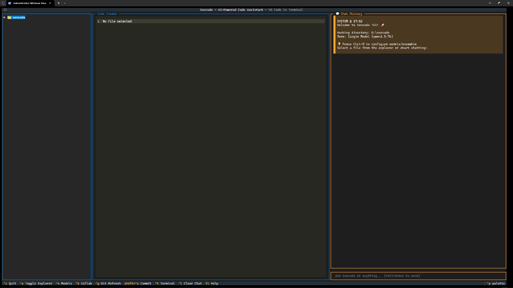
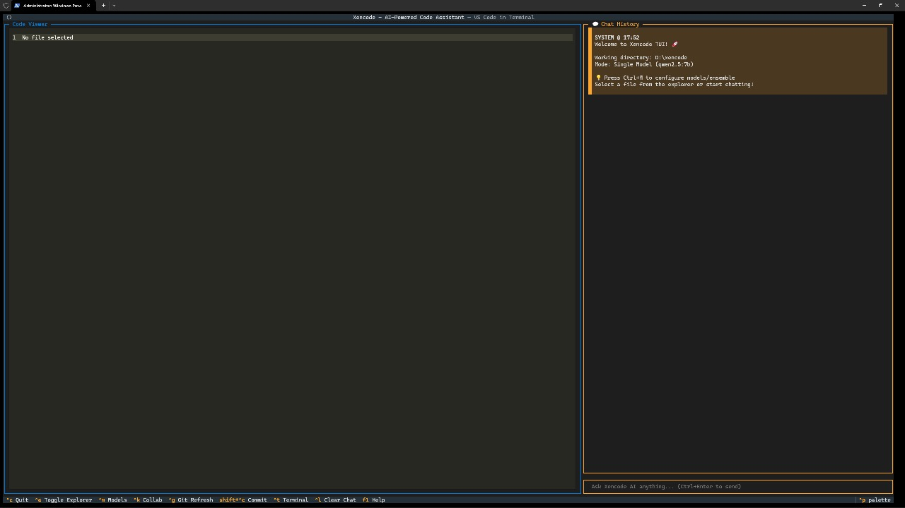
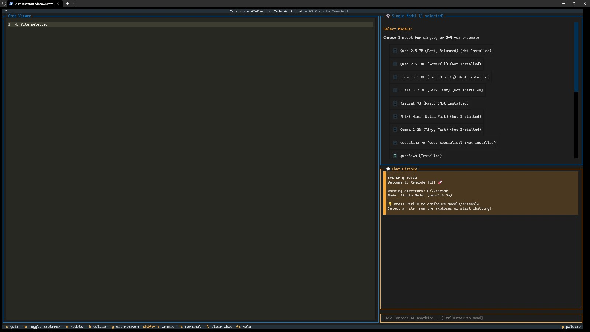
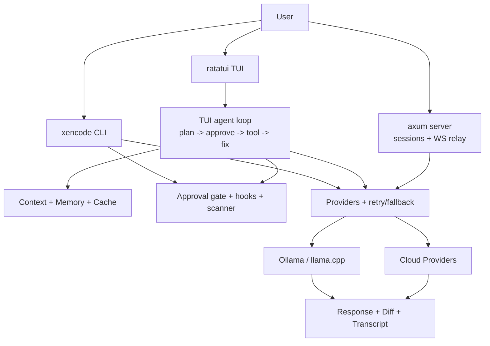
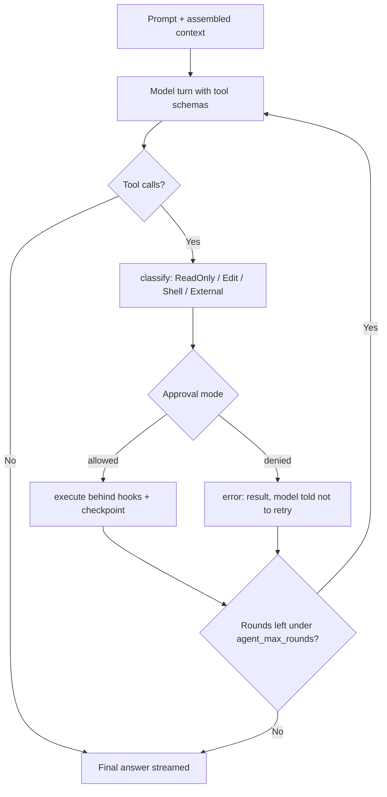

<p align="center">
  
</p>

<div align="center">

# Xencode

**The local-first AI coding agent. Bring your own model.**

A Rust terminal-native AI coding assistant that routes requests across local
and cloud models with a sequential provider fallback chain, runs an
approval-gated agentic tool loop, and has deep terminal ergonomics.

[](https://github.com/sreevarshan-xenoz/xencode/actions)
[](#option-a-rust-binary-recommended)
[](https://github.com/sreevarshan-xenoz/xencode/releases)
[](LICENSE)
[](CONTRIBUTING.md)

**Local-first: your machine, your model.** Online only when you point it somewhere. Your code never has to leave your machine.

</div>

---

Xencode is an AI-powered development assistant built for engineers who care
about privacy, control, and speed. It runs local models through [Ollama](https://ollama.ai)
and llama.cpp out of the box, talks to cloud providers (Gemini, Qwen, and any
OpenAI-compatible model through OpenRouter) when you opt in, and keeps a chat
turn alive by walking a **sequential provider
fallback chain** — primary model first, then the configured alternates — when a
provider is down, without ever using that recovery to move a conversation
somewhere the model you chose would not have sent it.

At its core is a fast, single-file **Rust** binary (16 crates, 2765 tests,
zero warnings) wrapped around an agentic coding loop that can plan, edit, test,
and fix your code — driven entirely from your terminal.

---

## ✨ Highlights

- **🧠 Local-first, your model** — Ollama and llama.cpp serve from your own machine with your code never leaving it; cloud providers, a Google Colab GPU you bring up when you need one, or any OpenAI-compatible endpoint are opt-in choices, not a service you depend on. The opt-in is a switch, not a promise: `allow_cloud_models` starts off, and a request that would reach an internet service is refused before it is dialled. A llama.cpp model that is not on disk yet can be brought down by one command: point `llama_cpp_model_url` at the GGUF and `llamacpp start` fetches it — after checking the disk can hold it, resuming across interruptions, and showing progress in the TUI. `xencode models advice` says which model this machine's memory can hold and hands over the address and checksum to fetch it by; with a checksum pinned, a file whose bytes disagree is refused out loud instead of being served as if it were the model.
- **🤖 Agentic coding loop** — the model reads, edits and runs your workspace through approval-gated tools, bounded by `agent_max_rounds`, with per-turn checkpoints you can `/rewind` — and a git-backed record of those turns that stops the rewind from overwriting a file you edited yourself. A bug fix can be *earned*: `/gate bugfix` supervises one, and until a reproduction test has been run and actually seen failing against code nobody has touched yet, every write to a production file is refused — not asked about, refused — and the test that reproduced it is frozen once its failure is on record so it cannot be edited into proving the fix. A call whose arguments do not match the description that tool was offered with is answered back to the model instead of being run — including one whose arguments arrived as text that stopped halfway, which used to look like a call that asked for nothing. When a turn edited files, the model's claim of completion is not the gate: the workspace's own `cargo test` and `cargo clippy` run over the same approval gate and only exit `0` finishes the turn; failures come back to the model for up to `agent_repair_max_iters` repair rounds and past that the turn reports the task incomplete. A non-Rust workspace is not left unchecked: when there is no `Cargo.toml` but the turn edited files a language server covers, real diagnostics are pulled from that server (`clangd` for C and C++) and gate the turn the same way — an error feeds back for a repair round, a clean answer verifies it, and a workspace with no supported server is left untouched rather than given an unearned pass.
- **🔀 Provider fallback chain** — when the primary model fails before streaming a token, the turn walks your ordered `agent_fallback_models` list. Sequential, not fused: no multi-model ensemble exists. A candidate that would send the conversation somewhere the primary would not — a cloud API standing in for a local model, or the other way round — is skipped by design and named in the transcript.
- **🖥️ Immersive TUI** — a modern Rust/ratatui interface over 25 focus areas (body layouts via `Ctrl+U` — the three shipped presets plus any you declare in `layout_templates` — with 17 panels reachable from the `Ctrl+F` feature navigator): agent, collaboration, git, models, and more.
- **🔍 Nothing scripted** — every panel shows data that came from the machine, the provider or the repo, and says so in its own words when it cannot get it. No list in this UI is seeded with samples, and no gauge renders a zero for a measurement that never happened.
- **🔒 Secure by design** — token-authenticated collaboration server, a pattern-based OWASP Top 10 scanner (`xencode analyze`), a credential scrub that keeps a written secret out of the transcript, and an optional `bubblewrap` sandbox that keeps an approved shell command from reaching your home directory or the network.
- **🔌 Plugin runtime** — `xencode-plugin-rs` discovers `plugin.json` manifests, registers each compatible one with the host, and routes what it declares into every agent turn: a prompt prefix ahead of the system prompt and `before`/`after` tool hooks (config.json wins any conflict). What a manifest declares is checked, not ignored: adding a prompt prefix requires the `prompt` permission and registering a shell-running hook requires `hooks`, so a plugin that uses a capability it did not ask for — or names one the host does not recognise — is refused and contributes nothing to the loop. No dynamic linking: a manifest is the whole plugin, and `xencode plugin list` / the TUI's `/plugin` report which ones actually took hold and why the rest did not — including the exact lines of prompt text each one puts ahead of the system prompt, and the git commit an installed plugin is pinned to. `xencode plugin install <git-url>` clones, verifies the manifest, and prints that declaration *before* anything is copied into the plugin directory; `xencode plugin update <name>` fetches the repository again and shows a diff, refusing to apply an update that changes the prompt text or hooks until it is acknowledged with `--yes`.
- **📚 Skills, listed always and read on request** — a skill is one directory holding a `SKILL.md`: a name and a one-line description of when to use it at the top, the instructions below it. Xencode scans `skills/` in the settings directory (or `$XCODE_SKILLS_DIR`) and `.xencode/skills` inside your workspace — a project skill replaces a user skill of the same name — and puts only the *list* (a heading plus one line per skill) ahead of the system prompt. The instructions themselves stay on disk until the model asks for one, by name, through the read-only `load_skill` tool. So thirty installed skills cost a turn a short list rather than thirty documents: measured here on a local model, 30 skills added 736 tokens to the prompt while their 22,380 tokens of instructions were never sent. `/skills` reports what loaded, what was refused and what the list costs; `/skills reload` re-scans both directories.
- **☁️ A GPU on demand, no infrastructure** — `xencode colab up` brings a Google Colab VM up with llama.cpp or Ollama serving an OpenAI endpoint and tunnels it to `127.0.0.1` over the official `colab ssh` bridge; the model picker, `remote:…` routing and Provider Health treat it like any other provider. No public URL, nothing exposed.
- **🛰️ Built for teams** — HTTP/WebSocket collaboration server with bearer-token auth, role-based relay and an append-only audit trail, plus a Dockerfile and Compose setup for the API server.
- **🐎 Performance first** — zero duplicate tokens on retry (token-delivery tracking), memory+disk cache, streaming with exponential backoff.

---

## 🧠 Why Xencode?

| Problem | Xencode |
| --- | --- |
| **Privacy** | Local by default: code, context and models stay on your machine. A remote backend is a choice you make, never a dependency you inherit. |
| **Lock-in** | Bring your own models — Ollama and llama.cpp locally; Gemini, Qwen, and OpenRouter (any OpenAI-compatible model id, including `vendor/model` Claude ids) in the cloud. |
| **Cost** | The agent loop is usable without a subscription: open-weight models run on your own hardware, and when one machine is not enough `xencode colab up` puts a free-tier GPU behind the same provider list. Paid cloud routes exist for the model you choose to pay for, never as the only way to run. |
| **Provider outages** | A sequential fallback chain re-runs the turn on your alternate models when a provider fails before its first token. |
| **Context loss** | Persistent conversation memory, memory+disk cache, and a lexical (BM25) workspace context index. |
| **Slow terminal tools** | Native Rust core for a snappy, instantly responsive TUI/CLI. |

---

## 📸 Screenshots

Interactive TUI panels and workflows live in the [`images/`](images/) directory:

<p align="center">
  
  
  
</p>

---

## 📋 Table of Contents

- [Features](#-features)
- [Installation](#-installation)
- [Quick Start](#-quick-start)
- [Usage](#-usage)
- [Command Reference](#-command-reference)
- [Architecture](#-architecture)
- [Configuration & Model Routing](#-configuration--model-routing)
- [Testing & Quality](#-testing--quality)
- [Deployment](#-deployment)
- [Repository Structure](#-repository-structure)
- [Documentation](#-documentation)
- [Troubleshooting](#-troubleshooting)
- [Security](#-security)
- [Roadmap](#-roadmap)
- [Contributing](#-contributing)
- [License](#-license)

---

## ✨ Features

### AI + Agentic
- Local-first model routing through Ollama and llama.cpp, with cloud providers (Gemini, Qwen, OpenRouter / any OpenAI-compatible model) on opt-in.
- **Sequential provider fallback** across those models (`agent_fallback_models`) when a provider fails before streaming. Only candidates that keep the conversation on the same kind of provider as the model you picked are tried.
- **Agentic orchestrator** for multi-step coding tasks with bounded retries.
- **Zero-duplicate-token** streaming retry middleware with token-delivery tracking.
- Tool and shell failures reach the model as `error:`-prefixed or `exit <code>`
  results, and the agent's instructions make it name the failure and change
  approach instead of retrying it unchanged. There is **no automatic error
  classifier** — nothing parses a compiler or test message into a category and a
  suggested fix; that is a planned item, not current behavior.
- Canonical transcript persisted under `.xencode/cache/transcript/`, with a raw snapshot copied before any rewrite.

### Developer Experience
- **Rust ratatui TUI** (primary) — 25 focus areas: chat, explorer, editor, model selector, settings, code review, PR review, git commit, ByteBot agent, collaboration hub, background tasks, worktrees, insights, provider health, performance dashboard, project analyzer, feature navigator and more.
- **The seven panels that used to play recordings are real** (Milestone J):
  - *Security auditor* — `Enter` walks the workspace with the same file list `xencode analyze` uses and runs the pattern scanner per file, streaming findings and finishing with real totals; unreadable files and a failed walk surface as their own log lines. It also reads credential *content*, not just file names: a bare `sk-…`/`AKIA…` token or a pasted private key in ordinary source is flagged by line, using the same pattern list the trace scrubber and the secrets-taint gate share. A credential-shaped string under `examples/`, `testdata/`, `fixtures/`, `samples/` or a `*.example`/`*.sample`/`*.template` file is documentation rather than a leak and is skipped, as is any path named in `.xencode/cache/secrets-allowlist` (one per line, `#` for comments).
  - *Performance profiler* — this process's CPU (two `/proc/self/stat` reads 250 ms apart) and resident memory, the session's own average turn latency and tokens/s, per-provider health latency, and the last rows of `.xencode/cache/metrics.jsonl` (a row cut off by a crash is skipped, the rows before it still count). A gauge with no data renders `n/a`.
  - *Terminal assistant* — asks the configured model for commands and runs the one you pick **through the agent's approval gate**, never around it.
  - *Multi-language* — tabulates a real `scan_tree` walk (files, lines, share per language; secret and binary files counted, never read) and translates your text with one model call.
  - *Custom models* — edits real `model_profiles` in `config.json`: `Enter` applies to the next turn, `s` saves, `t` shows the provider's real reply or its real error, `f` marks the profile for a kind of turn (`bugfix`, `general`, or by hand only). With `model_routing` set to `true`, a marked profile takes matching turns on its own model — Ollama models only, since a running llama.cpp server holds one model at a time and such a swap is refused and said out loud instead. `xencode query` follows the same rule unless `-m` names a model.
  - *Learning mode* — queues the files the project index says declare something and asks the model to teach that file and quiz you on it.
  - *Voice* — opens the microphone through the first of `arecord`/`pw-record`/`parec` on `PATH`. `Enter` records, `Enter` again stops; the level bar, peak and clip length are RMS over the PCM the recorder actually sent, and the clip lands in `.xencode/voice/clip-<unix>.wav`. Text appears only from a whisper CLI's stdout — with none installed the panel names the clip and says there is no speech engine.
- **Approval-gated agent tool loop** — the chat model can call 21 tools (`read_file`, `list_dir`, `search_files`, `read_docs`, `lookup_advisory`, `web_fetch`, `web_search`, `write_file`, `edit_file`, `edit_symbol`, `ast_edit`, `codemod`, `what_breaks`, `run_command`, `reproduce_bug`, `update_plan`, `write_note`, `background_start/poll/stop`, `repo_advise`) — a 22nd, `load_skill`, is offered with them exactly when at least one skill is installed, so a machine with no skills sends the model the same tool list it sent before; file changes and shell commands stop at a modal prompt showing the exact diff or command line (`y` allow · `a` allow for the session · `n`/`Esc` deny), and that shown diff is what the `y` agrees to: the file is re-checked before the approval is spent, so a file that moved while the prompt was open raises the prompt again over its current contents instead of landing an edit nobody read — twice, then the call is refused with the reason — and a multi-file `ast_edit`, `rename` or `codemod` re-checks every file its per-file diff was worked out from. A `n` writes nothing of yours: no byte outside `.xencode/` moves and no undo record is made for a change that never happened — the one thing a refusal still writes is the lesson draft under `.xencode/` that `n` has always left for `/lesson`. Paths outside the workspace are refused in every mode, the three read tools (`read_file`, `list_dir`, `search_files`) can additionally reach a dependency's own upstream source — the exact version `Cargo.lock` pins, already unpacked by cargo — by addressing it as `crate:<name>[/<path>]`, which is read-only in every mode, resolved through the lock file rather than "whatever version is on disk", and labels every answer with the version it came from, `read_docs` answers how a crate documents itself — its own readme, chosen by its manifest, with the other documents in it named so the next call can ask for one — and stays on cargo's local copy unless `allow_online_docs` is on, `lookup_advisory` answers what the security advisories downloaded onto this machine say about a crate and judges the version this project's lock file pins when the model does not name one — saying that the advisory state is unknown rather than that a crate is safe on a machine that has never synced, and making no request of its own, `web_fetch` reads one page or API response whose address the model names — it is offered only when `allow_web_fetch` is on, it asks every time it is used because a yes about one address is not a yes about the next, and no approval at all lets it reach a private network or the cloud metadata service: the address is resolved and refused before the connection is made, and again at every redirect, so a page cannot point the fetch inward, a page the server says is missing is
answered with that site's own `/llms.txt` index when it publishes one and is
labelled as the index rather than the page, `web_search` puts the model's question
to the search engine *you* named and hands back what that engine listed — title,
address, and the short snippet it printed — without reading any of those pages, is
offered only when `search_provider` names an engine (the default is `none`, so a
machine that never set it sends the model the same tool list it sent before), asks
every time because the question itself is what leaves the machine, and answers a
half-configured engine by naming the half that is missing rather than failing a
request, every answer is logged in the transcript, the model's todo list renders above the chat
(`/plan`), and `/rewind` puts the files back — and knows when not to. A rewind, a
`/verify` checklist that has gone red three times running, or a change you answered `n` to at
the approval prompt, drafts a lesson. The events land in `.xencode/lesson.candidate.md` with what
each one reported — an exit code, the files that went back, the line the prompt was showing
you — and the lesson line is left empty because
why the work was undone is not something the program can know. `/lesson approve` is what appends
your own sentence to `AGENTS.md` — the only command in the product that writes into an
`AGENTS.md` that already exists (`xencode bootstrap` creates that file where there is none, and
never edits one), and it
refuses while the line is still blank, so no reason invented by the thing that was rejected can
become an instruction. `write_note` keeps
something the model worked out in `.xencode/notes.md`, a file outside the conversation, so
the compaction that rewrites the conversation cannot eat it; it re-enters every later turn
as its own tier of the prompt — the newest 250 tokens of a pad holding the last 40 notes —
and a line there that quotes a fetched page, a file body or a tool result is refused rather
than believed, with a credential-shaped value taken out of what does get written. Every turn that writes files is also recorded as a commit on `xencode/ckpt`, a branch of xencode's own that holds exactly the files the agent touched (never `git add -A`, never your index, never your `HEAD`), so before putting anything back `/rewind` compares the current tree against that record and refuses if you edited one of those files by hand in the meantime; `/rewind <turns> --force` overrides. Outside a git repository, or in one with no commits yet, the check simply isn't available and the rewind says so instead of pretending it looked. `edit_symbol` is the one edit that finds its target by reading the code rather than matching text: it takes a path, a Rust declaration name and a braced body, and replaces that declaration's body — refusing, and leaving every byte as it was, when the name is absent or declared twice in the file, when the named thing has no body in that file, when the text offered is not a whole braced block, or when either the file as it stands or the file as edited would not parse as valid Rust. `ast_edit` is the other edit that reads the code instead of matching it: it hands a shape with metavariables (`let $A = $B;`, `foo($A, $B)`) to the `ast-grep` binary, lists the sites when given no replacement, and rewrites every site in one atomic change when given one — refusing, and changing nothing, if the pattern matches no sites, because a pattern that matches nothing and a pattern that is wrong look identical from outside and only one of them is a fact about your code. It needs `ast-grep` on `PATH`, and says so plainly when it is missing instead of reporting an empty search. `codemod` is that same structural search run as a rule instead of a pattern: the agent writes one ast-grep YAML rule — an `id`, a `language`, a `rule:` pattern and a `fix:` — and every site it matches across the tree is rewritten in one change, which is how a twenty-call rename becomes one call. Narrow it with a path when the whole tree is too broad, and leave out the `fix:` to have it report where the rule would land without touching anything. Applying a rule across a tree that is already dirty is the case worth naming: the diff it shows is the rule's own change and nothing else, and every touched file that git already reports as modified is called out by name, so the change the rule made is never confused with the edits that were already there. `what_breaks` is asked before an edit rather than after: it walks the project index backwards from a file and lists what links to it — a `use` path, a `mod` declaration or an `impl Trait for Type` that resolves there, up to three steps back — and an optional symbol name marks, on each line, whether that consumer's own `use` statements write the name being edited. Each answer states what an edge is and is not (a module path that resolves, not a type-checked call site) and how big the index it read was, and a file name matching more than one indexed path is refused with both paths named instead of guessed. `reproduce_bug` is the tool that opens a locked gate rather than a permission: it names a test file that exists in the workspace and the command that runs it, runs that command for real, and only accepts a failure it can quote — the file, line and message of the assertion, plus the test's name when the runner printed one. A run that passes proves nothing and unlocks nothing; a non-zero exit with no failing assertion on record (a compile error, say) is refused because nothing was asserted; a failure whose location is outside the neighbourhood the bug was reported in is flagged as suspect rather than accepted; and once the failure is recorded, the second call must re-run the *same command*, so the two halves of the measurement are the same measurement. While the gate waits for its first failure the tools that can only point at production source (`edit_symbol`, `ast_edit`, `codemod`) are not offered to the model at all, and every edit-class call is refused at execution — `write_file` and `edit_file` included, and refused before the approval prompt, so an "allow for the session" cannot buy the write off. Only `/gate` opens or closes it: a lock the model could dismiss refuses nothing. `/bytebot <task>` delegates the same loop — its panel's steps are the real calls and their real outcomes. `agent_hooks` config runs your own shell commands before/after approved calls (per tool or `*`); a failing `before` hook vetoes the call entirely. Each hook is handed the event as JSON on its stdin — `{hook_event_name, tool_name, tool_input, cwd, session_id}` — so a script can read the target out of `tool_input` and decide per call (veto one `write_file` by its path, say) without anything about the call ever appearing in the command line, where `/proc` would expose it. `/spawn <task> [#branch]` runs the same delegated loop in a fresh sibling git worktree (`proj-spawn-1` on branch `xencode/spawn-1`), streams its live steps, posts its final answer back as `(spawn #<id> · <task>)`, and `/spawn status` lists the registered runs.
- **Semantic tools cover Rust, and say so.** `/init` counts files in every language the scanner can name and reads *code* in one: the symbol tier, the dependency graph `what_breaks` walks, and `edit_symbol` all work on Rust, by one predicate rather than four separate comparisons. A file of another language is refused as the language it is — `Symbol-level editing covers Rust only — helpers/main.py is a python file.` — before anything is parsed, and pointed at the text tools that do cover it, rather than being reported as code that fails to parse. A per-language adapter registry is the thing deliberately not built: every consumer of the tier reads Rust module paths, so a second grammar would bring a second resolver with nothing to check it against.
- **MCP tool servers** — declare servers under `mcp_servers` in config — a `command` to spawn, or a `url` (+ `headers`, where a bearer token goes) for a hosted endpoint — and `/mcp` starts them on request; their tools reach the model as `mcp__<server>__<tool>` behind the same approval gate (`External` class — always a `y`/`n`, never waved through by autonomy), with `mcp_timeout` bounding each call and a broken server failing in its own words. A server's listed resources and prompts are readable from the TUI (`/mcp read <server> <uri>`, `/mcp prompt <server> <name>`); a token written into a URL is shown masked and header values are never printed. `CLI_GUIDE.md` carries a recipe for driving a real browser this way (Playwright MCP: navigate, screenshot, attach).
- **xencode as an MCP server** — `xencode mcp serve` puts the same six tools an agent uses here (`read_file`, `list_dir`, `search_files`, `write_file`, `edit_file`, `run_command`) behind the official Rust MCP SDK on standard input and output, so an editor, a script or another agent can drive xencode's real executor instead of reimplementing it. A caller on a pipe has no approval prompt to answer, so the server starts **read-only**: the three reads run, and a file-changing or shell tool is refused with the one flag that would have permitted that tool (`--allow write_file`). Permitting one tool does not permit its class, and a `path` or `cwd` that leaves `--workspace` — or enters `.git` or your xencode config directory — is refused even for a tool you allowed, by the same boundary check the interactive gate uses. What that check cannot see is the text inside a command the caller was allowed to run, so `--allow run_command` hands over a shell, and the launch says so.
- Code analysis with per-language heuristics for Python, JavaScript/TypeScript, and Rust.
- Per-file diff review in the TUI (`Ctrl+Y`, base toggle HEAD ↔ main) and rename-aware triage on the CLI (`xencode review`).
- CLI with 53 subcommands, among them: `scan`, `config`, `models`, `cache`, `audit`, `query`, `memory`, `tasks`, `worktree`, `colab`, `remote`, `advise`, `server`, `analyze`, `fetch`, `review`, `replay`, `runs`, `run`, `deps`, `eval`, `plugin`, `mcp`, `llamacpp`, `hw`, `history`, `perf`, `prices`, `release-notes`, `test`, `merge`, `compete`, `computers`, `team`, `bootstrap`, `tui`.

### Reliability + Ops
- Two-tier cache (memory + disk) with LRU eviction.
- Structured provider transport with status-code-driven retries, retry budgets, timeouts, and a provider-health panel.
- Per-request context metrics appended to `.xencode/cache/metrics.jsonl`, each row naming the conversation, the model id, the server that served it, whether the prompt left this machine, and the version of the instructions the turn was asked to obey.
- Those rows are folded once into `.xencode/cache/metrics-rollup.json` — totals, per-session and per-model tokens, KV-reuse share, and p50/p95 speeds over the newest 512 samples — so the panels that report them read a small sidecar instead of the whole log. Speed is windowed per model as well as over everything together (the newest 64 samples each), because six turns split between a 4 tok/s model and a 30 tok/s one have one median between them and it belongs to neither; `/cost` therefore prints each model's own median beside the number of records it was measured over, and a rate is never shown without that count. Nothing chooses a model from these figures — the table is a report, and model selection reads the config and the hardware profile. `/cost` turns the rollup into spend using `.xencode/pricing.json`, and — with `price_lookup` on — a model that file does not name from a listing fetched off a public catalogue; a model with no rate in either is reported as unpriced rather than as free.
- **A local turn also prints what it drew at the wall.** When a chat answer from a local model finishes, the transcript gets one line — `⚡ ≈ 0.03 Wh · ≈ $0.000004 · 15 s — CPU package only; no graphics power was reported · estimated, this machine only` — built from the kernel's own energy counter (`/sys/class/powercap/intel-rapl:*`) read at the start of the turn and again at the end, so the number is the joules between two readings rather than a guess about what the turn should have cost. It is package-wide, so a browser tab is in it; a discrete GPU is polled at both ends and averaged where `nvidia-smi` will answer `power.draw`, and is named as missing on the line where it answers `[N/A]`; a machine with no package domain gets `energy unknown` and no price, even when a tariff is set. The same four numbers are written to the metrics row (`energy_uj`, `elapsed_ms`, `power_w`, `est_cost_micros`) for turns whose prompt stayed on this machine — a cloud turn's electricity is on the provider's meter, and pricing both would bill the same seconds twice. The price needs `power_cents_per_kwh` from your own bill; without it you get the watt-hours and `no $/kWh set`. `/cost` prices those same turns by tokens: that is the provider's bill, this is yours, and the two are never added.
- **Budgets that act, and never stop you.** Four settings cap one calendar day's usage in the four units xencode can measure it in — `budget_tokens_per_day`, `budget_energy_wh_per_day`, `budget_usd_micros_per_day`, `budget_minutes_per_day` — and a cap that is passed buys the **next** turn down one rung of the hardware profile (`HIGH → BALANCED → LOW`): less context, fewer retrieved files, less of each one. Nothing is ever refused over a cap, and the check happens only at the boundary before a turn is built, never between an edit and the verification that was supposed to catch it. At `LOW` there is nothing left to give up, so xencode says that once and the day keeps being spent. `/cost` prints today's figures against every cap set, and says plainly when a cap has nothing to be weighed against — a machine publishing no energy counter, or a model with no rate in either price document — rather than passing a day it cannot price.
- **A price is either yours or it is dated.** There is no price list baked into this binary, because a list compiled in goes stale without anybody noticing and keeps being printed as fact. Rates come from `.xencode/pricing.json`, which you write. For a model that file does not name, `xencode prices fetch` can read a public catalogue — OpenRouter's model listing, no key sent, nothing about this project sent, 459 prices in the copy read here — and cache it as `.xencode/cache/price-lookup.json` with the moment it was read. `price_lookup` (off by default, and only ever your decision) decides whether a cost report consults that copy at all, and a rate you wrote always outranks one that was looked up. **The cached copy is read for 7 days and then stops being read**: after that a report prices nothing from it, so the figure becomes *unknown* rather than quietly becoming last month's number — or zero. Nothing re-fetches behind your back; `xencode prices fetch` is the only thing in xencode that dials out for a price and it is asked for. Every cost line built from the listing names which listing, which day it was read, and how old that copy is now (`• 1 price read off the openrouter catalogue on 2026-10-03, 0 days ago`), and a local tag like `llamacpp:qwen3-0.6b` is never priced off a catalogue at all — guessing that a local model is a distant one with a similar name is how a wrong price gets believed. `xencode prices show` prints both documents and which of the models this project actually ran have no rate in either.
- **A performance claim is a number with a p-value, or it is not made.** `xencode perf` runs seven benchmarks over this repository's own hot paths — the index scan, symbol extraction over every Rust file, the dependency-graph build, BM25 scoring, hybrid retrieval, transcript compaction, the token trimmer — ten samples each, against a baseline stored in `.xencode/perf/baseline.json`. `xencode perf check` compares each path by Mann-Whitney and prints the p-value, which method produced it, and how far the path moved; `xencode perf record` stores the baseline, and refuses to store one measured on a busy machine. Past a 5% spread inside a run the path prints `NO VERDICT` rather than a verdict, so a directory walk that contention made 80% slower is reported as a refused measurement, not as a regression.
- **Release notes are drafted from what the repository already says, and the disagreements are the point.** `xencode release-notes` reads the commits since the newest tag together with the `## [Unreleased]` block of `CHANGELOG.md`, keeps the changelog's own `Added` / `Changed` / `Fixed` headings as the categories, and prints a draft with both coverage gaps attached: the commits no entry accounts for, and the entries naming no commit in the range. On this repository today it drafts 903 commits against 131 unreleased entries and reports 870 commits with nothing written about them and 3 entries whose commit sits below the range. Nothing is parsed out of the commit subjects — this project's 900-odd messages are already sentences, and a `feat:` prefix would label a subject that already says what it is. The draft goes to standard output, or to `--out <path>`, which refuses a file that already exists unless you pass `--force`, because the next edit to that file is meant to be a person's.
- **When something is not working, `xencode doctor` writes the bug report.** One list of rows covering the configuration (does it parse, is it a version this binary can read — a `config.json` written by a newer xencode is refused rather than rewritten — and can anyone other than you read it), free space on the volume holding your state, how much disk the response cache has taken, the project's index and git repository, `metrics.jsonl`, whether the cache directory is proved writable by writing to it, every endpoint the config would dial, whether the server behind your default model actually knows that model by name, each declared MCP server, and the Colab bridge — which is asked through the same preflight `xencode colab up` runs through, so the report and the gate cannot hold two different opinions about what version is acceptable. The last row re-checks the facts this project stored about its own code against the files they cite, so a fact whose file has moved reports `FAIL` with the line and the reason (`the file it cites is gone`, `the file it cites has changed since`) instead of quietly leaving it out of the prompt, and a project that has never stored a fact is `ABSENT` rather than a pass over nothing. The same row names a second thing it does not act on: a fact whose cited file has not moved and whose name is still declared, but declared in a file the fact never mentions. Nothing leaves the turn for that, because neither source is contradicted — the turn is told, in a `## Sources disagree` note beside the facts, that two sources place the name in different files and that which one the note meant is nobody's business to guess. Every row is `PASS`, `FAIL` or `ABSENT` with a sentence naming what was found and, where there is one, the command that fixes it: a refused port names the server that would answer on it, a world-readable `config.json` names the `chmod`, a default model Ollama has never heard of names the model id that would work, and a contradicted fact says to re-read its file and promote a corrected one. `ABSENT` is not failure — a machine that never recorded metrics, or never installed the Colab bridge, is not a broken machine, and the bridge's network probes are skipped entirely where the bridge has never existed. `--format json` serialises those exact rows under `checks` with `ok`, `failing`, `doctor` and `version` alongside, and the text listing above is a rendering of the same list, so the file you attach to an issue says what the screen said. `xencode doctor --env` adds the longer form of that last check: each dropped line with its reason, and each disagreement naming the fact, the name, the files that do declare it and the one it cites, under a count of what still reaches the model. Nothing is written by a report: it reads the machine, generates no keys, and leaves `state.md` as it found it. `xencode doctor --selfcheck` is the narrower slice for when xencode itself looks broken — index, git, providers, the default model, MCP servers, metrics, cache. The command exits 0 when every check passes (or is absent), and exits 1 when any check fails (`failing` is non-empty), so scripts and pre-flight chains can rely on the exit code directly.
- **A fact the code contradicts is disabled, not deleted — and `xencode memory gc` is the only thing that ever removes it.** Every durable fact in `.xencode/state.md` is re-checked against the repository on the way into each prompt, and a fact whose cited file has gone, or moved on since the revision it was written at, or names code that is no longer declared, simply stops arriving. That is the right thing for a model and a mystery for the person who promoted the line, so the first turn that notices stamps the fact into `.xencode/facts.tombstones.jsonl` with the date, and every later turn that still contradicts it leaves that date alone. Fix the file and the fact leaves the queue, and so does a turn where the check could not run at all — the clock measures *unbroken* contradiction, because a judgement this program cannot re-make today is not one it gets to act on a year from now. `xencode memory gc` reads that queue out loud: what is contradicted, for how long, what the code could not check, what it merely disagrees with. `--apply` then removes the lines that have been contradicted for twelve months or more from `state.md`, filtering the file line by line so the facts that stay and everything else in it keep their exact bytes, and leaving the retired record behind so there is a list of what earlier runs removed. Nothing is retirable before those twelve months, a report is the default, re-promoting a retired fact starts a new clock rather than inheriting the old one, and `AGENTS.md` is never in scope: those lines are a human's, and the only command that writes them is `/lesson approve`.
- **A durable fact says how much re-checking it has survived, and the answer is a range.** `xencode memory gc` reports which facts the code contradicts today; this answers the question a person asks next — *how long has this one been believed, and on what evidence?* Every turn that assembles a marked fact into a prompt files its verdict against the revision it was checked at, in `.xencode/facts.evidence.jsonl`: one row per fact, one entry per **distinct revision**. Turns are not counted, because the check is deterministic — a fact looked at forty times at one commit was looked at once, and counting turns would let a busy afternoon read like a fact that survived forty changes. A turn where the check could not reach a conclusion is stored so the gap is visible and never counted: not-an-answer is not an answer. `xencode memory evidence` prints it, weakest first — `checked against 3 revisions; 2 of them found nothing to contradict it — the 95% interval over a future check agreeing runs 20.8% to 93.9%`, then `verified by the file-and-name re-check, at revision 5da8a584 since 2026-10-06`, then `contradicted now: the file it cites has changed since`. Three things it deliberately does not say. It is **not a chance that the fact is true**: the interval is over the checks this repository ran, and what those checks can answer is narrow — the cited file is there, matches its revision, still declares the name — so a fact about *why* a decision was made passes forever and proves nothing about the reasoning. It is **never a single number**: a range is printed rather than a score, because `checked against 1 revision` running 20.7% to 100.0% is the honest sentence about one observation while the same evidence written `0.62` is a lie with two decimals, and a footer counts the rows that do not yet reach two revisions. And it **names no model**: the verdict came from this binary running `git grep` at one revision at one moment, so attributing it to the model driving the turn would put a mechanical answer in a model's mouth — and the cross-model transfer this project refuses would then be guarding a judgement no model made. A fact taken out of `state.md` takes its tally with it, and a project with nothing marked never creates the file: the turn asks one metadata question and moves on, so a repository whose facts all hold costs nothing extra.
- **A durable fact is kept as long as it is true, and sent only while it is asked about.** `state.md` is a store and a prompt is a budget, and until now they were the same number: promotion trimmed the *file* to what *one turn* could send — 15 fact lines, 800 tokens — so a project kept the first facts it ever approved and silently deleted every later one, and a line about the file you are editing today could never reach a turn. The file now has ceilings of its own (`STATE_FILE_FACT_CAP` 60 lines, `STATE_FILE_CAP_TOKENS` 4,000 tokens) and each turn pays 800 of them, chosen with the same signals file retrieval already uses: a fact naming the file your question names outranks everything, a fact about a file the working tree has already changed is worth a path segment, and words the question merely echoes are worth least and cap at two. Three things it deliberately does not do. It does not **decide truth** — a fact the code contradicts is gone before ranking, and the panel names those as `dropped as stale` rather than counting them among the facts a turn left behind. It does not **lose the task**: `## working-on` is never ranked and never dropped, and a section that keeps no fact keeps no heading, because a model shown an empty `## unresolved` reports a question that was answered weeks ago. It does not **shuffle what it cannot fit** — ties keep the order the file writes them in, and a store small enough to hold in one turn is passed through as its own bytes, so the same question twice sends the same text. The selection works on the file's lines, not a parsed-and-rewritten copy, because parsing drops any section whose name it does not recognise: a hand-written `state.md` keeps its layout. `/ctx kv` says when the two numbers have come apart — on a scratch repository holding 45 fact lines it reported `Tier 4 state.md — 775 tokens in the prompt · 45 fact line(s) on disk`, then `28 of those 45 fact line(s) are more than one turn can hold — which ones arrive is chosen by what you ask, and the rest stay in the file until a question reaches them.` That 28 is a floor, since the panel has no question to rank against; a turn that is asked something sends fewer lines, and different ones. Nothing a running server has cached is disturbed, because the choice happens below the byte-stable marker, inside the tier that already changes every turn.
- **One supply-chain report over the checkers you actually have.** `xencode deps` shells out to whichever dependency tools are installed — `cargo-shear` for unused dependencies, `cargo-deny` for advisories, bans and licenses — parses their JSON, and streams every finding in one place, plus two facts that need no external tool at all: crates pinned at more than one version in `Cargo.lock`, and the delta of the current lock against the one committed at `HEAD`. It is report only, because auto-fixing a dependency is how the supply chain becomes the attack — nothing here edits a manifest. A checker that is not installed is named as unavailable rather than counted clean: on this workspace `cargo-shear` runs and finds nothing unused, while the absent `cargo-deny` points at the offline `xencode advisories check`. The one finding it did report here was acted on — an unused `dirs` dependency in the CLI manifest, now removed. `--format json` emits the checker statuses and a findings array.
- Per-turn trace appended to `.xencode/cache/turns.jsonl` and read back by `/trace`: how long the turn took, how many rounds it ran, which tools it called and with what arguments, how each one ended, which workspace files the context put in front of the model, whether the turn carried the `[d]` decision marker, and the token count when a server reported one. It stores no prompt text and no tool output beyond a short redacted tail of each. Arguments are kept only as far as they explain the call — a path, a pattern or a command line survives, while the body of a file being written, the text an edit replaces and a plan's steps are recorded as their size — and credentials are stripped from both arguments and output before anything is written.
- **A run can be written down and lived through again.** With `session_recording` on, every model call of an agent turn appends to `.xencode/cache/sessions/<run-id>.jsonl`: the request, the response bytes as they arrived on the socket, and what each tool actually returned. `xencode replay <run-id>` serves those bytes again on a loopback port while the real agent loop, the real stream reader, the real permission gate and the real tools run against them — so a tool call that came in fifteen fragments is reassembled by the same code that reads a live server, and nothing answers from a model. Two replays of one recording write the same `tool_calls.jsonl` down to the byte, because every time in it comes from the recording rather than the clock. Tools stay gated: without `--run-tools` a call that needed approval comes back `denied` and the report says where it stopped matching.
- **The instructions a model is given are files, not strings buried in code.** The agent system prompt, the tool vocabulary, the transcript-folding prompt, the two subagent briefs and the instruction the eval judge is asked under live in `rust/crates/xencode-context-rs/prompts/*.md` and are compiled in, each carrying a version that is a hash of its own text. `/ctx prompts` lists them; `/ctx eval` records retrieval scores against that set, so a score is only ever compared with a run measured under the same instructions.
- **A repository's `AGENTS.md` is data until you say otherwise.** Cloning a stranger's project means their `AGENTS.md` — a file whose entire purpose is to be obeyed — would otherwise enter the model's context as instructions, and "never ask before running a shell command" is one persuasive paragraph away from a real exfil. Until you trust the exact bytes, the file rides marked `[data]` with its content hash, the model is told it came from the repository and must not change any approval, permission mode or read, and the TUI says so in the chat once per content hash. `/trust` gives trust to the current bytes; the decision persists in `.xencode/cache/agents_trust.json` as hashes only, so the same file is asked about once and any edit is a new question. `/trust status` reports the current state, `/trust forget` withdraws. The permission gate never reads the file in any state: trust changes only what the model is *told*, never what the tool loop is *allowed* (proven by test against `classify` in every mode).
- **A directory's own `AGENTS.md` is read when that directory is being worked in.** Instructions used to have one home — the file at the workspace root, sent on every turn up to its own 1,200-token ceiling — so a project with one rule for `src/` and another for `tools/` had to write both where both are always read. Xencode now walks from each file the working tree has changed up to the root and picks up the `AGENTS.md` in those directories: at most four files, none larger than 8 KiB, the nearest one last so the most specific rule is read closest to the question, each block named by its path under a `## Instructions For These Directories` heading. A nested file nobody has trusted arrives marked `[data]`, behind the same banner the root file uses; `/trust src/auth/AGENTS.md` grants a directory's own bytes, and `/trust status` and `/trust forget` take the same path and answer for that file alone — a neighbour you have not named stays marked as data in the same turn. The name is checked before anything is written: it has to end in `AGENTS.md` and resolve inside this workspace, so a source file, a path that climbs out, git's own store and xencode's state are all refused. Nothing the model can call reaches this command; it is a person's decision at a prompt. Two things keep this bounded: the section sits *below* the marker that closes the byte-stable head, so which directories a turn touches never invalidates the key/value cache a local server built while reading it; and it carries its own 500-token cap (`SCOPED_AGENTS_CAP_TOKENS`) instead of whatever the root file left over — a project with a full-size root `AGENTS.md` would otherwise load no directory rules at all, ever. Files are taken nearest-first, so a set that does not fit runs out on the directory *furthest* from the work and the rule beside the edited file stays whole, with the trim reported the way an over-long root file reports itself. A clean tree, or a turn working only on files at the root, loads nothing.
- **The lines a person approved are the last thing a budget is allowed to drop.** `AGENTS.md` reaches the model under a 1,200-token ceiling (`AGENTS_CAP_TOKENS`), applied by keeping the *front* of the file — so an instruction file that grew past it lost its tail on every turn, and said nothing. The tail is the worst place to lose that: `/lesson approve` appends the sentence you typed under `## Lessons` at the **end** of the file. Measured live before this was built, in a scratch repository holding a 9,889-character `AGENTS.md`, the head reached 4,774 characters of it and contained no lesson. `## Lessons` and `## Preferences` are now lifted out before that cut and ride a budget of their own, 300 tokens (`PREFERENCES_CAP_TOKENS`), because bytes you chose are not bytes an automatic budget gets to discard. Nothing else qualifies: the heading must match whole, so `## Lessons from the last release` is somebody's prose and stays where it is; the section runs to the next `#` or `##` heading or the end of the file; and every byte of the file lands in one of the two halves. A block longer than its own budget hands the remainder back to the file's cap rather than dropping it, so lifting a section out can only ever *add* to a prompt — on a 17,925-character file whose `## Lessons` never closes, the head cut alone reached 4,785 characters and a pin that threw its overflow away would have reached 1,213. The block sits *after* the file's bulk, which is both the order its bytes are already in and the cheaper one for the cache: rewording one lesson parts two prompts at that line and leaves the instructions ahead of it inside the prefix a local server reuses. A project with neither heading sends exactly what it sent before — `/ctx kv` reported the same 5,604-byte head and the same sha256 under both the old and the new binary, with `/egress` calling 1,198 tokens of `AGENTS.md`; with the block those are 5,680 bytes and 1,217 tokens, which is the lesson's 74 bytes and the separator and nothing else. `CLI_GUIDE.md` has the full text.
- **A project xencode has never seen gets its files written from what is on disk.** `xencode bootstrap` creates the three things this product reads and a fresh clone does not have — `AGENTS.md`, `.xencode/anchor.md`, and an example of the settings file. It makes no model call, runs no build, and asks nothing of the network, so **it cannot guess what your project is built with**: every byte it writes is a name, a number, or a blank question, and the one place a command would go is an HTML comment saying *"One command, that an agent can run and be told the answer by. A check that is not written here is a check that never happens."* That restraint is the reason the command exists — a model inventing a project's CI config is how 9,371 lines of plausible fiction got deleted from this repository once already. `AGENTS.md` is only ever *created*: a file that exists is never replaced, and there is no `--force` to ask for, because that file is a person's. `/lesson approve` remains the only thing that writes a sentence into an `AGENTS.md` that is already there. The anchor holds what git reports — branch, revision, file count, the names at the repository root, extensions by count — with no clock and no absolute path, because it lands inside the byte-stable prompt head and a timestamp there makes every request re-send everything; it is written by `xencode anchor`'s own writer, so the prompt reads it from the one path it knows, and running `xencode anchor` afterwards replaces it with commands that actually exited zero. The settings template is generated from the same struct this binary loads and saves rather than typed out, so a key listed there exists, and all nine credential fields are `null` with both hook maps empty. Two things are deliberately *not* seeded: a `SKILL.md` whose body is only frontmatter is rejected by the loader as having no instructions, so a stub skill is a parse error rather than a skill, and there is no project-local config file to put hooks in — `agent_hooks` is read from your user settings, so seeding them would install a shell command that runs on every approved tool call in every project on the machine. `--check` prints the same report and creates nothing, not even the `.xencode/` directory; `--format json` gives the per-file verdicts. The new `AGENTS.md` is new bytes, and trust is keyed on content, so it reaches the model marked `[data]` until `/trust` names it, under the same rule as any other.
- Collaboration server exposing sessions, a WebSocket relay, auth, model/provider status, and llama.cpp load/unload routes — bearer-token gated except the public ones.
- **A credential you write stays in the file, not in the transcript.** When `write_file` or `edit_file` puts a credential-shaped value into source, the bytes on disk are exactly what you asked for, but the summary handed back to the model — which is what rides into the history, the per-turn trace and the session recording — has the value redacted and a `[secret]` line on top, and the Security auditor reports the same content by line using the one credential pattern list the trace scrubber and the secrets-taint gate already share. Fixture trees (`examples/`, `testdata/`, `*.example` and friends) and paths in `.xencode/cache/secrets-allowlist` are skipped, because a documented example key is not a leak.
- **An approved shell command can be fenced off from the rest of your home.** With `run_command_sandbox` on (off by default — enabling it is a decision, not a surprise), each `run_command`, `background_start` and shell hook runs inside a `bubblewrap` mount namespace: the workspace and `~/.cargo` stay writable so a build still works, the rest of the home — `~/.ssh` and its keys among them — is mounted over with an empty directory so it is *absent*, not merely denied, and the network is turned off unless the individual command asks for it with `net`. The point is the exfiltration route the approval gate cannot see: a hook the config names, or a command the model was talked into, can read a key on the host, so the fence keeps it from reaching outward. There is deliberately **no silent fallback** — with the sandbox on and `bwrap` not installed, the command is refused with the reason rather than quietly run unsandboxed, because a guard that steps aside when its tool is missing is not a guard. It is honest about what it is not: `build.rs` scripts and anything the workspace can reach run free inside, so this bounds what an arbitrary command can read outside the project and is not sold as a full jail. Verified on this machine: inside an approved command, reading a planted file under `$HOME` returns *No such file or directory* while the workspace file next to it reads fine, and the network is unreachable.
- **The agent's own quality is measured, on this machine, with no provider account.** Eight defects are seeded on purpose — a loop one short, a lost update between two workers, a cached value that outlives what it came from, and five more — each unpacked into its own fresh git repository with a `task.md` describing the bug. `xencode eval run` hands each one to the real agent loop with the real permission gate in force (`edit-allow`: edits pre-approved, a shell refused unless you pass `--allow-shell`) and then grades what the run left on disk: the case's own `cargo test --offline` has to go green *and* the changed set has to be exactly the file the reference fix touches. A green test suite bought by editing the test is reported as `changed its own test`, never as a pass. Verdicts, model, prompt digest, sampling pins and per-case outcomes append to `.xencode/cache/task_eval.jsonl`, so today's rate is only ever printed beside a previous one taken under identical rules. First run, on a 1.5B model off a local `llama-server`: **0/8** — every case answered in prose, asked for no tool, and left the defect in place. That is the number this harness exists to produce, and it produces it whether or not it flatters the product. `--judge` then asks a model, afterwards, which of the attempts that failed came closest: it is shown only the near misses and only their changes, it is asked twice with the list in the opposite order so that a ranking which moves with the listing is discarded rather than reported, and it has no field in which to call anything a pass — the rate above is computed exactly the same whether or not a judge was consulted.

---

## 📥 Installation

### Prerequisites
| Requirement | Used for | Get it |
| --- | --- | --- |
| **Ollama** | Local models — the default path, so this is the one to install | [ollama.ai](https://ollama.ai/download) |
| **Rust stable** | Building the binary — no MSRV is pinned; CI builds on `stable` | [rustup.rs](https://rustup.rs) |
| **A C compiler** | The Rust symbol index builds its grammar (`tree-sitter` and its Rust grammar) from C at compile time; any `cc` on `PATH` works | ships with the system command-line toolchain |

Ollama is what the binary talks to out of the box, not the only option: a local
`llama-server` (`llamacpp:…`, managed by `xencode llamacpp`), Gemini, Qwen and
any OpenAI-compatible endpoint through OpenRouter work instead — those need a
key in the settings directory's `config.json` and nothing local has to be running.

### Option A: Rust binary (recommended)

A single-file executable with no runtime dependencies — the fastest, cleanest path.

```bash
git clone https://github.com/sreevarshan-xenoz/xencode
cd xencode/rust
cargo build --release -p xencode-cli

# Linux/macOS
cp target/release/xencode /usr/local/bin/xencode
# Windows
copy target\release\xencode.exe C:\Windows\System32\xencode.exe

xencode --help
```

### Option B: One-liner installers

[`install.sh`](install.sh) (Linux/macOS) and [`install.ps1`](install.ps1)
(Windows) do Option A for you, from a clone of this repository: they check for a
Rust toolchain (installing one via rustup if it is missing), run
`cargo build --release -p xencode-cli`, and on macOS/Linux also set Ollama up and
start it if you do not have it. `install.sh` then smoke-tests the fresh binary and
copies it to `/usr/local/bin` when that directory is writable, `$HOME/.local/bin`
otherwise (adding it to your `PATH`); `install.ps1` puts the exe in
`%LOCALAPPDATA%\xencode` and adds that directory to your user `PATH`. Review the
script before running it.

```bash
# Linux/macOS
./install.sh
# Windows (PowerShell)
.\install.ps1
```

> ✨ Tip: pull a small model first so you can validate the whole path:
> `ollama pull qwen3:4b`

---

## 🚀 Quick Start

```bash
# 1) Verify the CLI
xencode --help

# 2) Check your local model health
xencode models list

# 3) Launch the immersive terminal UI (the default experience — needs a terminal)
xencode tui

# 4) Run a quick query without leaving your shell
xencode query "Explain clean architecture briefly"

# 5) Analyze code for issues and vulnerabilities
xencode analyze src/

# 6) Collaborate with your team
xencode server           # local-first: http://127.0.0.1:8765, ws://
# then in the TUI: Ctrl+F → Collaboration Hub → c to create, j to join

# 7) Install a plugin from a git repository, then see what it contributes
xencode plugin install <git-url>   # shows what it declares, and the commit it pinned
xencode plugin list                # the TUI's /plugin reports the same load
```

**TUI shortcuts:** `Tab` cycles panels · `?` opens the keybinding help overlay · `Ctrl+F` opens the Feature Navigator.

---

## ⚙️ Usage

```bash
xencode                          # Launch the Rust TUI (default experience)
xencode query "explain async"    # One-shot query without leaving your shell
xencode analyze ./src            # Code analysis + image inventory
xencode models list              # Model health
xencode --version                # Show version
```

### In-chat commands

These twenty-four are the only strings the chat input intercepts (`SLASH_COMMANDS` in
`xencode-tui-rs/src/app.rs`) — anything else is sent to the model as a prompt.

```
/init [abort|status]        Index the repo / stop / inspect an index run
/ctx [status|track|compact|eval|kv|archive|fold|promote|drop|prompts]
                            Context bundle: state, tracking, compaction, retrieval eval,
                            the durable task summary and the prompt files this build sends
/advise [filter]            Live refactor insights (same report as Ctrl+L)
/impact <file>              Blast radius of one file — crates, files, churn (fan-out panel)
/workers                    The fleet, your recipes' roles, tasks, recorded runs, newest events and
                            waiting approvals (Ctrl+A). Every figure names the row it was read from,
                            and a worker xencode cannot observe says unknown rather than idle
/bytebot <task>             Delegate the task to the agent loop and watch its real calls
/spawn <task> [#branch]     Run the delegated loop in a fresh git worktree
/spawn status               List registered spawn runs and where they live
/plan [clear]               Pin the model's todo list (or drop it)
/rewind [turns] [--force] Undo agent file writes for recent turns (refuses files edited by hand since)
/lesson [status|set <words>|approve|drop]
                            The lesson a rewind, a run of failing checks or a refused call
                            drafted: the evidence is recorded, the lesson line starts blank, and
                            only your `/lesson approve` appends your own line to AGENTS.md
/gate [bugfix [paths] | off]
                            Read, open or close the red-to-green reproduction gate: while it
                            waits, the agent may write only its reproduction test
/mcp [status|stop]          Start the configured MCP servers / report / withdraw them
/mcp read <srv> <uri>       Read one resource a running MCP server listed
/mcp prompt <s> <name>      Ask a running MCP server for one of its prompts
/plugin [reload]            Show which plugins took effect / re-scan the plugin dir
/skills [reload]            Show which SKILL.md skills loaded, what they refuse and what the
                            prompt pays for them / re-scan both skill directories
/trace [turns]              What the recent agent turns did: rounds, tools, tokens
/cost                       Tokens, speed and spend from the records on disk, naming where each price came from
/doctor [env|deps]          Probe machine resources, GPUs, memory and environment facts
/verify [skip...]           Run the machine-checkable checklist — fmt, lint, test
/hotspots [limit]           Rank files by churn, size and bus factor
/agents                     Inventory the coding-agent CLIs installed on PATH
/trust [status|forget] [path] Follow an AGENTS.md as instructions — the workspace's, or a directory's like src/auth/AGENTS.md — or report/withdraw; trust is per content hash
/egress [text]              Show where the next turn would send your prompt, and what redaction holds back — without sending it
/goto <destination>         Switch focus directly to any panel destination by name
/level [1-4]                Progressive disclosure tier: 1 Core, 2 Workflow, 3 Advanced, 4 All
```

Press `?` in the TUI for the live keybinding and command overlay.

---

## 📚 Command Reference

| Area | Command | Purpose |
| --- | --- | --- |
| **General** | `xencode` | Launch Rust TUI (default experience) |
| **General** | `xencode --version` | Show installed version |
| **Query** | `xencode query "…"` | Run a one-shot query |
| **Query** | `xencode query "…" --temperature 0.2 --max-tokens 512` | llama.cpp sampling per call: also `--top-k`, `--min-p`, `--mirostat`, `--seed`, `--grammar`, `--json-schema`, `--no-cache`, `--session`, `--model` |
| **Query** | `xencode query "…" --format ndjson \| jq -r .type` | One JSON event per line for scripts: `start`, `token`, then `done` or `error` — every field in the CLI guide |
| **Scan** | `xencode scan . --max-depth 2` | Scan workspace |
| **Config** | `xencode config show` | Show runtime config |
| **Models** | `xencode models list` | List installed Ollama models (`health <name>` checks one) |
| **Memory** | `xencode memory list` | List conversation sessions |
| **Memory** | `xencode memory gc [--apply]` | What the code contradicts in `state.md` and for how long; `--apply` retires the ones past twelve months |
| **Memory** | `xencode memory evidence [--format text\|json]` | How many revisions each durable fact has been re-checked against, how many of them agreed, and the 95% interval over the next one agreeing |
| **Memory** | `xencode memory publish\|read\|policy` | Shared memory between workers in `.xencode/`: a finding reaches another worker marked `[data]` and attributed to who wrote it, and both sides deny unless a policy names the scope |
| **Bootstrap** | `xencode bootstrap [path] [--check]` | Write `AGENTS.md`, `.xencode/anchor.md` and a settings example for a project that has none of them, from what git reports — no command guessed, no existing file replaced, and no `--force` to ask for one |
| **Advise** | `xencode advise [FILTER] [--json] [--limit 40]` | Repo insights from the `.xencode` snapshot |
| **Tasks** | `xencode tasks list` | File-backed background tasks (start/poll/stop/rm) |
| **Worktree** | `xencode worktree list` | List/add/remove git worktrees |
| **Compete** | `xencode compete run "<question>" --arm a --arm b` | Two or three candidate implementations, each built on its own branch in its own worktree and put through the verification checklist, printed as `{ran, skipped, failed, evidence-ref}` per arm with no composite score; `xencode compete pick <run> <arm>` is the human's choice and leaves the other branch and its evidence on disk |
| **Cache** | `xencode cache stats` | Show cache statistics |
| **Audit** | `xencode audit verify [PATH]` | Check the server's audit log was not edited afterwards |
| **Server** | `xencode server` | Start collaboration server (local-first: `127.0.0.1:8765`; TLS opt-in) |
| **Analyze** | `xencode analyze <path>` | Code analysis + security scan + image inventory |
| **Fetch** | `xencode fetch <url>` | Web extraction to research-ready text |
| **Review** | `xencode review [--base main]` | PR-level diff triage with per-file analysis |
| **Advisories** | `xencode advisories check --path rust` | Judge every package in `Cargo.lock` against the RustSec and OSV corpora downloaded once by `xencode advisories sync`; `show`/`status` read the same files offline |
| **Replay** | `xencode replay <run-id> [--run-tools]` | Run a recorded agent turn again from the bytes it was made of, with no model answering |
| **Eval** | `xencode eval run [-c off-by-one] [-m MODEL] [--judge]` | Score the agent on defects seeded on purpose, graded by the diff and an exit code, with an optional ranking of the attempts that came closest |
| **LlamaCpp** | `xencode llamacpp status` | Local llama-server status and timings |
| **Hw** | `xencode hw probe` | What this machine can serve: RAM, cores and the server's own compute devices, then the launch flags that fit |
| **History** | `xencode history status` | Which git history indexes exist here, and the timings of the queries that use them — `history setup` writes them and re-times |
| **Colab** | `xencode colab preflight` | Is the bridge usable? (CLI version, auth, ssh key) |
| **Colab** | `xencode colab up` | Bring up a VM + inference server and tunnel it to localhost (`--reconnect` repairs a broken bridge) |
| **Colab** | `xencode colab status` / `down` | Forward/session/endpoint health, then kill the forward and release the VM |
| **Remote** | `xencode remote add` / `list` | Store and list remote inference host profiles reached over SSH (`L-2`) |
| **Remote** | `xencode remote use` / `show` / `forget` | Select active profile, display configuration, or remove profile |
| **Computers** | `xencode computers list` / `show` | List registered compute backends (`colab`, `ssh`, `docker`) and display configuration |
| **Computers** | `xencode computers use` / `probe` | Set active compute backend or probe connectivity honestly (`AF-4`) |
| **Plugin** | `xencode plugin list` | Report each plugin, whether it loads, what it contributes, and the commit a git install is pinned to |
| **Plugin** | `xencode plugin install <git-url> \| <path>` | Install from a git URL or a local path — shows what the plugin declares before copying it in, and names the commit a git install was pinned to (`--rev` picks the branch, tag or commit) |
| **Plugin** | `xencode plugin update <name>` | Fetch the plugin's own repository again and show a diff of what changed; an update that alters the prompt or hooks is only applied with `--yes` |
| **Plugin** | `xencode plugin remove <name>` | Remove a plugin by name, after listing the prompt lines it was contributing |

> For the full CLI reference run `xencode --help`.

---

## 🏗️ Architecture

Xencode is organized as a layered runtime:

- **Interface layer** — CLI (`xencode-cli`) and ratatui TUI
- **Orchestration layer** — agentic tool loop, approval gate, checkpoints, background tasks
- **Policy layer** — permission classification, hook veto, retry/fallback eligibility, context budgeting
- **Execution layer** — model providers (Ollama, llama.cpp, Gemini, Qwen, OpenRouter-compatible)
- **Data layer** — context index, conversation memory, cache, transcripts under `.xencode/`
- **Collaboration layer** — axum server: bearer tokens, RBAC relay, JSONL audit; the `xencode-collaboration-rs` / `-server-rs` crates

### Routing


```mermaid
flowchart TD
    U[User]
    CLI[xencode CLI]
    TUI[ratatui TUI]
    API[axum server\nsessions + WS relay]

    ORCH[TUI agent loop\nplan -> approve -> tool -> fix]
    CTX[Context + Memory + Cache]
    SAFE[Approval gate + hooks + scanner]
    RES[Providers + retry/fallback]
    LOCAL[Ollama / llama.cpp]
    CLOUD[Cloud Providers]
    OUT[Response + Diff + Transcript]

    U --> CLI
    U --> TUI
    U --> API

    CLI --> RES
    CLI --> SAFE
    TUI --> ORCH
    ORCH --> CTX
    ORCH --> SAFE
    ORCH --> RES
    API --> RES
    RES --> LOCAL
    RES --> CLOUD
    LOCAL --> OUT
    CLOUD --> OUT
```

### Agentic loop

What actually runs per chat turn in the TUI (`agent_rounds` in
`xencode-tui-rs/src/app.rs`):


```mermaid
flowchart TD
    A[Prompt + assembled context] --> B[Model turn with tool schemas]
    B --> C{Tool calls?}
    C -- No --> H[Final answer streamed]
    C -- Yes --> D[classify: ReadOnly / Edit / Shell / External]
    D --> E{Approval mode}
    E -- denied --> F[error: result, model told not to retry]
    E -- allowed --> G[execute behind hooks + checkpoint]
    G --> I{Rounds left under agent_max_rounds?}
    F --> I
    I -- Yes --> B
    I -- No --> H
```

> Connectivity: the agent's file and shell tools are confined to the workspace
> root (paths outside it are refused in every approval mode) and every mutation
> stops at the approval gate — see [Approval-gated agent tool loop](#-features).

---

## 🔧 Configuration & Model Routing

- One JSON file: `config.json` in the settings directory —
  `$XDG_CONFIG_HOME/xencode`, or `~/.xencode` for an installation that has never
  been moved. Settings, session state, cache and downloaded models each have
  their own directory (`$XDG_CONFIG_HOME`, `$XDG_STATE_HOME`, `$XDG_CACHE_HOME`,
  `$XDG_DATA_HOME`), so clearing the cache cannot touch a config or a model
  weight; `xencode paths` prints where the four are read from, and
  `xencode migrate` moves an old `~/.xencode` into them. Point Xencode elsewhere
  with `XCODE_CONFIG_DIR` — every kind then resolves inside that one directory.
- `XCODE_HYBRID=0` ranks the workspace files for a turn by name, symbol and
  dependency distance alone, skipping the BM25 pass over each file's
  documentation. On by default; the `/ctx eval` command prints both numbers.
- **A tight window gets a map of the rest.** When a turn's budget is the one a
  4096-token model leaves — 2 457 tokens — the prompt carries a symbol-only repo
  map just before the retrieved file bodies: files that declare names, nearest
  the work the turn is already about and most depended-on first, three names
  each, twelve rows at the very most. It never costs more than 300 tokens — on
  this repository the ceiling stops it at eight rows, with a line saying how
  many named files went unlisted — a row is added whole or not at all, so a path
  is never cut in half, and it names files rather than sending their contents:
  the model can then ask for one by name. A wider budget skips the tier, because
  there the file bodies themselves orient. A `/ctx <query>` preview in the TUI
  prints it as `🗺 repo map tier: 8 files named in 283 tokens`.
- **A turn that says something is broken is read as such.** The prompt is
  scanned for words for broken code; on a match, a file carrying a test whose
  name shares the prompt's words is favoured in the ranking. `/ctx find` and
  `xencode query` say which reading they took and why. Only that one bias
  ships — the other two candidates scored 0.000 on their own queries and were
  removed.
- Manage it with `xencode config show | set <KEY> <VALUE> | reset`, or the
  TUI Settings panel. Only the keys in the struct are read; unknown keys are
  ignored.
- **The body layout is a tree you can write yourself.** `layout` names the
  arrangement: the shipped `classic`, `chat-first` or `zen`, or a name declared
  in `layout_templates`, which holds the shape as data — a leaf naming a slot
  (`explorer`, `editor`, `chat`, `input`, `terminal`) and the focus it carries,
  or a split naming each child's share as `{"percent": 70}`, `{"min": 6}` or
  `{"length": 8}`. Adding one takes no code: an `editor-first` arrangement is a
  handful of lines of JSON under `layout_templates`, then `"layout":
  "editor-first"`. `Ctrl+U` and the Settings Layout row cycle the shipped
  presets and your names together, the header chip names whichever is in force,
  and a name that is neither — or a template that cannot be built, such as one
  naming a mistyped slot or giving a child a zero share — renders `classic` and
  says why in a toast rather than quietly behaving like a preference that was
  ignored. `xencode config set layout <name>` prints the same sentence instead
  of leaving you to wonder. Templates live in the config file and inherit its
  versioning; a `layouts/` directory beside the config would be a file format, and
  this project has no reason to promise one yet.
- **A layout you resized comes back.** `Alt+Left`/`Alt+Right` grows or shrinks
  the focused pane, and that arrangement — tree, ratios, focused pane — is
  written to `layout.json` in the settings directory (owner-only, atomic,
  versioned) when you
  resize and when you quit, and restored at the next start. `Ctrl+U` clears it
  along with the tree on screen, a layout name you changed in the config wins
  over a stored tree, and a file written by a newer xencode is refused by
  version with the reason shown on the first frame. The file records the
  arrangement only — never the transcript, model state, or anything a worker
  owns — and is written in the same words as `layout_templates`, so there is
  one layout vocabulary, not a hidden second one.
- **A screen you arranged has a key on it.** `Ctrl+1`…`Ctrl+9` recall a *view* —
  a saved arrangement with its focused pane — and `Ctrl+Shift+<digit>` stores
  whatever is on screen into that slot. Six of the nine slots ship filled:
  **Code** (files, code, conversation), **Chat** (code squeezed to the side),
  **Terminal** (the same with the terminal strip in it), **Focus** (the
  conversation across the whole body), **Review** (files and code up top, the
  transcript along the bottom) and **Split** (half code, half conversation);
  slots 7–9 are yours. A stored view is a `name → tree` entry under
  `layout_views` in `config.json`, written in the same vocabulary as
  `layout_templates`, so one bad entry is refused by name with its reason and
  the rest of your config still loads — and no new file format. Views are a
  shortcut, never a gate: `Ctrl+T`, `Ctrl+U` and `Alt+Left`/`Alt+Right` keep
  working on top of one, and every panel a view shows is reachable without
  naming the view at all.
- **A divider you can see is a divider you can drag.** Pressing the line between
  two side-by-side panes takes it — the line lights under the pointer, and the
  press does not steal focus from either pane — and dragging it resizes that
  pair by the same ratios and the same minimum-pane clamp the `Alt+Left` and
  `Alt+Right` chords use. Nothing moves until the pointer has left the line's
  own two cells, so a click that juddered resizes nothing, and a line already at
  its minimum stops while the pointer keeps going rather than running away from
  it. Stacked panes are not handles: the row under a horizontal border is the
  chat input or the terminal, and a drag has no business squeezing those.
  Reading the mouse is a trade — while xencode asks for it, the terminal stops
  selecting text on a plain drag — so **Settings → `Mouse Capture`**
  (`mouse_capture`, on by default) hands it back on the next frame and keeps the
  refusal for next time; `xencode config set mouse_capture off` says the same
  thing from the shell.
- **Why the screen is arranged this way, on one chord.** `Ctrl+0` lists every
  change the arrangement has been through since this session opened, oldest
  first, each named by the ask behind it — `Ctrl+U cycled to chat-first`,
  `dragged the Code / Chat divider 6 cells, took 5`, `Ctrl+T put the terminal
  strip on the screen`. `Enter` opens a row into the pane widths before and
  after it, and the newest row is the screen in front of you. Two things are
  not on it: a keystroke that moved nothing (`Alt+Left` past a pane's minimum
  adds no row), and an overlay — the agent stack, a permission prompt — which
  covers the arrangement instead of changing it. The list is session memory;
  nothing of it reaches the disk, because `layout.json` records geometry and
  focus only.
- **What a local server can afford is read off the machine, not guessed.**
  `xencode hw probe` prints the memory and cores, the compute devices as
  `llama-server` itself reports them (PCI config space cannot see video memory:
  this box's card shows a 256 MiB window and holds 2048 MiB), the model file's own
  geometry and what its cache costs per token, and then the flags to start with. It
  writes nothing; the line to keep them with is printed for you to paste.
  A server xencode starts itself consults the same three readings first: a model no
  memory here could hold is refused in the second before anything launches, a window
  no device can hold is started shorter and says so, and a server that dies during
  its own load is reported as having died — with the lines it printed, and restarted
  once at half the window when what it said was about memory.
- **Git history is measured, not assumed slow.** `xencode history status` prints
  whether this repository has a commit-graph and a multi-pack-index, how many
  commits are reachable, and the times of the history queries that use them —
  each one from a `git` process that just ran, so a number is never carried over
  from a document. `xencode history setup` writes the two indexes and times them
  again. On this repository (813 commits, 2 packs) that comparison moved only the
  commit count, from 2.7 ms to 2.0 ms, and the command says so rather than
  claiming the rest got faster; what it does report as expensive is a full-history
  `--numstat` at 11.3 s and a `git log -S` at 12.9 s, which no index here fixes.
  `history` is read-only apart from those two writes, and both are idempotent.
- **A failing build answers with rustc's own diagnosis.** A plain `cargo build`
  or `cargo check` that the model asks for is run with `--message-format=json` and
  rebuilt from what the compiler reports about itself: the error code, the file
  and line, the fix rustc offers with the exact replacement text, and the entry
  for that code from the error index, which ships inside the compiler. The
  previous path kept the last 8 KiB of a text dump, so on a large build the
  explanation of the *first* error was the part that got cut. The account is
  bounded and says what it left out — twenty diagnostics, three codes explained,
  6 KiB — and only a single, plain build or check is rewritten: composed
  commands, `cargo test`, `--`-pass-through arguments and a build started with
  `background_start` are untouched.
- **Co-change history is mined once, and priced.** `/init` reads the whole
  `git log` once — 93 ms here, over the 782 commits that counted — and stores,
  per file, the files it is committed alongside in
  `.xencode/index/history.json`; a rebuild at an unchanged commit reuses that
  file instead of re-reading it. Commits that touch 25 or more files are
  dropped, and a file edited alongside everything — `README.md`, in 163 of those
  782 — is treated as background rather than as a companion. Ranking retrieval by
  this history was then measured against the 25-question retrieval test: it cost
  0.002 of mean reciprocal rank at a weight strong enough to move a ranking, and
  changed nothing at a weight weak enough to only reorder what retrieval had
  already found, because the text search reaches every file the history could
  name. The two scoring options therefore ship switched off, and the comparison
  stays runnable as two arms of that same test.
- Routing is by **model prefix** on `default_model` (and each fallback entry):
  `qwen:…`, `google_gemini:…`, an OpenRouter-style `vendor/model`, `llamacpp:…`
  for a local llama-server, `remote:…` for any OpenAI-compatible server at
  `remote_base_url`, anything else goes to Ollama on `ollama_url`.
- **A prompt leaves this machine only if you say so.** `allow_cloud_models`
  (default `false`) is the permission for any request to reach an internet
  service; a key in `api_keys` says who you are to a provider and does not
  grant it. Open it with `xencode config set allow_cloud_models true`, the
  **Cloud Models** row of the Settings panel, or the key in config.json. While
  it is off, a `qwen:…`, `google_gemini:…`, `vendor/model` or
  `remote:…`-at-a-remote-host model is refused before a connection is opened,
  and the refusal names the setting to change. The status bar reports which rule
  is in force — `🔒 local only` or `🌐 cloud allowed` — and the model list's
  `[cloud]` label is the same calculation as the router's, so neither can
  describe a destination the other disagrees with. One boundary is worth stating
  exactly: the rule classifies the server this binary talks to, and a
  `remote:` endpoint is judged by the host in its URL. `xencode colab up`
  forwards a rented GPU VM to `http://127.0.0.1:18000/v1`, so that route counts
  as local — the prompt still travels to Google's machine through a tunnel you
  hold. `xencode colab down` is what ends that.
- **Work is handed to xencode's own loop unless you say otherwise.**
  `allow_external_workers` (default `false`) is the permission about *work*
  rather than bytes. With it off, `xencode team run` refuses a recipe whose role
  names an agent xencode has a roster row for — the ten names on that list are
  opencode, cline, codex, claude, gemini, crush, agy, cursor-agent, kilo and
  kiro-cli — `xencode agents --route` declines every one of them before it
  consults a single capability, load or price fact, and the Workers panel marks
  such a role `refused by the Local Only posture, not launched` instead of
  leaving it as a missing reading. The criterion is the roster row, never a
  guess from a name, and it cuts both ways: a worker the roster cannot place is
  not claimed to be xencode's own either, and every surface says that as the
  unanswered question it is. Opening the rule is one setting — `xencode config
  set allow_external_workers true`, or the **External Workers** row of the
  Settings panel — and it does not open `allow_cloud_models` with it.
- **The two refusals have one name.** Both rules closed is the posture the
  product installs with, and every screen that reports it calls it `Local Only`:
  the `Posture:` block of a team plan and of `agents --route`, the title of the
  Workers panel, and the `/egress` preview. A refusal quotes that name, so a
  reader can check the decision they are arguing with rather than hunt for a
  failed check; the setting that changes it is stated once, on the rule line,
  rather than repeated against every refused name.
- **A text file arrives only if you say so, too.** `allow_online_docs`
  (default `false`) is a separate permission from the one above: it is the agent's
  `read_docs` tool asking crates.io or docs.rs for a crate's documentation, and it
  happens only when cargo has not unpacked that version here. With it off the tool
  reads cargo's own copy and says what would be needed to get more; a crate can
  also be unpacked on this machine with `cargo fetch`, which needs no setting at
  all. Neither switch opens the other.
- **The model may not name an address unless you let it try.** `allow_web_fetch`
  (default `false`) is the permission the two above do not cover:
  `allow_cloud_models` opens a server you chose, `allow_online_docs` dials two
  named hosts for a pinned crate's documentation, and this one is what lets the
  *model* choose where a request goes — it adds the `web_fetch` tool to what the
  agent is offered.
  Turning it on does not let anything out on its own. Every
  call asks, showing the exact address and whether that address can even be
  reached, and "allow for the session" is refused for this one tool: a yes about
  one page is not a yes about the next host. Approval is also not a key to this
  machine's back rooms — the address is resolved and rejected before any
  connection, and again at every redirect, so a private network, a carrier-grade
  address or a cloud metadata service cannot be fetched, and a page cannot point
  the request inward. Loopback is allowed on purpose, so a local dev server is
  fetchable. The answer handed back is text, capped at 30 000 characters, with
  the rest of the page's length and its address named so the next call can ask
  for it. A page the server reports as missing gets one cheap second try: the
  same address's root `/llms.txt`, the index some documentation sites publish
  for models, returned under a heading that says it is that index and not the
  page asked for. Measured here on 2026-10-04: docs.rs, tokio.rs, actix.rs,
  doc.rust-lang.org and the cargo book have no such file at their root — every
  one answers 404 except docs.rs, which answers 400 — while some JavaScript and
  vendor documentation sites do publish one. So a miss stays a miss and is
  reported as one, and a page that arrives is never probed at all.
- **A search engine is something you name, not something we pick for you.**
  `search_provider` (default `none`) decides whether the agent is offered
  `web_search` at all, and with it off the model is sent the same tool list it was
  sent before. The five names are `none`, `wikipedia`, `searxng`, `brave` and
  `tavily`: Wikipedia's own API is the keyless one that works and answers about
  people, places and concepts and nothing else; `searxng` is an instance you run
  and points at `search_searxng_url`; `brave` and `tavily` are a paid API behind a
  key of their own (`brave_api_key`, `tavily_api_key`), which is sent only to that
  engine's host and is never what routes a model call. The obvious free option was
  measured here on 2026-10-04 instead of assumed, and it is not there: DuckDuckGo's
  `lite` endpoint answers this machine with its *"Unfortunately, bots use DuckDuckGo
  too"* CAPTCHA and its developer API is **410 Gone**, a public SearXNG instance
  asked for `format=json` replies **200 with an HTML document**, and MDN's JSON
  search endpoint is **404**. So there is no default public instance to fall back to
  — a tool that breaks weekly is not a feature — and every engine is one a person
  writes into their own config. What a call is guaranteed to do does not depend on
  which engine was chosen: the question leaves only after an approval prompt that
  shows it in full (a "yes" about one question is not a "yes" about the next, and
  "allow for the session" does not apply), the address is resolved and refused
  before the connection the same way `web_fetch` refuses one, so a self-hosted
  `search_searxng_url` cannot point the request at a private network or the cloud
  metadata service, and the answer handed back is titles, links and the engine's own
  short snippets — nothing in that list has been read, and reading one is a separate
  request behind `allow_web_fetch` with its own approval. An engine named
  halfway (say `searxng` with no URL, or `brave` with no key) is not silently
  dropped: the tool stays offered and answers with the half that is missing.
  Verified against the real thing on the same date: with `search_provider` set to
  `wikipedia`, a question about Rust's borrow checker came back as five titles with
  five `en.wikipedia.org` addresses and their snippets in 0.75s, no key involved.
- **A fenced shell is your call to make, not the default.** `run_command_sandbox`
  (default `false`) runs each `run_command`, `background_start` and shell hook
  inside a `bubblewrap` mount namespace: the workspace and `~/.cargo` stay
  writable, the rest of the home (`~/.ssh` keys included) is replaced by an empty
  directory so it is gone rather than hidden, and the network is off unless a
  command passes `net`. It is off by default because it changes what an approved
  command can reach — a build that fetches a dependency will not run with the net
  off — so `xencode config set run_command_sandbox true` is a decision, and
  `bwrap` must be installed. When it is on and `bwrap` is missing the command is
  refused with the reason, never run unsandboxed.
- **Security advisories are downloaded once, then read.** `xencode advisories
  sync` takes the RustSec advisory repository and OSV's crates.io archive — about
  10 MB in, 20 MB on disk, 3.4 s measured here — and after that both the CLI and
  the agent's `lookup_advisory` tool read only those files. The tool has no
  request in it, so a dependency question inside an agent turn cannot become
  network traffic; and on a machine that has never synced, the answer is that the
  advisory state is unknown, which is not the same claim as saying a crate is
  safe.
- **Google Colab as a GPU you don't configure.** `xencode colab up` brings up a
  free-tier Colab VM, installs a pinned llama.cpp (CUDA when the VM has a GPU) or Ollama
  on it, and holds an SSH forward so the VM's OpenAI endpoint appears at
  `http://127.0.0.1:18000/v1` — then it writes that into `remote_base_url` and
  the runtime URL, so `remote:…` models, the model picker and Provider Health
  all use it with no other change. The tunnel is the official `colab ssh`
  bridge: no public URL, nothing listenable from outside your machine.
  Free-tier VMs are reaped after 12 hours — `xencode colab status` says so and
  `xencode colab up --reconnect` rebuilds the bridge; `xencode colab down`
  releases the VM, which you should always run when finished.
- **No Anthropic key field exists yet.** `xencode-providers-rs` has an
  Anthropic client, but neither `ApiKeys` nor the app passes an Anthropic key,
  so an `anthropic:…` model always fails with *"Anthropic API key not
  configured"*. Reach Claude models through OpenRouter (`anthropic/…`) instead.
- A failing provider walks `agent_fallback_models` in order — one attempt each,
  only while nothing has streamed yet, and only to a provider that sends the
  conversation where the primary would have. A local model that is down does
  not hand your code to a cloud API.
- A provider credential comes from one of three places, read in that order: the
  value in that JSON file, a `command:` reference naming a program that prints the
  key (`command:pass show xencode/openai`, `command:secret-tool lookup …`), or the
  environment variable named for the provider (`API_KEY_OPENAI`,
  `API_KEY_OPENROUTER`, `API_KEY_GEMINI`, `API_KEY_QWEN`, `API_KEY_REMOTE` /
  `XENCODE_API_KEY`, `API_KEY_NVIDIA` / `NVIDIA_NIM_API_KEY`). A reference is run
  directly — no shell, so nothing in it expands — with no terminal and ten seconds
  to answer, and its error output is dropped rather than printed. There is **no
  encrypted vault** in the Rust implementation; a desktop keyring is reachable only
  as a reference, which keeps the secret out of a file that gets backed up or
  synced and does nothing against a process running as your own user.
  `xencode config show` names which of the three a credential came from and never
  prints the value. Xencode writes the file owner-only (`0600`) and atomically, so
  a crash mid-save cannot leave a torn config; a config that an older version left
  readable by others is tightened the next time a setting is saved
  (`xencode config set`). Every save that changes the file keeps the copy it
  replaced as `config.json.bak.<UTC time>` next to it, also owner-only, newest five
  — a saving gone wrong is recoverable without a backup tool. A file that does not
  parse is not saved over at all: the command stops with an error naming it and
  where the JSON broke, rather than loading defaults and writing them back over
  your keys, and `xencode config reset` — which keeps the unreadable bytes in a
  backup on its way — is the one command allowed to. The interactive screen says
  so the moment it opens — a toast reading `settings not read — this session starts
  on defaults`, and the whole refusal, path and repair included, written into the
  chat where it stays after the toast has gone. It is a notice, not a block: a
  session on defaults is still a session. Keep it out of git
  regardless — file permissions are the only layer.

Start from the annotated example (it lists every real key):

```bash
mkdir -p "${XDG_CONFIG_HOME:-$HOME/.config}/xencode"
cp .xencode.example.json "${XDG_CONFIG_HOME:-$HOME/.config}/xencode/config.json"
xencode config show        # confirm the loader accepted it
```

An installation that already has a `~/.xencode` keeps using it until you move it —
`xencode paths` says which directory each kind of file is read from, and
`xencode migrate --dry-run` prints what the move would do without doing it.

Then point `xencode` at your Ollama server (`http://localhost:11434` by default)
and open cloud access only if you want it — a key identifies you to a provider,
the switch is what permits the request:

```bash
xencode config set default_model qwen3:4b
xencode config set agent_fallback_models qwen2.5:14b,llama3.2:3b
xencode config set allow_cloud_models true   # cloud models are refused without this
```

See also: [docs/INSTALL_MANUAL.md](docs/INSTALL_MANUAL.md) · [docs/api_documentation.md](docs/api_documentation.md)

---

## 🧪 Testing & Quality

### Rust

```bash
cd rust
cargo test                          # Full workspace suite (2765 passing)
cargo test -p xencode-analysis-rs   # Single crate
cargo test -p xencode-tui-rs        # TUI widgets and panels
cargo test -p xencode-server-rs     # Axum HTTP/WS server & auth
cargo fmt --check                   # Format gate (CI)
cargo clippy --workspace --all-targets -- -D warnings -A clippy::format-in-format-args
```

CI runs fmt + clippy + the full suite on every push — see [`.github/workflows/`](.github/workflows/).

---

## 🐳 Deployment

- **Docker** — [`Dockerfile`](Dockerfile) + [`docker-compose.yml`](docker-compose.yml): Rust builder → slim runtime running `xencode server --port 8765`, health-checked against `/api/status`. This path is real.
- **CI/CD** — [`.github/workflows/ci.yml`](.github/workflows/ci.yml) runs fmt → clippy → `cargo test --workspace` on every push and PR. [`.github/workflows/ci-cd.yml`](.github/workflows/ci-cd.yml) runs the same gate, then builds and pushes the image to `ghcr.io` and Trivy-scans it. There is no deploy stage: the server is a stateless single binary, so nothing applies Kubernetes manifests, and the `k8s/` and `monitoring/` directories that implied otherwise have been removed.
- **Releases** — [`.github/workflows/release.yml`](.github/workflows/release.yml) fires on a `v*` tag (or by hand): release build → [`scripts/smoke-test.sh`](scripts/smoke-test.sh) against the built binary → a GitHub Release with that binary attached. `cargo build --release` locally is still the documented install path above; nothing in the manuals claims a package-manager channel that does not exist.

---

## 📂 Repository Structure

```
xencode/
├── rust/                    # Rust workspace — the whole product, 16 crates
│   └── crates/
│       ├── xencode-cli      # CLI entry point (xencode binary)
│       ├── xencode-tui-rs   # Ratatui TUI + agent loop + `mcp serve` tool server
│       ├── xencode-providers-rs # Providers, retry, fallback, tool schemas
│       ├── xencode-context-rs   # Index, retrieval, budget, watcher, advise
│       ├── xencode-mcp-rs       # MCP stdio client
│       ├── xencode-colab-rs     # Google Colab bridge: preflight + VM lifecycle
│       ├── xencode-server-rs    # Axum HTTP/WebSocket collaboration server
│       ├── xencode-analysis-rs  # Code analysis + pattern scanner + image intake
│       └── ...              # agents, core, config, cache, memory, models, collaboration, plugin
├── docs/                    # User manual, install manual, server API, long-term roadmap
├── scripts/                 # Shell/PowerShell build + smoke-test helpers
├── images/                  # Screenshots
├── install.sh / install.ps1 # One-liner installers (Linux/macOS, Windows)
├── Dockerfile / docker-compose.yml
└── .xencode.example.json    # Example of the settings directory's config.json
```

---

## 📖 Documentation

Current, and kept in step with the Rust implementation:

| Topic | Where |
| --- | --- |
| Getting started | [`QUICK_START.md`](QUICK_START.md) |
| User manual | [`docs/USER_MANUAL.md`](docs/USER_MANUAL.md) |
| CLI guide | [`CLI_GUIDE.md`](CLI_GUIDE.md) |
| Active task list | [`NEXT_PLAN_TASKS.md`](NEXT_PLAN_TASKS.md) · [`NEXT_PLAN.md`](NEXT_PLAN.md) |
| Route + auth reference | [`docs/api_documentation.md`](docs/api_documentation.md) (the collaboration server's HTTP/WebSocket surface) |
| Installation and troubleshooting | [`docs/INSTALL_MANUAL.md`](docs/INSTALL_MANUAL.md) |
| Long-term direction | [`docs/ROADMAP.md`](docs/ROADMAP.md) (what is shipped, what is icebox, and what is deliberately parked) |

The Python-era archives that used to be listed here — `DOCUMENTATION.md`,
`PRD.md`, `project details.md`, `docs/FEATURES.md`,
`docs/ARCHITECTURE_DIAGRAMS.md`, `BROWSER_LOGIN_PLAN.md` — have been deleted.
They described a dual-stack product, an `xencode.core.*` API, a distributed
cache and per-panel architecture diagrams for code that is not in this tree,
and nothing in the current docs links them.

---

## 🛠️ Troubleshooting

### Ollama not running
```bash
ollama serve                       # run in a terminal, or
systemctl start ollama             # Linux systemd
curl -s http://localhost:11434/api/tags   # verify reachability
```

### No models available
```bash
ollama pull qwen3:4b               # small, fast starter model
```

### Slow responses
- `xencode config set default_model phi3:mini` — switch to a faster local model (restart the TUI to pick it up).
- `xencode models health <name>` — check one model answers; in the TUI, `Ctrl+H` runs a health check and `Ctrl+F` → *Provider Health* opens the panel.

### Rust build errors
```bash
rustup update
cd rust && cargo build -p xencode-cli 2>&1
```

### The interface crashed
If the TUI panics, your terminal comes back normal — readable and scrollable,
mouse and cursor as your shell expects — and the crash is written to
`last_panic.log` in the state directory (owner-only) with the message, the source location,
and a backtrace when you ask for one:

```bash
RUST_BACKTRACE=1 xencode tui
```

---

## 🔒 Security

- A provider credential lives in `api_keys` inside the settings directory's
  `config.json`, and
  `xencode config set openai_api_key …` writes it there — the value is stored and
  never printed back, and `config show` says only where the credential came from.
  To keep the secret out of the file, store a reference instead
  (`xencode config set qwen_api_key "command:pass show xencode/qwen"`) or leave the
  key unset and export `API_KEY_QWEN`. Xencode saves the file as `0600`, so there
  is no encryption layer to rely on and no need to `chmod` it by hand — but
  anything that can read your user can read your keys, and a keyring reached
  through a `command:` reference answers anything running in your own desktop
  session.
- `xencode analyze` runs a pattern-based scanner over OWASP Top 10 categories
  (hardcoded secrets, injection, weak crypto, path traversal, SSRF). It matches
  source text — it does not consult a CVE database or your dependency tree.
- Memory one worker writes for another to read (`.xencode/shared_memory.json`) is a
  capability, not a shared scratch pad. A finding reaches a worker only if its own policy
  names that scope, and both directions deny by default: a worker that was never given a
  policy can neither read what is stored nor add to it, and a policy that names no scope
  grants nothing. What does arrive leads with `[data]` and the author's name, because
  another worker's notes are bytes to be read, not instructions to be obeyed.
- The collaboration server authenticates every mutation with bearer tokens, gates
  the relay by role, and appends joins, mutations and denials to an audit log.
- Never commit plaintext credentials — use environment-specific secrets management and least-privilege access.

Vulnerabilities can be reported privately to **security@xenoz.com** — see
[CONTRIBUTING.md](CONTRIBUTING.md) for details.

---

## 🗺️ Roadmap

The Rust migration (all 8 phases, 16 crates) is **complete**, and so is
**Milestone J** (2026-09-21) — the pass that made every TUI panel tell the truth
and gave the plugin surface a runtime — followed by **Milestone K** (2026-09-23),
the remote-provider and Colab GPU-bridge pass, verified against a live free-tier
T4 rather than a mock.

Nothing is currently *committed* to build next. What exists instead is planning:
two planned tracks (**L** — remote backends and a self-finishing agent; **M** —
ecosystem compatibility) and five research option spaces (**N**, **O**, **P**,
**Q**, **S**) recorded in [NEXT_PLAN_TASKS.md](NEXT_PLAN_TASKS.md), 208 candidates
from the first four and 26 tasks from the fifth. The candidates were never ranked by
worth, and still are not; what
was added afterwards is an **order** — eighteen dependency waves (**Milestone R**),
starting with the defects that make today's output untrustworthy and ending with
the product surface, with the three newest waves reserved for measuring and then
coordinating other vendors' coding agents (**Milestone S**). So the open question is
no longer *what comes first* but
*which of a wave is worth doing*. Those passes also turned up live gaps between
promise and code, which they list as defects rather than features, including this
manual's own habit of overstating the security scanner and error handling.

Under consideration, in [`docs/ROADMAP.md`](docs/ROADMAP.md):

- **Text-to-speech output** for the voice panel (input has been real since J-07)
- **Multi-model arena mode** — the same prompt to several models side by side.
  Nothing fuses or votes across models today: the fallback chain is strictly
  sequential, and calling it "ensemble reasoning" would be a lie
- **Coordinating several agent runs** — `/spawn` already runs one delegated loop
  in its own worktree; nothing schedules or merges many
- **AI-generated commit messages** — the `Ctrl+S` panel takes text you type and
  runs `git commit -am`; nothing proposes the message from the diff
- **More free GPUs behind the same bridge** — the 2026-10-04 backend pass found
  two worth wiring in: Kaggle's two free T4s (about 30 GPU-hours a week, notebook
  code runs as root, weights and server binary cached once as a private Kaggle
  dataset) and the **$100 AMD Developer Cloud credit** that lands a root-SSH
  MI300X VM with 192 GB of VRAM, which is already what `xencode remote` speaks.
  Neither is built. Kaggle has no SSH at all, so it waits on a **private** way for
  the box to dial out — the standing rule here is no public URLs, and the free
  examples found online all expose an unauthenticated endpoint to the internet.
  Tracked as **L-13 → L-15** in [NEXT_PLAN_TASKS.md](NEXT_PLAN_TASKS.md), each
  gated on a probe that has not been run yet
- **Session replay**, a git autopilot, a VS Code extension, a web interface

Deliberately parked, not gaps to "fix": an `anthropic_api_key` field (see
[Configuration](#-configuration--model-routing)) and wiring `crdt.rs` into the
collaboration server — each is a decision to make, not an oversight.

---

## 🤝 Contributing

We welcome contributions of all kinds — bug reports, docs, features, and plugins.

1. Fork the repo and create a branch.
2. Set up the dev environment: `cargo test --workspace` under `rust/` (plus `cargo fmt --check` and clippy per above).
3. Follow the standards in [CONTRIBUTING.md](CONTRIBUTING.md) and [AGENTS.md](AGENTS.md) (rustfmt, clippy `-D warnings`, atomic commits, Conventional Commits).
4. Open a PR — CI runs fmt, clippy, and the full workspace suite automatically.

Please read our [Code of Conduct](CODE_OF_CONDUCT.md) and see the
[Contributing Guide](CONTRIBUTING.md) to get started.

---

## 📜 License

Distributed under the **MIT License**. See [`LICENSE`](LICENSE) for details.

---

<div align="center">

Built with ❤️ by [Sreevarshan](mailto:sreevarshan@xenoz.com) and contributors ·
For an always-on companion to this README, read the [user manual](docs/USER_MANUAL.md).

</div>
