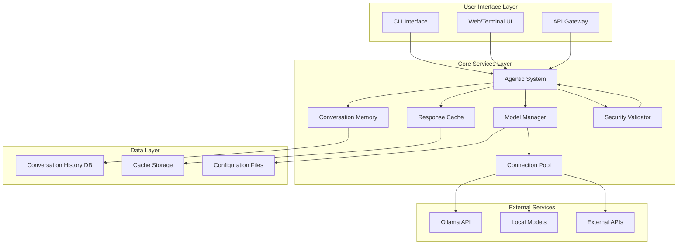
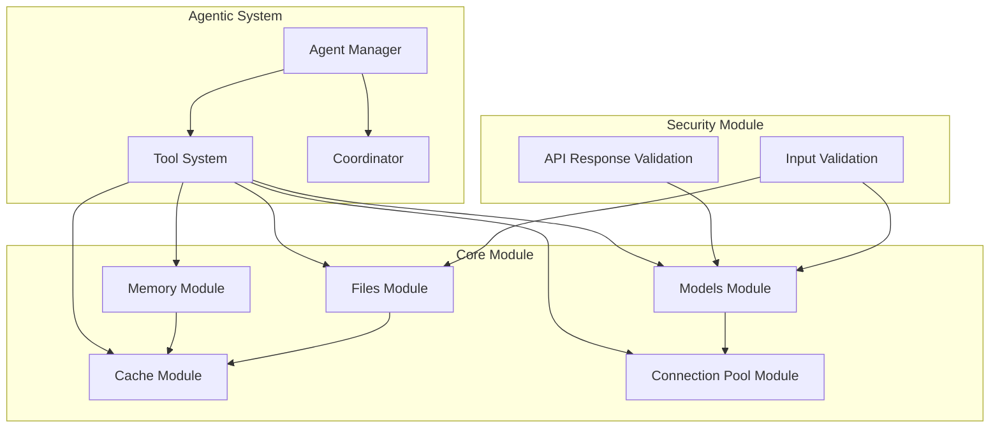
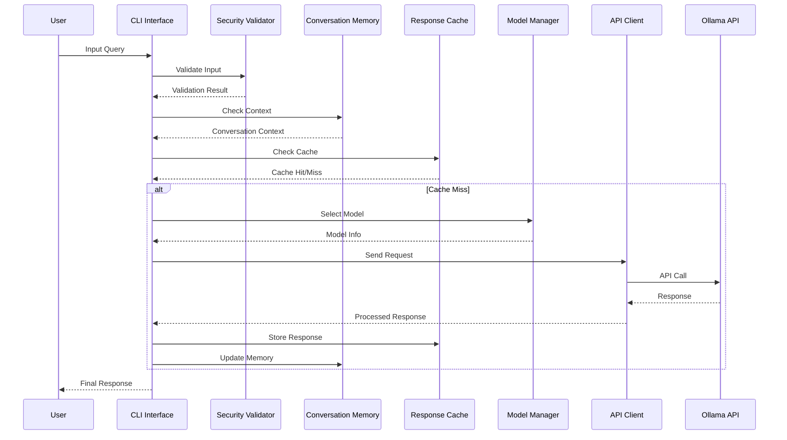
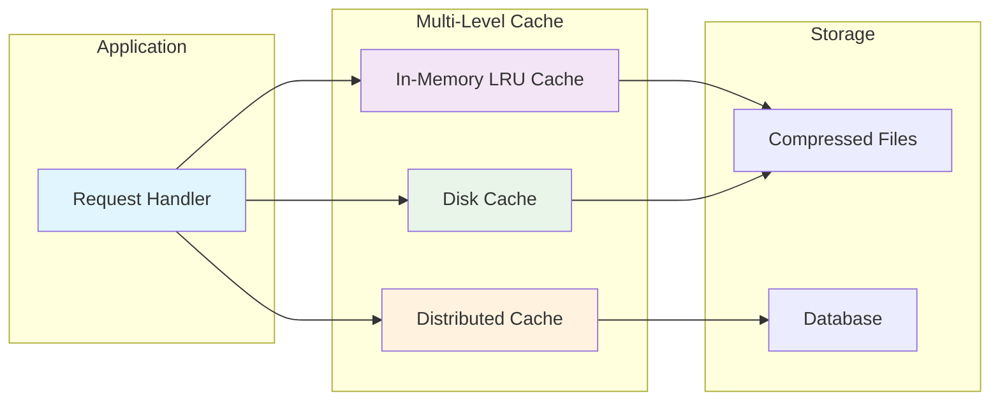
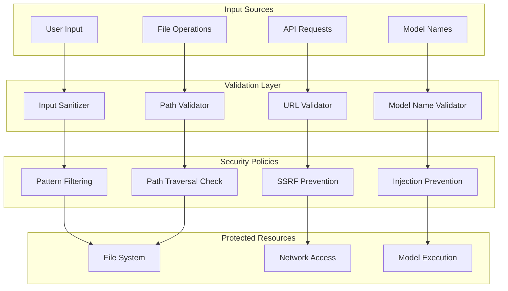

# Xencode Architecture Diagrams

## High-Level Architecture

```mermaid
graph TB
    subgraph "User Interface Layer"
        A[CLI Interface] 
        B[Web/Terminal UI]
        C[API Gateway]
    end
    
    subgraph "Core Services Layer"
        D[Agentic System]
        E[Model Manager]
        F[Conversation Memory]
        G[Response Cache]
        H[Security Validator]
        I[Connection Pool]
    end
    
    subgraph "External Services"
        J[Ollama API]
        K[Local Models]
        L[External APIs]
    end
    
    subgraph "Data Layer"
        M[Conversation History DB]
        N[Cache Storage]
        O[Configuration Files]
    end
    
    A --> D
    B --> D
    C --> D
    D --> E
    D --> F
    D --> G
    D --> H
    E --> I
    I --> J
    I --> K
    I --> L
    F --> M
    G --> N
    E --> O
    H --> D
```

## Component Architecture

```mermaid
graph TB
    subgraph "Core Module"
        A[Files Module]
        B[Models Module] 
        C[Memory Module]
        D[Cache Module]
        E[Connection Pool Module]
    end
    
    subgraph "Security Module"
        F[Input Validation]
        G[API Response Validation]
    end
    
    subgraph "Agentic System"
        H[Agent Manager]
        I[Tool System]
        J[Coordinator]
    end
    
    A --> D
    B --> E
    C --> D
    F --> A
    F --> B
    G --> B
    H --> I
    H --> J
    I --> A
    I --> B
    I --> C
    I --> D
    I --> E
```

## Data Flow Diagram

```mermaid
sequenceDiagram
    participant U as User
    participant CLI as CLI Interface
    participant V as Security Validator
    participant CM as Conversation Memory
    participant RC as Response Cache
    participant MM as Model Manager
    participant APIC as API Client
    participant O as Ollama API
    
    U->>CLI: Input Query
    CLI->>V: Validate Input
    V-->>CLI: Validation Result
    CLI->>CM: Check Context
    CM-->>CLI: Conversation Context
    CLI->>RC: Check Cache
    RC-->>CLI: Cache Hit/Miss
    alt Cache Miss
        CLI->>MM: Select Model
        MM-->>CLI: Model Info
        CLI->>APIC: Send Request
        APIC->>O: API Call
        O-->>APIC: Response
        APIC-->>CLI: Processed Response
        CLI->>RC: Store Response
        CLI->>CM: Update Memory
    end
    CLI-->>U: Final Response
```

## Caching Architecture

```mermaid
graph LR
    subgraph "Application"
        A[Request Handler]
    end
    
    subgraph "Multi-Level Cache"
        B[In-Memory LRU Cache]
        C[Disk Cache]
        D[Distributed Cache]
    end
    
    subgraph "Storage"
        E[Compressed Files]
        F[Database]
    end
    
    A --> B
    A --> C
    A --> D
    B --> E
    C --> E
    D --> F
    
    style A fill:#e1f5fe
    style B fill:#f3e5f5
    style C fill:#e8f5e8
    style D fill:#fff3e0
```

## Security Architecture

```mermaid
graph TD
    subgraph "Input Sources"
        A[User Input]
        B[File Operations]
        C[API Requests]
        D[Model Names]
    end
    
    subgraph "Validation Layer"
        E[Input Sanitizer]
        F[Path Validator]
        G[URL Validator]
        H[Model Name Validator]
    end
    
    subgraph "Security Policies"
        I[Pattern Filtering]
        J[Path Traversal Check]
        K[SSRF Prevention]
        L[Injection Prevention]
    end
    
    subgraph "Protected Resources"
        M[File System]
        N[Network Access]
        O[Model Execution]
    end
    
    A --> E
    B --> F
    C --> G
    D --> H
    
    E --> I
    F --> J
    G --> K
    H --> L
    
    I --> M
    J --> M
    K --> N
    L --> O
```